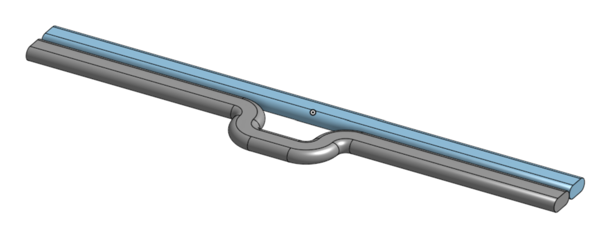

# Conformal Skin Support Algorithms for Aerodynamic 3D Prints
### *A Technical Specification for FeatherPrint, a Modification of the Cura Engine by Ultimaker*
---
*Rick Szalay, 10 June 26 — revised 26 July 26*

## Revision History

| Date | Description |
| --- | --- |
| 10 Jun 26 | Initial release |
| 28 Jun 26 | First revision — added Whip description and collision feature stubs |
| 30 Jun 26 | Second revision — corrected Stringer Trace arc geometry; added Whip Terminal arc geometry; updated CW mirroring description; added Stringer × Whip collision approach distance; replaced Whip support stub description with Splay dependency note |
| 30 Jun 26 | Third revision — added Flange feature for open-top gluing surfaces; distinguished Boundary Loop from Boundary Edge in Input Model section |
| 30 Jun 26 | Fourth revision — fixed Flange ramp increment at w/2 per layer; added Flare (Stringer × Flange) and Miter (Whip × Flange) collision features; clarified that a boundary loop may itself be interrupted by a boundary edge where a slot or hole reaches the open top |
| 30 Jun 26 | Fifth revision — finalised Flare as morphologically identical to Gusset, applied at a single layer; finalised Miter's loose-then-wrap behaviour |
| 01 Jul 26 | Sixth revision — generalised Flare to Stringer/Lacing × Flange (single width-parametrized feature rather than two collision types); added Flare Rim profile geometry with depth/radius formulas tying the crossover to a fixed 2.5w below the OML |
| 02 Jul 26 | Seventh revision — corrected the Flare Rim to the as-implemented five-segment profile and clarified Q as a toolpath-centreline-to-centreline distance (not the full physical Wall-stack span), resolving the prior revision's flagged CAD-check inconsistency; simplified Flange detection to an unconditional Layer span from the model's top, gated by `featherprint_flange_enabled`, replacing the unreliable open-top/closed-apex heuristic; implemented Miter, including the open-Wall radial-offset approximation and Flare Rim insertion within Miter's open Walls; added the Wall Print Order requirement (OML strictly last, IML second-to-last where three or more Walls are present), enforced at the engine level rather than left to the slicer's general Wall-order preference; added the planned Collar feature, generalising Flange-style reinforcement to every Whip Terminal |
| 19 Jul 26 | **Eighth revision (major, REV 2.0)** — merged the standalone Conformal Placement Transform spec's rigorous chord-tolerance arc-handling procedure into this document's Geometric Features section, replacing the previous fixed-segment-count tessellation description; formalised the Conformance Pipeline as an explicit, ordered procedure including the post-transform chord-tolerance re-sampling loop; added the proposed (not yet implemented) Skin-Normal Variant: Tangent-Blend Placement as an alternative to the centroid-based Conformal Transform step; **fully replaced the fixed-dimension canonical profiles for Stringer Trace, Whip Terminal, Lacing Trace, and Flare Rim with parametrized Depth/Width/Gap-driven profiles**, retiring the old fixed w-unit dimensions (this is an intentional redesign of these profiles' geometry, not a re-expression of the old shapes — the new and old profiles do not coincide for any parameter values, see inline notes); finalised Gusset Hoop as a Flare Rim reusing the Stringer's own Width, formalising the existing "morphologically identical to Gusset" relationship; finalised Splay as a Whip Terminal widened to cover both the colliding Stringer Trace and the Whip Terminal itself, with the exact resulting width left as an open item; flagged that several downstream constants derived from the old fixed dimensions (the Stringer × Whip collision zone distance, the Lacing collision thresholds) need to be re-derived in terms of the new parametrized widths before implementation, and are not yet updated; flagged the interaction between CW Helix Mirroring and the new left-right-symmetric Stringer/Whip profiles as unresolved, since symmetric profiles may not require mirroring the way the old asymmetric ones did (see Flare's own precedent for a symmetric profile that already skips it) |
| 20 Jul 26 | **Ninth revision (minor, REV 2.1)** — folded in the 20 Jul 26 as-built report against commit `9fa2e7fc7`. The Skin-Normal Variant: Tangent-Blend Placement is promoted from proposed to the sole as-built Conformal Placement Transform, replacing the centroid-radial map outright (no fallback); frame resolution now resolves directly from perimeter arc-length rather than an angle ray-cast, and the blend placement is rewritten to be arc-length-exact so physical feature width no longer varies with local skin curvature; four root-caused robustness fixes folded in (nearest-intersection ray-cast, degenerate-segment tangent skip, ±0.3mm tangent windowing; the old ray-cast-failure fallback is noted superseded). Stringer Trace's CW Helix Mirroring open item is resolved as-built (reverse traversal, x_sign flip, and x_s/x_e swap, verified together — a partial fix alone does not mirror correctly); Whip Terminal's own CW mirroring was not touched this session and remains as previously described. Lacing Trace's R2 formula gains an as-built floor (`R2 = max(0, (D − Lw)/2)`) and an implementation note that the code walks the profile in the reverse of the table's Start→End order, with each arc's direction flipped to match, to satisfy the caller's stitching direction — the physical shape and directions documented are unaffected. Whip Terminal's End.y = Lw/2 is confirmed as-built (a stale code comment claiming y = 0 is flagged for cleanup, not the spec). Flare Rim is rewritten to the as-built five-segment profile (Line-in/Arc1/Line-mid/Arc2/Line-out), which preserves the full requested channel depth even when the R1 clamp caps the fillet radius at W/2; Q is corrected to mean Wall-stack thickness in w-units excluding the innermost Wall (not a Wall count), and `oml_shift` is corrected to anchor against the innermost Wall's own offset rather than the outer Wall's; traversal direction is corrected to left-to-right, matching the wall walk (mirroring the previous revision's Start/End labels). Miter gains a documented bug fix: the outer Wall's Terminal shape is now scaled by the global line width, with the printed bead width overwritten to the local Wall's width afterward, fixing a half-size Terminal/gap defect at the first double-Wall Flange layer. New Cura settings are recorded (`featherprint_stringer_depth`/`width`, `featherprint_lacing_depth`/`width`, `featherprint_flare_depth`), and a Known Loose Ends note is added (stale debug logging, the Whip End.y doc-comment, Splay/Gusset items still open). Installer bumped 0.3.0 → 0.4.0. |
| 20 Jul 26 | **Tenth revision (minor, REV 2.2) — proposed, not yet implemented.** Replaces the centroid/angle-ray-cast anchor *distribution* mechanism (Reference Ray, Fixed Ray, `referenceArcPos`) with a fixed-point-projection, pure-arc-length scheme — the last remaining star-convexity/single-valued-R(θ) dependency in the pipeline, and the one Skin-Normal Tangent-Blend Placement (REV 2.1) explicitly did not touch ("the anchor's own position is still resolved by angle/ray-cast — a separate concern"). A single fixed world point is seeded once, at the first Layer that carries a Stringer (defined as Layer 0 for this purpose, not necessarily the model's actual bottom Layer — see Anchor Distribution, below), as the point on that Layer's outer wall at x = 0 furthest in +Y. Every subsequent Layer's Phase Origin is the nearest point on that Layer's own outer wall to this same fixed world point — recomputed independently each Layer, not carried forward recursively, so it cannot drift with local shape distortion. Stringer 1 CCW and Stringer 1 CW are mirrored ± the same cumulative phase magnitude (now expressed in arc-length, `phase(z)·L(z)`, not angle) from the Phase Origin, meeting exactly at the halfway arc-length mark; the remaining stringers are offset by `i/N·L(z)` from their own direction's Stringer 1. This preserves the existing ring-wide synchronized-Lacing-crossing property without requiring a closed-form or angle-based reference. Where the outer wall itself is interrupted (a boundary loop broken by a boundary edge), the Phase Origin and every stringer's arc-length walk operate on the same virtual closed ring (real arcs + gap chords) already used for open-manifold helix-phase continuity, rather than a new closing mechanism. Downstream, this also removes a wasteful arc-length→angle→arc-length round-trip already present in the as-built REV 2.1 code (anchors are computed in arc-length, converted to an angle via `atan2` purely to satisfy `buildBlendPlacement`'s signature, then converted straight back) — `s_anchor` should be threaded through directly, and `theta_anchor`/`R_a` dropped from the placement machinery's signatures (`R_a` was already dead code in REV 2.1's `buildBlendPlacement`). **Status note per the person requesting this revision:** proposed as a real, mergeable minor revision rather than a discussion draft — reversible by deletion if it doesn't pan out. |
| 20 Jul 26 | **Eleventh revision (minor, REV 2.3)** — as-built confirmation of REV 2.2's Anchor Distribution, against commit `1e45aa239` (uncommitted at time of writing). Implementation went smoothly overall ("already works shockingly well out of the box") but with **one significant deviation from REV 2.2's literal text**: the fixed-point-projection scheme (one seeded world point, every layer independently re-projecting against it) produced large spurious Phase Origin jumps on shapes symmetric about the seed's `x = 0` axis — the seed point sits near-equidistant from the left and right sides of the boundary there, so a small smooth asymmetry between layers can flip which side is "nearest," jumping the projection by up to half the perimeter. As-built replaces this with a **continuity-tracking walk** (each layer's Phase Origin = nearest point on that layer's own outer wall to the *previous* layer's own Phase Origin), fixing the jump at the explicitly-accepted cost of reintroducing the drift risk the independent-per-layer design was meant to avoid — evaluated and chosen deliberately, not silently. Confirmed after this fix: "worked perfectly." Also as-built: both duplicated copies of the old `referenceArcPos` ray-cast were replaced (not just one), the `theta_anchor`/`R_a` round-trip was fully removed per the primer's Step 4, and one **unplanned, out-of-scope fix** was made alongside this work — `resolveFrame`'s tangent/inward-normal orientation, previously resolved via two centroid-relative geometric tests (the same class of fragility as the ray-cast this revision targets), is now a single global polygon-winding test (`ArcParam::ccw`), correct at every point regardless of concavity, no centroid reference at all. **Not verified this session:** the primer's own non-star-convex stress test and synchronized-Lacing-crossing sanity check — only the user's own real part(s) in the dev build were tested. Installer not yet rebuilt; changes not yet committed. |
| 20 Jul 26 | **Twelfth revision (minor, REV 2.4) — proposed, not yet implemented.** Adds **Thin-Section Pruning**: where a feature's own Depth (D) doesn't fit in the local material thickness at its anchor, delete that feature's geometry at that anchor for that Layer only, leaving the anchor itself in place (downstream anchor-continuity tracking — helix phase, Lacing pairing — is unaffected; only emitted extrusion geometry is suppressed). Applies generically to any feature with an anchor and a Depth (Stringer, Lacing, Whip Terminal, Flare Rim), though the practical motivating cases are Stringer, Lacing, and Flare specifically. Detection: a ray cast from the anchor along the feature's own local inward normal (the same winding-based inward normal `resolveFrame` already computes, per REV 2.3 — not a centroid-directed ray, for the same reason Anchor Distribution moved off centroid), of length D. If that ray hits the real perimeter (excluding a small self-hit exclusion window around the anchor, and excluding any virtual-ring gap chords on an open-manifold Layer — real material only), the local thickness is less than D and the feature is pruned at that anchor for that Layer. Detection radius is exactly D for now (no added margin) — an explicit, flagged-as-tentative starting point pending test results, to be revisited and reported in the eventual as-built. Runs **after** existing collision-based suppression (Lacing's merge threshold, Stringer×Whip's Splay suppression zone) — an anchor already suppressed by collision detection doesn't get a redundant thin-section check; both are independent reasons the same "no feature geometry emitted at this anchor, this Layer" outcome can occur. Documented under Geometric Features (not Collision Features), since it's a self-thickness check rather than an interaction between two print features. |
| 21 Jul 26 | **Thirteenth revision (minor, REV 2.5)** — as-built confirmation of REV 2.4's Thin-Section Pruning, against a commit atop `1e45aa239` (per the as-built report; the repo's own git log shows this work landed as `4d940c98d`), plus one unplanned pipeline fix. **Scope narrowed as-built**: Whip Terminal is deliberately excluded from pruning — unlike Stringer/Lacing/Flare, an open perimeter end has no ordinary-wall fallback if its Terminal is skipped, defeating the reason Whip exists; only Stringer, Lacing, and Flare are implemented, matching the "practical motivating cases" the spec's own text already named. **Detection mechanism refined through four rounds of real-print testing**: the plain distance-only ray test (Round 1) false-positived on gently curved, non-thin sections, where the ray hit the *same* wall curving back on itself; fixed by an opposing-normal filter (Round 2, a hit only counts if its own inward normal points more than 90° from the ray direction), which then regressed on genuinely thin, tight corners under ~10° (Round 2). Two fix attempts at the corner regression were tried and reverted (a sharp-bend fallback to plain distance, and a milder 45° widening of the opposing-normal threshold alone — both failed or worsened the case). The actual fix (Round 4) was recognizing that the anchor-neighborhood exclusion window itself was the bug: at a tight enough fold, the genuine opposing wall is arc-length-*close* to the anchor precisely because the fold is tight, so a metric (arc-length or world-distance) exclusion window discarded the real hit before the opposing-normal test ever ran. Fixed by changing the exclusion criterion to **vertex/segment-index adjacency** (only the anchor's own segment and immediate neighbors, regardless of metric distance) — a structural change from the spec's "tentative starting value" framing, not a retuned constant. The 45°-widened opposing-normal threshold (from the abandoned Round 3 attempt) was kept, since Round 4's fix is what actually resolved the reported case — but this combination has **not been re-validated** against Round 1's original false-positive scenario (gently curved, non-tight sections), flagged as an open risk rather than assumed fine. **Unplanned fix**: `SliceLayerPart::inner_area` — previously left empty unconditionally for FeatherPrint layers, silently breaking stock `top_layers`/`bottom_layers` (no top skin was generated at all) — is now populated from the innermost printed Wall's own inner face via a new `FeatherPrintGenerator::innerOffset()` accessor, for closed-perimeter layers only; open-manifold (Whip) layers are deliberately left untouched, preserving "no surface where the designer left it open." Confirmed working on a real print with `top_layers = 2` set. Installer not yet rebuilt; changes not yet committed. |
| 21 Jul 26 | **Fourteenth revision (minor, REV 2.6) — proposed, not yet implemented.** Adds **Curvature-Weighted Stringer Density**, the last of this cycle's four planned changes. Motivation is the inverse of an initial guess: flat (low-curvature) regions benefit from *additional* stiffening and should get *denser* stringer spacing, while curved regions are already stiffened by their own curvature and can afford *sparser* spacing. Mechanism: a per-layer monotonic re-parametrization of the perimeter into a "warped" arc-length coordinate `W(s) = ∫ρ(s')ds'`, where the density weight `ρ(s)` is larger in flat regions and smaller in curved ones; all N stringers of each helix direction are placed evenly spaced *in W*, not in raw arc-length, then mapped back to real positions. Because `W` is a monotonic bijection, the ring-wide synchronized-crossing property Anchor Distribution relies on (shared origin, shared phase magnitude, fixed per-stringer offsets, all in one coordinate) transfers over unchanged — crossings still land on the same Layer ring-wide, just at non-uniformly-spaced real positions. Density weight is defined via a **local realized helix angle** `θ_local(s)`, continuous in local radius of curvature `R_c(s)`: `tan(θ_local(s)) = tan(θ_h) · R_c(s)/R_ref`, which simplifies to `ρ(s) = R_c(s)/R_ref` directly. `θ_h` (the existing Helix Angle parameter) is now read as the angle achieved specifically at the reference curvature; the **one new parameter**, `k_ref` (dimensionless, default 1.0), sets `R_ref = k_ref × R_avg`, where `R_avg` is a single characteristic radius **averaged once across the whole part** (not per-layer, so an end user can reuse similar settings across differently-tapered parts). Mins/maxes fall out for free from the formula's own domain limits (`θ_local → 90°` as `R_c → ∞` flat, `→ 0°` as `R_c → 0` tight) rather than being separate tunable bounds — though a numerical safety clamp is needed in practice since a literally straight perimeter segment has `R_c = ∞` exactly. Explicitly accepted consequence, confirmed by the person requesting this: individual stringers' *real* physical helix angle will differ stringer to stringer depending on local density, even though all share the same nominal `θ_h` in warped terms — intended behavior, not a defect. Flagged for implementation: local curvature is a noisier, more vertex-sensitive quantity than tangent (which already needed a smoothing window in REV 2.1) and will need its own smoothing; the whole-part `R_avg` average requires a new kind of pre-pass (whole-mesh, not the existing sequential per-layer Phase Pre-Pass); and whether curvature sign (concave vs convex) matters or only its magnitude is an open assumption (magnitude-only assumed for now). |
| 21 Jul 26 | **Fifteenth revision (major, REV 3.0) — proposed, not yet implemented.** Bumped to a new major revision to mark the start of a new design cycle, per explicit request, closing out the REV 2.x cycle (Anchor Distribution, Thin-Section Pruning, and Curvature-Weighted Stringer Density — three of that cycle's four planned changes shipped; released to GitHub). Adds the first two planned changes of this new cycle: **Synchronized Feature Depth** — consolidates the separate `featherprint_stringer_depth`/`featherprint_lacing_depth`/`featherprint_flare_depth` settings into one shared `featherprint_feature_depth` parameter that Stringer, Lacing, Whip Terminal, and Flare Rim all derive Depth from directly, with no per-feature override — and **Shore**, addressing unsupported overhangs enclosed by the outer shell that external tree supports structurally cannot reach. See Feature Geometry, below, for both; Shore's design is superseded before implementation by REV 3.1, below. |
| 22 Jul 26 | **Sixteenth revision (minor, REV 3.1)** — replaces Shore's design wholesale, before any implementation was attempted; REV 3.0's original approach is not carried forward. Shore is a self-contained bridging mechanism with no dependency on Stringer, Lacing, or any other print feature, documented under Geometric Features rather than Collision Features. Because FeatherPrint prints hollow — there is no solid infill anywhere, only the manifold outer shell — "internal" describes the space beneath a given overhang, not the wall itself: a top-facing surface is internal if the space directly beneath it is enclosed within the model's own envelope (bounded by the OML, whether occupied by wall material or open hollow interior) rather than opening into air reachable by ordinary external tree support. (The top cap of a hollow cube is the clarifying case: exterior air sits above it, but its underside is the cube's own enclosed hollow interior — internal, in the sense that matters here, despite being visibly part of the model's exterior.) Detection is two independent tests: a **Top Surface** test (`T = layer_n.difference(layer_{n+1})`, mirroring ordinary top-skin detection with no angle filter, since this identifies where top skin will be generated rather than testing a printable overhang angle) and an **Enclosure** test (the space immediately below T, at layer n−1, must fall within the model's own envelope rather than open exterior air, and must be hollow rather than already solid, or Shore does not apply). Because Test 1 fires exactly once, at a locally solid region's own single topmost Layer, there is no multi-Layer growth run to track and no ramp-planning lookahead, unlike the abandoned REV 3.0 approach. For the resulting region O (T filtered by Test 2), points are distributed around O's own outer boundary; each casts candidate straight-line bridges — one along its local inward normal, plus two tangent lines per hole present in O, for cases where a not-yet-closed portion of the surface, or a genuine hole feature, sits between the point and the far side. Every candidate is a single unbent straight line; ones that don't land back on O's own boundary, or that cross any hole's interior, are discarded. Surviving candidates are pooled, sorted shortest-first, and kept greedily unless they cross an already-kept shorter one. The result is generated as **Infill**, at Layer `n − top_layers`, so ordinary top skin has real material to build on by the time the slicer reaches Layer n itself. With this redesign, Shore no longer touches Stringer Depth at all — Synchronized Feature Depth's "no per-feature override" now holds unconditionally, with no runtime exception. Exact pipeline ordering relative to existing collision detection and Thin-Section Pruning is left open, to be resolved during implementation. |
| 26 Jul 26 | **Seventeenth revision (minor, REV 3.2)** — as-built confirmation of Shore against commit `f593a624d` (`src/FffPolygonGenerator.cpp` uncommitted at time of writing), folding in two rounds of real-model bug fixing beyond REV 3.1's proposed design. **Filtered outline:** Shore's Top Surface and Enclosure tests originally read the raw slice-time outline directly; on a non-manifold input mesh, the slicer's own contour-stitching can leave sub-line-width slivers in that raw outline that never become real printed geometry (they're dropped by `WallsComputation.cpp`'s own morphological-open filter before any Wall is generated). Shore was detecting Top Surface in exactly these slivers. Fixed by applying the identical filter to all of Shore's own outline reads. **Open-top signal — geometric approach disproven by direct measurement, not just difficult:** an attempt to detect a genuinely open top (as opposed to a closed apex) via `open_polylines` at the topmost Layers did not fix the reported case; diagnostic logging against a real model's last 5 Layers showed the true topmost Layer still reporting `open_polylines=0` with a genuinely non-empty `T` — the slicer's 2D ray-casting can't distinguish a missing 3D cap face from a real one, so **no 2D per-layer signal exists for this**, and the geometric guard was removed as dead code for this purpose (a narrower version survives for Whip Terminal's own genuinely-open boundary edge, an unrelated case that does leave a real trace). **As-built fix:** Shore reads `featherprint_flange_enabled`/`fp_flange_start_layer` directly instead — the same signal the person operating the slicer already provides — skipping any Layer at or above the Flange ramp's start. The Flange-start-layer pre-pass was reordered to run before Shore's own pre-pass so this value is available. Confirmed working on the model that exposed the bug. **Settings guidance reversed** from REV 3.1's as-built expectation: Flange and Shore are not mutually exclusive — Flange enabled now actively defines the lower boundary of Shore's operating range, rather than needing to be disabled for Shore to be useful. A previously-flagged concern (the Enclosure test's envelope inset not accounting for a thicker Flange Wall stack) is now moot rather than deferred, since Shore never runs inside the Flange zone at all under the new guard. Installer not yet rebuilt; changes not yet committed. |

---

## Description
This document specifies modifications to the Cura Engine — the core slicer of Ultimaker's Cura — to produce conformal, single-line-width skin structures in 3D prints. The intended application is the development of ultralight parts for drones and other aerodynamic structures, including model aircraft, wind turbines, and hydrodynamic surfaces.

## Input Model
FeatherPrint expects a manifold STL file as input. A **manifold** is a closed, watertight mesh in which every edge is shared by exactly two faces, with no gaps, holes, or self-intersections. This condition ensures that the mesh encloses a well-defined volume and that every cross-section at a given z-height produces a closed polygon.

A manifold is composed of **surfaces** — the individual planar or curved faces that together form the outer boundary of the model. In the context of FeatherPrint, surfaces are the model-space counterparts to the Skin feature: the faces of the input mesh from which the outer skin geometry is derived.

FeatherPrint also accepts open manifolds — meshes that contain one or more **boundary edges**, where an edge belongs to only one face rather than two. Boundary edges fall into two categories, distinguished by their orientation relative to the slice planes.

Where boundary edges run predominantly in the z direction — crossing multiple slice layers — they produce one or more open polygons at each affected layer. These are handled by the Whip feature, which closes and terminates them.

Where boundary edges instead form a closed loop lying within a single slice layer's z-tolerance band — as occurs when the top of the model is open, such as an unclosed tube or shell with no cap — the edges are treated as a **boundary loop** rather than a boundary edge. A boundary loop still produces a closed perimeter polygon at every affected layer (unlike a boundary edge, which produces an open polygon), so it does not require the Whip's termination logic. Boundary loops are instead handled by the Flange feature, which converts the terminating layers into a bonded gluing surface.

A boundary loop is not required to be unbroken. Where a hole or slot in the model's side wall reaches the open top, the loop is interrupted at that point: part of its boundary continues as an in-band boundary loop (handled by the Flange), and part descends out of the z-tolerance band as an ordinary boundary edge (handled by the Whip). The vertex where the two meet is a junction point, and is handled by the Miter collision feature described under Collision Features.

All other features assume a closed perimeter at each layer.

## Terminology
### Layer and Wall

Two terms are used throughout this document with specific meanings:

**Layer** refers to geometry distinguished by its position along the z axis — one pass of the print head at a fixed z height, and the atomic unit of the slicer's layer-by-layer output.

**Wall** refers to linear geometry distinguished by its position along the canonical y axis (the Anchor Point UCS's inward direction) within a Layer. A Layer may consist of a single Wall — an ordinary single-line-width Skin pass — or several concentric Walls offset inward from one another, wherever a feature's cross-section exceeds one line width. Walls within a Layer are ordered outward-in: the outer Wall is, by definition, the Wall coincident with the model's outer mould line (OML); each subsequent Wall lies further inboard, toward the centroid.

### Print Features

Print features are described across four spaces, corresponding to the pipeline from input model through to physical output.

| Print Feature | Manifold Feature | Developed Geometry | Slice Geometry |
| --- | --- | --- | --- |
| Skin | Surface | Skin | Perimeter |
| Former | N/A | Former | Hoop |
| Stringer | N/A | Stringer | Trace |
| Whip | Boundary Edge | Whip | Terminal |
| Flange | Boundary Loop | Flange | Rim |
| Collar (planned) | Boundary Edge (both ends) | Collar | Rim |

#### Skin
Skin is the most basic feature, consisting of a stack of single-line-width extrusions. The specification uses "Skin" rather than the more conventional "Wall" to distinguish this feature from the other multilayer features defined below.

This distinction is necessary because, strictly speaking, all geometry generated by FeatherPrint is wall: the engine's purpose is to produce complex manifold geometry from a single continuous curve, with no infill or traditional wall-loop stacking. "Wall" alone is therefore too generic to single out any one feature. Skin specifically refers to the segments of that geometry corresponding to the model's surface — the portion of each slice that traces the outer perimeter, as opposed to internal features like Formers or Stringers.

#### Former
The Former is a feature consisting of a localised thickening of the skin at a set of slices. This thickening corresponds with the crossing of stringer helices, suppressing the geometric irregularity at the crossing while also serving as a transverse brace to the geodetic net.

Formers must be multilayer because the thickening occurs across several z layers, and because the stringers must cross over a span of layers to complete the helix transition. The thickness of the Former is stepped out by half a line width per layer. The peak thickness is therefore determined by the line width and the total number of layers comprising the Former. Where the peak thickness exceeds two line widths, the Former becomes hollow.

**Status: not yet implemented.**

#### Stringer
A Stringer is a multilayer print feature which, together with the Former, forms the geodetic net of the conformal support. It consists of a tube running primarily in the z direction in a helix around the outer skin. At each layer, the tube is formed by a loop of extrusion — called a Trace — extending inward toward the centroid. When stacked across layers, these Traces form a continuous tube.

Each Trace requires a crossover to close the loop. This crossover firmly bonds the perimeter extrusions together across the Trace and welds the Trace to the layer below. Squeezout from the crossover fills the divot left by the radii of the loops forming the Trace.

The crossover required by each Trace is also where the layer lift occurs.

FeatherPrint generates two counter-rotating helices — one CCW and one CW — which together form the geodesic diamond pattern of the net. Each helix produces its own set of Traces on every layer. The two helices are interleaved: both start from the same reference ray on each layer, with the CCW helix advancing in the positive arc direction and the CW helix advancing by the same amount in the negative arc direction. When a CCW Trace and a CW Trace approach the same perimeter location, a Lacing collision feature replaces both Traces.

#### Whip
A Whip is a termination feature applied wherever the input manifold contains a boundary edge, producing an open perimeter polygon at the affected slice layers. At each such layer, the open end of the perimeter terminates at the anchor point, where the path turns into a small closed loop — called a Terminal — which closes back onto itself. This eliminates the stress riser that would otherwise occur at an open filament end, and forms a well-bonded column of material at the opening as Terminals stack across layers. A parametric cut-back of the perimeter end prior to the Terminal is reserved for a future revision.

#### Flange
FeatherPrint applies a Flange to the top `featherprint_flange_ramp_layers` Layers of every mesh, unconditionally, rather than attempting to first determine whether the top is genuinely open. Because `top_layers` is fixed to 0 for FeatherPrint prints, every mesh would otherwise simply stop at the last Skin layer with no usable surface to bond a cap or mating part to — so the Flange applies by default rather than only when a boundary loop is detected. Two earlier heuristics for distinguishing an open top from a naturally closed apex/taper were tried and abandoned: an area-ratio taper check misfired both ways — it missed a boundary loop interrupted by a slot reaching the top (those top Layers have no closed-polygon area to measure a taper from at all, only open polylines), and it could still misclassify an ordinary closed taper depending on the ratio threshold. For a manifold with a genuinely closed top — a nose cone, for example — the Flange must instead be turned off explicitly, via `featherprint_flange_enabled = false`.

The Flange is multilayer, occupying the final Layers of the model below the open top. Its outer Wall remains coincident with the OML for the entire span — the Flange does not bulge outward past the model's outer surface, since that would alter the aerodynamic profile. All added thickness builds inward, toward the centroid, as additional Walls behind the outer one.

The total wall-stack thickness increases by w/2 per Layer, the same per-Layer step used by the Former, but here applied in one direction only (there is no ramp-down on the far side, since the open top is the end of the printed geometry). Because w/2 does not divide evenly into a whole number of line-width Walls at every Layer, the Wall count and arrangement follow a fixed rule rather than a single scaling Rim:

- At the first Flange Layer (total thickness 1.5w), there is no room to bury a partial-width Wall, so the stack is one full-width Wall (w) — placed as the *inner* Wall, since it is the one with no support beneath it and needs to be printed at full width for the overhang to hold — plus one half-width Wall (0.5w) at the outer position, tracing the perimeter at the OML.
- At each subsequent Layer, the total thickness increases by w/2. Where the resulting total is an exact multiple of w, the stack is simply that many full-width Walls. Where it is not (a remaining 0.5w), the extra half-width Wall is buried in a middle position — between two full-width Walls — rather than exposed at either the outer or inner position, so long as there are at least three Walls to make burial possible; the outer Wall stays full width once this is achievable.

This continues until the topmost Layer — the brim — which is printed as the final, flush term of this Wall stack rather than as a separate feature; there is no single-layer "flat brim pass" distinct from the last increment of the ramp. The exposed top face of the brim's Wall stack is the gluing surface referenced in the feature's description.

The Flange is detected independently per boundary loop: a manifold may be open at the top only, disabled at the top only (via `featherprint_flange_enabled`), or open at multiple boundary loops on the same part. Where a Former would otherwise fall within the Flange's Layer span, the Former is deleted outright — the Flange's own Rim, built up as the Wall stack described above, supersedes it. Where a Stringer or Lacing would otherwise fall within the Flange's Layer span, it cannot simply be deleted, since an unterminated tube end would be left inside the Flange; this is handled by the Flare collision feature, which generalizes to either case (see Flare, under Collision Features). Where a boundary loop is itself interrupted by a boundary edge (see Input Model), the Flange and Whip meet at the junction; this is handled by the Miter rule, which — unlike Flare and the other collision features — introduces no geometry of its own. Both are described under Collision Features.

#### Collar (planned)
A Collar is a short, local reinforcement band applied at every Whip Terminal — not only where a Flange already occupies the model's top, but at both ends of every interior hole or slot, and at the top or bottom of the model where no Flange is present. It reuses the Flange's own Wall build-up rule (w/2 total thickness increase per Layer) but spans only a small, fixed number of Layers (`featherprint_collar_layers`) immediately adjacent to each Terminal, rather than the Flange's model-wide span.

The Collar serves two purposes. First, it reinforces the opening itself against tear-out — an opening's edge is a stress concentration, much like the bond line the Flange provides at the model's top. Second, it gives the Whip's Terminal column a genuine multi-Wall substrate to weld into at its ends, replacing the placeholder `featherprint_whip_stub_layers` fixed single-width Traces currently used for that purpose (see Splay). Once implemented, the Collar supersedes Whip support stubs entirely.

The Collar shares its Wall-ordering requirement with the Flange: the outer Wall (at the OML) must print last, closing its Terminal over the already-printed inner Wall(s) — the same rule Miter already applies (see Wall Print Order).

**Status: not yet implemented.** Whip support stubs (`featherprint_whip_stub_layers`) remain the current placeholder bonding mechanism for ordinary Whip endpoints away from any Flange/Miter zone.

---

### Collision Features

Collision features arise wherever two developed features meet on the surface. Rather than allowing the toolpath planner to resolve these intersections arbitrarily, FeatherPrint detects each collision type in advance and substitutes a defined collision feature that produces predictable geometry and preserves bond integrity at the junction.

Collision features are described across the same two spaces used for the print features that give rise to them — developed geometry and slice geometry. They have no independent manifold representation, as they are derived entirely from the spatial relationship between two parent features.

| Collision | Print Feature | Developed Geometry | Slice Geometry |
| --- | --- | --- | --- |
| Stringer × Stringer | Lacing | Lacing | Lacing Trace |
| Stringer × Former | Gusset | Gusset | Gusset Hoop |
| Stringer × Whip | Splay | Splay | Splay Terminal |
| Former × Whip | Cuff | Cuff | Cuff Terminal |
| Stringer/Lacing × Flange | Flare | Flare | Flare Rim |
| Whip × Flange | Miter | N/A | Terminal |

> **Shore is not listed here.** It does not arise from a collision between two print features — see Shore (Internal Overhang Bridging), under Geometric Features.

#### Lacing (Stringer × Stringer)

A Lacing occurs where the CCW and CW Stringer helices converge at the same angular position on the perimeter. Because each Stringer advances at a fixed helical pitch, the two helices will periodically arrive within one line width of each other. When a CCW Trace anchor and a CW Trace anchor are within one line width of each other in world space, both standard Traces are suppressed and the Lacing Trace is substituted.

The Lacing Trace is an S-link: a single continuous extrusion path symmetric about the midpoint between the two suppressed anchors, consisting of two interlocked loops that together occupy the same interior space as the two standard Traces would have. The path crosses above the perimeter at the midpoint, bonding the two loops at the crossover. In the spiralised print the crossover is separated vertically by the layer-height lift, allowing the two filament passes to interlock without collision. See Lacing, under Feature Geometry, for the current parametrized profile.

#### Gusset (Stringer × Former)

A Gusset occurs where a Stringer helix intersects a Former band. This is the most frequent collision type in a typical geodetic layout, as every Stringer must pass through every Former it encounters as it ascends the z layers. The Former already exists partly to manage this interaction, but the Gusset is the explicit developed feature that defines how the Stringer geometry transitions through the Former zone.

The Gusset Hoop's concrete geometry is now defined identically to the Flare Rim (see Flare, under Feature Geometry and under Collision Features), with Width set to the colliding Stringer's own Width and Anchor matching the Stringer's anchor exactly — formalising the "morphologically identical to Gusset" relationship the Flare section has stated since the fifth revision. This resolves what geometry to emit at each Layer of the Former zone the Stringer passes through; it does not change the collision's dependency on Former itself.

**Status: not yet implemented** (depends on Former).

#### Splay (Stringer × Whip)

A Splay occurs where a Stringer helix arrives at the angular position of a Whip — that is, where the ascending Stringer tube reaches the boundary edge of an open manifold. Because the Whip replaces the perimeter with a closed Terminal loop at the open edge, the Stringer cannot continue past it. The Splay is the developed feature that terminates the Stringer cleanly at the Whip boundary.

A Splay is a Whip Terminal (see Whip, under Feature Geometry) with Width widened enough to cover both the incoming or outgoing Stringer Trace and the Whip Terminal itself at that position. **The exact resulting Width is an open item** — "sufficient to cover both" is a design constraint, not yet a computable formula in terms of the Stringer's and Whip's own Width parameters. Everything else about the Splay Terminal is the Whip Terminal's own profile with this wider Width substituted.

The Splay also provides the bonding substrate for the Terminal column at the transition layers above and below the Whip. When a Stringer helix is present at the angular position of a Whip endpoint on the n layers immediately below the first Terminal and the n layers immediately above the last, those Stringer Traces are the bonding medium. In the absence of a coincident Stringer, dedicated fixed Traces are inserted at the Whip endpoint position on those layers — these are the **Whip support stubs** described in the Parameters table. The planned Collar feature (see Print Features) is intended to eventually replace Whip support stubs with genuine multi-Wall reinforcement.

#### Cuff (Former × Whip)

A Cuff occurs where a Former band reaches the angular extent of a Whip — that is, where the thickened Former zone runs up to a boundary edge on the open manifold. The Former cannot continue past the Whip boundary, and the Terminal column of the Whip sits within the angular range that the Former would otherwise occupy. The Cuff is the developed feature that resolves the transition between the Former's thickened wall and the Whip's Terminal column.

In developed geometry, the Cuff spans the layers of the Former zone that are adjacent to the Whip boundary. Within this range, the Former's stepped thickening is truncated at the angular position of the Whip, and the wall thickness is ramped back down to one line width as it approaches the boundary edge. This prevents the Former from attempting to thicken into the open perimeter region where no substrate exists.

At the boundary-adjacent layers, the Cuff Terminal substitutes for both the standard Hoop of the Former and the standard Terminal of the Whip. The Cuff Terminal traces the truncated Former profile up to the boundary position and then closes with the Terminal loop, bonding the end of the Former wall to the Terminal column in a single continuous extrusion. This ensures that the Former's transverse bracing function extends as close to the open edge as the geometry permits, with the Terminal column providing the closing structure.

**Status: not yet implemented** (depends on Former).

#### Flare (Stringer/Lacing × Flange)

A Flare occurs where a Stringer helix's angular position — or a Lacing's midpoint anchor — falls within the Layer span of a Flange: that is, where an ascending Stringer tube, or a Lacing bonding two such tubes, would otherwise run into the Flange occupying the model's final Layers. Because the Flange occupies these Layers rather than sitting atop them, there is no ordinary Skin left above the Flange zone for the tube to bond to; the collision must be resolved at every Layer it shares with the Flange, not just where it first meets it. This includes Layers where the Flange's boundary loop is itself interrupted by a Miter junction (see Miter) — the innermost open Wall on either side of the interruption still carries Flare Rim insertion exactly as the closed case does.

The Flare is morphologically identical to the Gusset: both substitute a single Hoop-like feature for the standard Hoop (or Rim) and the standard Trace at their shared Layer, incorporating the colliding feature's crossover into one continuous extrusion. The two also match in span, for the same underlying reason: the Gusset must span the full Former band because the Former is multilayer and the Stringer must be re-integrated at every one of those Layers to avoid a void inside the thickened wall; the Flare spans the full Flange zone for the same reason, re-integrating the Stringer or Lacing at every Layer of the Flange rather than only where it enters.

A Stringer anchor and a Lacing anchor are resolved by the same Flare mechanism; they are not treated as separate collision types. The only difference between the two cases is the Width of the canonical Flare Rim profile, matching each feature's own perimeter engagement width — which is a parameter of the one Flare geometry rather than the trigger for a second feature. This mirrors how the Conformal Placement Transform already treats CCW and CW Stringer Traces as one geometry, rather than as two features.

Within a given Flange Layer, only the innermost Wall of that Layer's Wall stack carries a Flare — the outer Wall, and any buried middle Walls, are unaffected and continue as standard Flange geometry at the colliding feature's angular position. At the innermost Wall, the Flare projects it further inboard at that angular position, in the same manner as the Gusset Hoop is projected relative to the Former's Hoop, to cover and weld the crossover. This produces the Flare Rim, substituting for both the standard innermost Wall and the standard Trace (Stringer or Lacing) at that Layer.

Because the Stringer or Lacing continues ascending through the full height of the Flange zone, the Flare stacks from Layer to Layer just as the parent feature's own Traces do below the Flange: each Layer's Flare Rim welds to the one beneath it via the same crossover mechanism a normal Trace uses, continuing the tube as a sequence of Flare Rims embedded in the innermost Wall of each successive Flange Layer, all the way to the topmost Layer.

#### Miter (Whip × Flange)

A Miter occurs at the junction where an interrupted boundary loop meets a boundary edge — that is, where a hole or slot in the model's side wall reaches into a Flange zone (see Input Model). Because the interruption in the boundary loop runs all the way up through the Flange, this junction is present at every Layer of the Flange's ramp at that angular position, not just at the top.

Unlike the other collision features, the Miter introduces no distinct geometry of its own. It is a rule governing how the Flange's Walls and the Whip's Terminal column interact at the junction, together with a Wall-ordering requirement that makes the rule work (see Wall Print Order). Its outer wall is morphologically identical to the standard Whip Terminal (see Whip, under Feature Geometry) and is generated the same way; the Miter's parametrized geometry applies only to that outer wall.

At every affected Layer, the outer Wall — the Wall coincident with the OML — is treated exactly as it would be at any ordinary Whip boundary below the Flange: its perimeter is walked to the anchor at each end of the open arc and closed into a standard Terminal, continuing the same Terminal column, unmodified, from the last ordinary Whip Terminal beneath the Flange all the way up through the Flange zone.

The Flange's inner Wall(s) at each of those Layers are not closed at all — their perimeter is walked to each anchor and simply left open. This is safe because the outer Wall's Terminal loop, in closing, sweeps from the OML inward to the anchor depth and passes directly over whatever inner-Wall open ends sit in that same cross-section, welding them down as a side effect of its own ordinary geometry. No separate closing pass, and no distinct "Miter Terminal" shape, is generated for the inner Walls.

This weld only occurs if the inner Walls are already in place when the outer Wall's Terminal sweeps over them — see Wall Print Order.

Because a boundary loop is interrupted by a boundary edge rather than replaced by one, a Miter Layer's geometry is an *open* arc rather than the Flange's usual closed ring. FeatherPrint's normal Wall-stack construction offsets a closed polygon using the slicer's own polygon-clipping offset, which is undefined for an open polyline; the open-arc case instead approximates each Wall's toolpath by moving every point of the arc radially toward or away from the layer's centroid by that Wall's offset distance. This is the same radial approximation the Conformal Placement Transform already relies on everywhere else (see Perimeter Radius R(θ)), and is exact only for a circular cross-section — on a strongly non-circular Miter arc, a Wall's true (perpendicular) offset and this radial approximation diverge slightly, more so away from the centroid's own axis of symmetry, if any.

---

### Geometric Features

#### Rays
Rays extend from the centroid of a layer outward to the perimeter.

##### Anchor Ray
The Anchor Ray extends from the centroid to a specific point on the perimeter. This point defines the origin and local coordinate system from which all points in a print feature are specified.

##### Reference Ray and Fixed Ray — superseded (as-built, REV 2.3)

> Both are retired as anchor-phase landmarks in favour of the **Phase Origin** (see Anchor Distribution, under Feature Geometry). Their descriptions are kept here for historical continuity with prior revisions' terminology; new work should use Phase Origin.

The Reference Ray was a stable per-layer geometric landmark used to anchor helix phase across layers, defined as the first intersection of the +X ray from the layer centroid with the perimeter polygon, found by ray-casting. Because this intersection was defined geometrically rather than by polygon vertex order, it was invariant to changes in the starting vertex of the perimeter polygon between layers — eliminating the phase discontinuities that would otherwise occur when the slicer reindexes the polygon. This benefit is preserved by the Phase Origin, which is also geometrically (not vertex-order) defined. What the Reference Ray did not tolerate is the actual motivating problem for this revision: on a non-star-convex slice, the +X ray can cross the perimeter more than once, and the as-built ray-cast underlying it (`ArcParam::referenceArcPos`) took the *first* crossing found in vertex order — with no nearest-to-centroid disambiguation — silently resolving the landmark to the wrong location whenever the ray happened to cross a concave region, a hole, or a non-star-shaped tooth more than once.

The Fixed Ray defined the helix of the Stringers as they ascend the z layers, indexed by the pitch of the helix at each layer, serving as the starting ray from which all other rays were laid out; during the relaxation algorithm, the Fixed Ray did not move. The Phase Origin fulfils the same role (a starting landmark that "does not move," in the sense of being independently re-derived each layer from one fixed world reference rather than drifting) without depending on a ray or an angle at all.

#### Anchor Point
An Anchor Point is a point on the perimeter of a layer that serves as the local coordinate system for the points making up a print feature's curve. All points required to print a feature are transformed from their feature-space definition to the Anchor Point before being connected.

The basis of the Anchor Point's UCS is defined as:
- **y** — the direction from the Anchor Point toward the centroid.
- **z** — parallel to the print z axis.
- **x** — mutually orthogonal to y and z, pointing in the counter-clockwise direction relative to the centroid.

#### Centroid
The centroid of a slice is the geometric centre of the bounding box encompassing all geometry on a given layer. The centroid is calculated per layer; the resulting centroid line — connecting all per-layer centres along z — is then low-pass filtered along the z axis.

#### Perimeter Radius R(θ)
The perimeter radius R(θ) is the distance from the centroid **C** to the perimeter along the ray at angle θ. It is computed by ray-casting from the centroid against the perimeter polyline at each queried angle. Because the perimeter is a polyline, R(θ) is piecewise-linear in θ, with slope discontinuities at perimeter vertices.

R(θ) is required to be single-valued: a ray from the centroid must intersect the perimeter exactly once. This holds for star-convex slices. Reentrant slices — in which a ray from the centroid crosses the perimeter more than once — are disallowed; behaviour on such slices is undefined.

> **Narrowed scope (as-built, REV 2.3).** This single-valued/star-convex requirement is no longer needed for Stringer, Lacing, or Whip Terminal anchor *placement* — Anchor Distribution (below) locates and distributes those anchors by nearest-point projection and arc-length walking, with no ray-cast against the centroid anywhere in the path. R(θ) and this requirement still apply wherever a genuine angle-based ray-cast survives elsewhere in the pipeline — as of this revision, that means Flare Rim's own blend-range derivation, which still computes its Start/End extent from `theta ± x·w/R_oml` (an angle offset) rather than a pure arc-length offset. Bringing Flare Rim's blend range onto the same arc-length-exact footing as Stringer/Lacing/Whip's width (see Skin-Normal Variant, REV 2.1) is a natural follow-on but is not addressed in this revision — flagged here as a related, not-yet-scoped item rather than assumed resolved.

#### Anchor Distribution (Layer-Shift Strategy)

**Status: as-built (REV 2.3), commit `1e45aa239` (uncommitted at time of writing).** Proposed in REV 2.2; implemented this session with one significant deviation from the proposed text — see Phase Origin, below.

Replaces the centroid/angle-ray-cast mechanism (Reference Ray, Fixed Ray) used to locate and distribute Stringer anchors around a Layer's perimeter, with a pure-arc-length scheme. This is the anchor *distribution* problem — deciding where each Stringer anchor sits on a given Layer's perimeter — as distinct from the Skin-Normal Variant (REV 2.1), which already handles placing a feature's *body* once its anchor's arc-length position is known. Anchor Distribution is the one remaining piece of the pipeline that still depended on a centroid ray-cast, and therefore the one remaining piece that broke down on a non-star-convex slice (a ray from the centroid crossing the perimeter more than once) — the direct motivation for this revision.

##### Layer 0 and the Seed Point

"Layer 0," for the purposes of this section, is **the first Layer that carries a Stringer** — as-built, the first Layer whose largest outline (or virtual ring, for an interrupted boundary loop) passes the same size guard `generate()` itself uses (`arc.total < 4.0·w` returns early otherwise). This is not necessarily the model's actual bottom Layer (a bottom-side Flange zone, if present, would push it upward). At that Layer, a seed point is captured once: the point on that Layer's outer wall (or virtual ring) at world x = 0 furthest in +Y (a fixed world/build-plate axis, not any feature-local or centroid-relative frame). **Degenerate fallback, as-built, not specified in REV 2.2:** if the ring never crosses x = 0 at all (the part doesn't straddle the build plate's X origin), falls back to the ring's own topmost point.

##### Phase Origin

> **Deviation from REV 2.2 (as-built, significant).** REV 2.2 specified independent re-projection every Layer against one fixed seed point, explicitly to avoid drift. As-built, this produced large spurious jumps — up to half the perimeter length — on shapes symmetric about the seed's x = 0 axis: a point near a symmetry axis sits nearly equidistant from the corresponding left- and right-side boundary points, so a small, smooth asymmetry between Layers can flip which side projects nearest, even though the shape barely changed Layer to Layer. Since this system's target domain (fuselage/aero cross-sections) is often exactly this kind of near-symmetric shape, the failure mode was not an edge case.
>
> **As-built fix: a continuity-tracking walk**, not independent re-projection. Every Layer's Phase Origin is the nearest point on *that Layer's own* outer wall (or virtual ring) to the *previous Layer's own* Phase Origin — the Layer-0 seed point (above) is only ever used to start the walk, not referenced again afterward. This fixes the jump (the walking target now drifts naturally with the shape instead of sitting fixed on a degenerate axis) at the explicitly-accepted cost of reintroducing the drift risk REV 2.2's independent design was meant to avoid: a local shape distortion can now bias every Layer above it, not just the one Layer it occurs on. Chosen deliberately after the fixed-point version was built and tested, not silently — confirmed in testing: "worked perfectly," versus the fixed-point version's confirmed jumping. A Layer with no valid ring (a momentary gap) carries the previous Layer's origin forward unchanged rather than leaving a hole in the walk.
>
> The Phase Origin is still the direct replacement for the old Reference Ray, and still avoids the ray-cast's multiple-crossing failure mode entirely (the walk is a nearest-point scan, never a ray-cast) — only the *independent-vs-recursive* question changed from the REV 2.2 proposal, not the elimination of angle/ray-cast dependence itself.

Where the outer wall itself is interrupted at a given Layer (a boundary loop broken by a boundary edge — see Input Model), the Phase Origin and every Stringer's arc-length walk on that Layer operate on the same virtual closed ring (real perimeter arcs plus gap chords across each discontinuity) already used for open-manifold helix-phase continuity (see Open Manifold Layers, under Implementation Notes) — no separate closing mechanism is introduced for this purpose. A genuine interior island (a strut, an enclosed cavity — a closed loop that isn't the outer wall) does not affect this at all: the outer wall's own polygon stays intact regardless of what interior loops coexist with it, so the Phase Origin and every anchor walk continue to ride on the outer wall (the largest polygon, per the existing convention) unaffected.

**As-built state and plumbing:** `SliceMeshStorage::fp_phase_origin` is a `std::vector<Point2LL>`, one entry per Layer (not REV 2.2's literal single seed point + seeded flag), computed in the same sequential pre-pass that already accumulates `fp_helix_phase` in `FffPolygonGenerator.cpp` — no new sequential dependency introduced, since that pre-pass already had to run before the parallel wall-generation pass. It threads down the same path `fp_helix_phase` already used: `SliceMeshStorage` → `FffPolygonGenerator::processWalls` → `WallsComputation`'s constructor (new `Point2LL fp_phase_origin` parameter) → `fp.generate(...)` / `fp.generateFlange(...)` (new `Point2LL phase_origin` parameter). `generateOpen`/`generateFlangeOpen` consume it indirectly via `OpenLayerParams::full_ring_arc_ref`. `ArcParam::referenceArcPos` (the old ray-cast) is deleted outright, replaced by `ArcParam::nearestArcPos(target)` — a plain O(n) point-to-segment min-distance scan, no centroid/ray/angle at all — at both of its call sites (`generate()`, `generateFlange()`). The second, independently-duplicated copy of the same ray-cast bug in `WallsComputation.cpp` (Step 5 of the open-manifold full-ring construction, computing `full_ring_arc_ref`) was fixed the same way, not left in place.

##### Stringer Anchor Placement

Let `phase(z)` be the existing running phase integral (`Σ dz / (L(z)·tan θ_h)`, unchanged from the Phase Pre-Pass — see Helix Phase and Angle, under Stringer) and `L(z)` the Layer's own perimeter length (largest polygon, or the virtual ring's total length for an interrupted Layer).

> **Updated by Curvature-Weighted Stringer Density (REV 2.6, proposed).** Where that feature is in effect, every `L(z)` below is replaced by the warped arc-length `W_total(z)` (see Curvature-Weighted Stringer Density, below), and every walk described below is performed in warped coordinates, then mapped back to a real arc-length position. The structure of the placement (shared origin, shared mirrored phase magnitude, fixed per-stringer offsets) is otherwise identical — described here in terms of raw `L(z)` first, since that's the simpler base case Curvature-Weighted Density's `k_ref = 1.0` default reduces to on a plain tube.

- **Stringer 1 CCW** is placed by walking `+phase(z)·L(z)` forward (in the polygon's own consistent winding sense) from the Phase Origin.
- **Stringer 1 CW** is placed by walking the same magnitude, `phase(z)·L(z)`, in the opposite direction from the *same* Phase Origin — mirroring Stringer 1 CCW in arc-length terms, exactly as the two helix directions previously mirrored each other in angle from the Reference Ray. Both start at the fixed world point itself at Layer 0 (`phase(0) = 0`) and diverge from there.
- The remaining `N − 1` CCW stringers are placed at `i/N·L(z)` further forward from Stringer 1 CCW's own position on that Layer (not from the Phase Origin directly); the remaining CW stringers are placed symmetrically off Stringer 1 CW.

This preserves the ring-wide synchronized-crossing property that makes Lacing collisions happen simultaneously across the whole ring rather than drifting pair to pair: the arc-length gap between any CCW-i/CW-j pair reduces to `2·phase(z)·L(z) + (i+j)·L(z)/N`, a function of z alone, identical for every pair, regardless of how the Phase Origin itself is computed layer to layer (fixed-point projection or otherwise) — the invariant that matters is that both helix directions measure off the *same* single landmark, not that the landmark's own derivation be closed-form. This same argument is what lets Curvature-Weighted Density substitute `W_total(z)` for `L(z)` without breaking synchronization — see that section for why a monotonic re-parametrization preserves the invariant. A useful sanity check that falls out of the mirrored construction: Stringer 1 CCW and Stringer 1 CW meet exactly when `phase(z)·L(z) = L(z)/2` — the halfway mark in arc-length terms, regardless of whether the manifold is symmetric about the Phase Origin's meridian. (On an asymmetric manifold this meeting point will generally not be the spatial antipode of the Phase Origin, only its arc-length antipode — expected, not a defect.)

##### Downstream simplification — as-built

Anchors are known as arc-length positions `s` directly once located this way, so the arc-length→angle→arc-length round-trip flagged in REV 2.2 (converting `s` to `theta_anchor` via `atan2` purely to satisfy `buildBlendPlacement`'s old signature, which then ray-cast straight back to arc-length internally) is deleted as-built. `buildBlendPlacement`'s signature is now `(s_anchor, x_sign, x_s, x_e, centroid, arc, w)` — no `theta_anchor`, no `R_a`, no internal `arcLengthAtAngle` call. `appendTrace` and `appendLacingTrace` take `s_anchor` the same way; their call sites in `generate()`/`generateOpen()` already had the real arc-length value in hand (`anc.s`, `s_mid`), so the `atan2`/`sqrt` computation immediately above each call site was deleted, along with the `R_a < 1.0` degenerate-anchor guard, which no longer has a role once `R_a` isn't used. `appendTerminal`'s external signature was already `s_anchor`-based; its internal round-trip (converting back to `theta_anchor`/`R_a` only to hand them to `buildBlendPlacement`, which converted straight back) is deleted the same way. `appendFlareRim` keeps its own angle-based signature unchanged, per REV 2.2's own scoping (Flare Rim's blend-range derivation, `theta ± x·w/R_oml`, stays angle-based for now) — since `buildBlendPlacement` no longer does the angle→arc-length conversion itself, `appendFlareRim` now does that one conversion internally, immediately before its own `buildBlendPlacement` call: a mechanical relocation, not a behavior change.

#### Thin-Section Pruning

**Status: as-built (REV 2.5).** Proposed in REV 2.4; implemented against real test prints this session, with a narrowed scope and a refined detection mechanism — see below.

Where a feature's own Depth (D) doesn't fit in the local material thickness at its anchor — two walls of the perimeter facing away from each other with less than D of clearance between them — that feature's geometry is deleted at that anchor, for that Layer only. This is expected to be structurally harmless: walls in that close contact will nearly weld at that point regardless of whether a Stringer/Lacing/Flare loop runs through it, so nothing is lost by not routing the feature through a gap too narrow to hold it.

> **Scope narrowed as-built.** REV 2.4 named Stringer, Lacing, Whip Terminal, and Flare Rim as generically in scope. **Whip Terminal is deliberately excluded, as-built.** Skipping a Stringer/Lacing/Flare anchor just means "no extra loop, the ordinary perimeter wall passes straight through instead" — there's an ordinary-wall fallback. A Whip Terminal has no such fallback: it closes a genuinely open perimeter end, and pruning it would leave that end undrawn entirely, defeating the reason Whip exists (avoiding a stress riser at an open filament tip). Implemented for Stringer, Lacing, and Flare only — the three cases the spec's own text already called out as the practical motivation.

##### Detection — as-built (`FeatherPrintGenerator::isThinSection`)

A ray is cast from the anchor along the feature's own local **inward normal** — the same winding-based inward normal `resolveFrame` already computes (see Skin-Normal Variant, REV 2.3) — of length D·w. This is deliberately not a centroid-directed ray, for the same reason Anchor Distribution moved off centroid: a centroid-directed test would misjudge local thickness on an asymmetric or off-center shape. Called from all four anchor-processing sites that needed it: `generate()`'s and `generateOpen()`'s ordinary Stringer/Lacing loops, and the Flare Rim loops in `generateFlange()`/`generateFlangeOpen()`.

> **Refined through four rounds of real-print testing — the final mechanism differs from a plain distance check in two load-bearing ways, not just a tuned constant.**
>
> 1. **Opposing-normal filter.** A candidate hit only counts if the hit segment's own winding-based inward normal points more than 45° away from pointing the same direction as the ray (`dot(ray_dir, hit_normal) < cos(45°)`). Without this, a plain distance-only test false-positived on gently curved (but not actually thin) sections — the ray could hit the *same* wall a bit further around its own broad curvature, which isn't a genuine opposing wall bounding a real gap. (The threshold started at strictly-past-perpendicular, `dot < 0`, and was later widened to 45° during the corner-regression debugging below; the 45° value is what shipped, but see the open verification note below.)
> 2. **Vertex/segment-index exclusion, not a metric window.** The anchor-neighborhood exclusion (needed so the ray doesn't trivially self-hit at near-zero distance) is **not** an arc-length or world-distance window — it excludes only the anchor's own segment and its immediate neighbor on each side, by index, regardless of metric distance. This was a genuine bug fix, not a retuning: at a fold tighter than roughly 10°, the real opposing wall sits arc-length-*close* to the anchor precisely *because* the fold is tight, so any metric exclusion window (arc-length or world-distance alike) discarded the real hit before the opposing-normal filter ever got to evaluate it — silently letting a feature "stick through" at sharp corners. Switching to index-based adjacency fixes this regardless of how tight the fold is, since it no longer depends on how close the real hit happens to sit in space.
>
> **Not fully re-validated:** the 45°-widened opposing-normal threshold was tuned to fix the tight-corner regression, but has not been re-checked against the original gently-curved false-positive scenario that motivated the filter in the first place, now that the exclusion criterion has also changed. Treat the combination as working (confirmed on the test prints run this session) but not as a fully closed case — a regression check against a model with genuinely gentle, non-cornered curvature is still owed.

The per-anchor test, as-built:

1. Resolve the anchor's frame (position and inward normal) via `resolveFrame`.
2. Exclude the anchor's own segment and its immediate neighbor (index distance ≤ 1) from the hit test — not a distance-based window.
3. For every other segment, test ray-vs-segment intersection, requiring the hit within the segment and within ray length (`0 < t ≤ D·w`).
4. For a qualifying hit, require its own inward normal to point more than 45° away from the ray's direction.
5. Any accepted hit → prune. No accepted hits → not thin.

##### Deletion, not suppression — as-built

Only the feature's emitted extrusion geometry is skipped — the anchor itself (`anc.s`, the `FlareAnchor` struct, etc.) is never touched, and the ordinary perimeter walk's bookkeeping (`current_s` and the Flare loop's equivalent departure/resume tracking) proceeds exactly as if no anchor were there, passing straight through that span. This matches the "deletion, not suppression" requirement precisely: downstream anchor-continuity tracking (the helix phase a Stringer anchor represents, a Lacing pairing, whatever the next Layer up needs to know where this anchor was) is unaffected.

##### Ordering

This check runs **after** existing collision-based suppression (Lacing's merge threshold, Stringer×Whip's Splay suppression zone — see Collision Detection, under Implementation Notes). An anchor already suppressed by collision detection doesn't receive a redundant thin-section check. Both mechanisms are independent reasons the same outcome — no feature geometry emitted at a given anchor, on a given Layer — can occur; thin-section pruning is simply evaluated last, against whichever anchors collision detection didn't already suppress.

#### Curvature-Weighted Stringer Density

**Status: proposed (REV 2.6) — not yet implemented.**

Flat (low-curvature) regions of the skin benefit from additional stiffening; curved regions are already stiffened by their own curvature and can afford less. This section varies Stringer spacing accordingly — denser in flat regions, sparser in curved ones — while preserving the ring-wide synchronized-crossing property Anchor Distribution depends on (see Anchor Distribution, above).

##### Local radius of curvature

`R_c(s)` is the local radius of curvature of the perimeter at arc-length position `s` — distinct from the Perimeter Radius `R(θ)` defined earlier (which is measured from the centroid; `R_c(s)` is intrinsic to the curve itself, independent of any centroid). Only its magnitude matters (concave vs. convex curvature are assumed to stiffen similarly for this purpose — an assumption, not a settled fact, flagged for confirmation once tested). Like tangent direction (see Skin-Normal Variant, REV 2.1, which needed a ±0.3mm arc-length window to suppress mesh-slicing discretization noise), curvature is a noisier, more vertex-sensitive quantity than position or tangent — a naive vertex-to-vertex estimate will be dominated by slicing noise. `R_c(s)` should be estimated the same way tangent already is: from the change in tangent direction across an arc-length window centred on `s`, not from a single raw polyline segment or vertex.

##### Reference curvature and the one new parameter

A single characteristic radius, `R_avg`, is computed **once for the whole part** — averaged across all Layers, not per-Layer — specifically so a end user can reuse the same settings across multiple differently-shaped or differently-tapered parts without recalibrating. This requires a new whole-mesh pre-pass, distinct from the existing sequential per-Layer Phase Pre-Pass (see Implementation Notes) — it needs the whole part's geometry, not a running integral carried Layer to Layer.

The **one new parameter**, `k_ref` (dimensionless, default 1.0), sets the reference radius at which the nominal Helix Angle θ_h applies exactly:

`R_ref = k_ref × R_avg`

Default `k_ref = 1.0` means a plain, roughly-constant-radius tube reduces exactly to today's uniform-density behavior with no tuning required — this is a strict generalization of the existing behavior, not a departure from it. Larger `k_ref` shifts the reference point toward flatter regions (making the part relatively denser overall); smaller shifts it toward tighter curvature (relatively sparser overall).

##### Local realized helix angle and density weight

The local realized helix angle at `s` — the actual physical pitch angle a stringer passing through that point will have, as distinct from the nominal θ_h — is:

`tan(θ_local(s)) = tan(θ_h) · R_c(s) / R_ref`

which gives the density weight directly: `ρ(s) = tan(θ_local(s)) / tan(θ_h) = R_c(s) / R_ref`.

The natural bounds of this formula require no separate tunable min/max: as `R_c(s) → ∞` (a dead-flat segment), `θ_local → 90°` (maximum density); as `R_c(s) → 0` (the tightest curvature), `θ_local → 0°` (minimum density) — these are the domain limits of a helix angle itself, not designer-facing settings. In practice, a genuinely straight perimeter segment has `R_c = ∞` exactly, which would make `ρ(s)` infinite over a nonzero span and blow up the warped-length integral below — a numerical safety clamp on `R_c` (or equivalently on `ρ`, or on `θ_local` approaching 90°) is required to prevent this. This clamp is an implementation-level numerical safety measure, not a new designer-facing parameter, and its exact value is left to be tuned during implementation.

**Explicitly accepted consequence:** individual stringers' *real* physical helix angle will differ from one another depending on the local density where each one sits — a stringer riding through a flat panel the whole way up will have a measurably steeper real pitch than one riding through a curved region, even though every stringer shares the same nominal `θ_h` in warped terms. This is intended behavior, confirmed by the person requesting this feature, not a defect to guard against.

##### Warped arc-length and integration with Anchor Distribution

The warped arc-length coordinate is `W(s) = ∫₀ˢ ρ(s')ds'`, computed per Layer (since `R_c(s)` and hence `ρ(s)` are Layer-specific, following that Layer's own perimeter). `W` is monotonically increasing wherever `ρ(s) > 0` (guaranteed once the clamp above is in place), so it is a bijection between real arc-length and warped arc-length on that Layer's perimeter.

Anchor Distribution's Stringer Anchor Placement (see above) is updated to operate in `W` rather than raw arc-length: the Phase Origin still corresponds to `W = 0`; Stringer 1 CCW/CW still walk `± phase(z)·W_total(z)` from there (mirrored exactly as before, just in warped units); the remaining stringers are still placed at `i/N · W_total(z)` further along in `W` from their own direction's Stringer 1. Each resulting warped position is inverted through `W` back to a real arc-length `s`, and placement proceeds exactly as before from that point onward (`resolveFrame`, `buildBlendPlacement`, etc. all still operate in real arc-length — only the *distribution* step among stringers changes).

**Why the synchronized-crossing property survives this change:** the invariant that guarantees ring-wide simultaneous crossings is a *shared* coordinate, a *shared* phase magnitude, and *fixed* per-stringer offsets — nothing about it requires that coordinate to be raw arc-length specifically. Since `W` is a monotonic bijection, two stringers coincide in real space if and only if they coincide in warped space, so the crossing condition transfers over unchanged: whatever guaranteed synchronized crossings before still does, at whatever (now non-uniformly-spaced) real positions the density weighting produces.

##### Phase Pre-Pass update

The existing running phase integral (`Δphase = layer_height / (perimeter_length × tan θ_h)` — see Helix Phase and Angle, under Stringer) is updated to use `W_total(z)` (this Layer's total warped length) in place of `L(z)` (raw perimeter length): `Δphase = layer_height / (W_total(z) × tan θ_h)`. This preserves the same physical meaning as before — a constant warped advance rate `h / tan θ_h`, matching the pre-existing formula's structure exactly — while the *real* advance rate now varies locally with `ρ(s)`, per the local realized helix angle above.

#### Shore (Internal Overhang Bridging)

**Status: as-built (REV 3.2), commit `f593a624d` (`src/FffPolygonGenerator.cpp` uncommitted at time of writing).** Implemented per REV 3.1's design; this revision folds in two rounds of real-print bug fixing against that implementation — see Detection — as-built refinements, below. Self-contained bridging mechanism with no dependency on Stringer, Lacing, or any other print feature — which is why Shore is documented here, under Geometric Features, rather than as a Collision Feature.

Every surface FeatherPrint prints is part of the same manifold outer shell — there is no separate concept of "internal" print geometry, since the design prints hollow rather than filling the interior with infill. What "internal" describes here is the space a given overhang sits over, not the wall itself: a top-facing surface is internal if the space directly beneath it is enclosed within the print's own envelope (bounded by the OML, whether that space happens to be occupied by wall material or is open hollow interior) rather than opening into genuine exterior air reachable by ordinary tree support. The top cap of a hollow cube is the clarifying example: the cap itself sits at the model's own outer top, with true open air above it, but the space immediately *beneath* it is the cube's hollow interior, walled off on every side — internal, in the sense that matters here, despite being visibly part of the model's exterior.

##### Detection

Two independent tests, evaluated together:

1. **Top Surface.** `T = layer_n.difference(layer_{n+1})` — the part of Layer n's solid area with nothing above it at Layer n+1. This mirrors ordinary top-skin detection exactly (see Inner Area / Solid Layers, under Implementation Notes) and, like that computation, is not angle-filtered — it fires wherever a locally solid region tops out, regardless of local slope, since it's identifying where top skin will be generated, not testing for a printable overhang angle.
2. **Enclosure.** For a given T, the space immediately below it, at Layer n−1, must fall within the model's own outer envelope (the OML's own extent at that Layer, whether occupied by wall material or open hollow interior) rather than opening into genuine exterior air. If that space is already solid at Layer n−1 (T is resting on a Former, a thick Wall stack, or similar), Shore does not apply at all — ordinary skin generation already has something to close against. Shore's target is specifically where the enclosed space below T is hollow: nothing solid for the resulting top skin to rest on.

This is a per-Layer test — Test 1 fires exactly once for any given locally solid region, at its own single topmost Layer, by construction (only the true top of a region has nothing above it), so there is no multi-Layer run to track and no need to plan a ramp or lookahead across a closing void's full height, unlike earlier drafts of this feature. Test 2 only examines the Layer immediately below T. **Known limitation, accepted:** this does not verify that the enclosed space stays enclosed for the full height of the print's hollow interior below — it is a local, single-Layer check, not a full-height void-connectivity analysis. Treated as an acceptable tradeoff, consistent with how Thin-Section Pruning and other Geometric Features checks in this document are scoped.

Call the resulting region — T, filtered to the portions that pass the Enclosure test — **O**. O may itself contain one or more holes: a literal hole feature cut through the surface being capped, or a portion of the same top-facing region that hasn't itself closed at this Layer.

##### Detection — as-built refinements (REV 3.2)

Two real-model bugs surfaced after initial implementation, both traced to the same underlying issue: Shore's Detection tests were reading raw per-layer slice geometry, and two different notions of "the top is open" turned out not to be visible in that geometry at all.

**Filtered outline.** `T`'s two operand outlines (`outline_li`/`outline_above`) and the Enclosure test's `envelope_below` originally read `SliceLayerPart::outline` directly — the raw slice-time contour, before the morphological-open filter (`offset(-w/2).offset(w/2)`) `WallsComputation.cpp` already applies before generating any Wall, to drop sub-line-width slivers. On a non-manifold/non-watertight input mesh, the slicer's own contour-stitching can leave exactly this kind of spurious sliver in a layer's raw outline — Shore was detecting Top Surface in slivers that never become real printed geometry. Fixed by a new `filteredSliceOutline(layer, line_width)` helper (same filter, same "fall back to the raw outline if opening empties it" guard as `WallsComputation.cpp`'s own), applied to all three operands.

**Open-top signal — geometric approach disproven, not just difficult.** An "open top" (a Whip/Flange-style boundary edge left open in the source mesh, rather than a genuinely closed apex) was expected to leave some trace in `open_polylines` at or near the topmost Layers. A guard skipping Layer n when either Layer n's or Layer n+1's `open_polylines` was non-empty did not fix the reported case. Diagnostic logging against the real model's last 5 Layers (395–399 of 400) confirmed why: every one of those Layers, including the true topmost, showed `parts=1`, `open_polylines=0`, with `T` genuinely non-empty. The slicer's ray-casting produces a closed 2D contour from whatever triangles it hits regardless of whether the source mesh has a real face capping that region in 3D — a taper with a missing cap face and a taper with a genuine closed apex are indistinguishable at the per-layer level. **There is no 2D geometric signal for this**, confirmed by direct measurement rather than assumed. The Layer-n guard was removed as dead code for this purpose. A narrower Layer-n+1 guard was kept, for its original, different purpose: a genuinely open boundary edge belonging to Whip Terminal (which does leave a real trace, since Whip's own open edge is represented via `open_polylines` by construction, not inferred from a missing 3D face).

**As-built fix: Flange as the detection signal, not geometry.** Rather than re-deriving open-ness from geometry that provably doesn't carry it, Shore reads the same signal the person operating the slicer already provides: `featherprint_flange_enabled`. The Flange-start-layer pre-pass (`mesh.fp_flange_start_layer`) is reordered to run before Shore's own pre-pass (previously it ran after, per a known ordering TODO), and Shore's per-layer loop skips any Layer at or above `fp_flange_start_layer` whenever Flange is enabled, before ever computing `T` for that Layer. Since Shore now never runs inside the Flange ramp zone at all, the previously-flagged concern about the Enclosure test's envelope inset not accounting for a thicker Flange Wall stack at Layer n−1 is moot rather than merely deferred — Layer n−1 is now always strictly below `fp_flange_start_layer` too. Confirmed working on the real model that exposed the bug.

**Settings guidance reversed.** Flange and Shore are not mutually exclusive — Flange enabled now actively defines the lower boundary of Shore's own operating range, rather than being something that must be disabled for Shore to do anything. A model with a genuinely closed top (Flange disabled) is unaffected: `fp_flange_start_layer` stays unset (`-1`) and the new guard never fires.

##### Rim Point Distribution

Points are distributed at regular arc-length intervals around O's own outer boundary only. O's hole boundaries, where present, are never sampled directly — there is nothing on a hole boundary to bridge to, since it isn't solid material.

##### Candidate Bridge Generation

For each rim point, one or more candidate straight-line bridges are generated:

- **The normal-direction candidate.** A ray cast from the point along O's local inward normal.
- **A tangent candidate per hole.** For every hole present in O, the two lines from the point tangent to that hole's boundary (its convex hull, if the hole itself is non-convex — a straight line can only ever be tangent to a convex boundary), each extended straight through in the tangent direction.

Every candidate is a single, unbent straight line — there is no routing around a hole via a bent path; a point-and-hole combination for which no straight tangent clears every hole present simply produces no candidate. A candidate is discarded unless it terminates by landing back on O's own outer boundary (the "opposing side"), and unless it passes cleanly by every hole in O without crossing any hole's interior — a tangent line, correctly constructed, grazes the one hole it was built against without crossing it, but must still be checked against every other hole present, since a straight line built tangent to one hole has no guarantee of clearing a second.

##### Selection

All surviving candidates, from every rim point on this Layer's O, are pooled and sorted in ascending order of length. Walking the list shortest-first, each candidate is kept unless it crosses — a true interior line-segment intersection, not a shared endpoint — an already-kept, shorter candidate, in which case the longer one is discarded. What remains is the final set of bridges for this Layer's internal overhang.

##### Generated Geometry

Each surviving candidate is generated as **Infill**, at Layer `n − top_layers`, where `n` is the Layer at which O was detected (a single Layer, per Detection above — not the end of a tracked run) and `top_layers` is Cura's own top-skin-layer-count setting (see Inner Area / Solid Layers, under Implementation Notes). This places the bridge material far enough below the true top surface that `top_layers` worth of ordinary solid top skin can build up on it by the time the slicer reaches Layer n itself, rather than Layer n's own top skin being left to bridge the gap directly.

**Open items, not yet resolved:**
- Exact pipeline placement relative to existing collision detection, Thin-Section Pruning, and whatever else touches the same Layers is not documented here — not addressed by the as-built work folded into this revision.
- Test 1's lack of an angle filter means a shallow, already-self-supporting top-facing slope produces a T (and, if enclosed, an O) the same as a steep one; whether this is worth a minimum-area or minimum-span floor to avoid generating bridges for negligible slivers is unresolved.
- The filtered-outline fix (above) was validated only indirectly — no regression reported on a non-manifold model specifically re-tested after the Flange-based fix landed. If a future non-manifold-mesh Shore bug appears, re-verify this fix is still doing its job rather than assuming it from this record alone.
- The Layer-n+1 `open_polylines` guard (kept, for Whip Terminal's genuinely-open boundary edge) has not been specifically re-tested against a real Whip Terminal model in the session that produced this record — carried over from the implementation session, not newly validated here.
- Installer not yet rebuilt against this revision's changes; not yet committed/pushed (`src/FffPolygonGenerator.cpp` uncommitted, atop `f593a624d`).

#### Conformal Placement Transform

> **Superseded as-built (20 Jul 26), further narrowed as-built by REV 2.3.** The centroid-radial map described immediately below (`r = R(θ) − y`) is retained here for historical continuity, but as the mechanism that places the rest of a feature's canonical points, it has been replaced outright by the Skin-Normal Variant: Tangent-Blend Placement (see below), with no fallback to this method. As of REV 2.1, locating *which* perimeter position an anchor sits at was still this Map's job (angle + ray-cast via θ_anchor, R_a). As of REV 2.3, that's no longer true either for Stringer, Lacing, or Whip Terminal anchors — see Anchor Distribution, above — which locate anchors by nearest-point walking with no angle or ray-cast at all. This section's Map, Arc Handling, and Conformance Pipeline descriptions are kept because the Tangent-Blend Variant explicitly reuses the Arc Handling and Conformance Pipeline structure (it only replaces Conformance Pipeline step 3), and because the Map's radial formula remains the working definition wherever an angle-based ray-cast still survives (currently, Flare Rim's blend-range derivation — see the note under Perimeter Radius R(θ)).

Every print feature and collision feature is defined once in canonical form as a 2D extrusion-path profile in the Anchor Point UCS (perimeter along x, inward along **+y** — see Note below, dimensions in units of line width *w*). The **Conformal Placement Transform** maps each canonical point to a world-space layer-plane coordinate, placing the feature flush against the actual skin of the layer at the given anchor point.

> **Note on sign convention:** earlier drafts of individual feature profiles in this document (and in working sketches) used −y for inward depth. As-built, and in every canonical profile in this revision, **+y is inward** (increasing y moves toward the centroid), consistent with the Radial component formula below (`r = R(θ) − y`: increasing y decreases r, i.e. moves toward C). Any profile transcribed from an older −y sketch needs every point's y negated and every arc's CW/CCW label flipped when brought into this convention — reflecting one axis reverses the sense of every rotation, without exception.

The transform is feature-agnostic. All features — Stringer Trace, Lacing Trace, Flare Rim, and future features — use the same method and differ only in the canonical profile supplied, and in which perimeter (the OML, or an offset Wall) the profile's radial component is evaluated against.

##### The Map

A canonical point (x, y) maps to a world-space point **P** as follows.

**Angular component:**

θ = θ_anchor + x_sign × x / R_a

where R_a = R(θ_anchor) is the perimeter radius evaluated once at the anchor point. This converts the canonical along-perimeter offset x into a swept angle using the anchor-point arc-length scale. Evaluating R at the anchor (rather than integrating R(θ) across the feature) keeps θ linear in x, which is justified because every feature is orders of magnitude narrower than the perimeter radius. x_sign = +1 for CCW helix features and x_sign = −1 for CW helix features (see CW Helix Mirroring below).

**Radial component:**

r = R(θ) − y

where R(θ) is evaluated per point, at that point's own angle θ. This is the defining choice of the method: the baseline radius from which inward depth is subtracted tracks the real skin contour across the feature's angular span. The feature's perimeter edge (all points with y = 0) follows the actual perimeter polyline, remaining flush with the skin even where the skin curves or kinks within the feature's span.

For the Flare Rim specifically, R(θ) is evaluated against the OML — the outer Wall's own toolpath centreline — rather than against the Wall the Rim is embedded in (the innermost Wall of a Flange Layer). This is what lets the Rim's canonical y-coordinates be expressed directly in terms of Q (see Flare Rim, under Feature Geometry) without first having to know the innermost Wall's own offset polygon.

**World coordinate:**

**P** = **C** + r (cos θ, sin θ)

##### Arc Handling

Canonical profiles store arcs as primitives (centre, radius, start/end angles). The Conformal Placement Transform does not preserve arcs — because R(θ) varies across a feature's span, a canonical circular arc does not map to any analytic arc in the layer plane; its image is a general curve.

Arcs are therefore **flattened during placement, not at emit**, following a chord-tolerance procedure rather than a fixed segment count:

1. Each canonical arc is sampled into points in canonical Cartesian space, at the canonical chord tolerance.
2. Every point — line vertices and arc samples alike — is passed individually through the map above.
3. After deformation, the chord deviation of each flattened arc segment is checked against the chord tolerance ε (mm). Any segment exceeding ε is resampled at higher density and re-deformed, repeating until all segments pass.

The post-deformation check is required, not optional, because deformation **adds** curvature: the skin's own curvature R(θ) compounds with the arc's curvature. An arc adequately sampled against a flat reference can be under-sampled once placed on tightly curved skin (e.g. a leading edge), producing visible faceting of loop interiors that a pre-deformation-only check would miss. This supersedes the previous revision's "tessellated at a fixed segment count" description, which did not include this check.

##### Conformance Pipeline

The end-to-end procedure for placing one canonical feature profile as world-space G-code, incorporating the Arc Handling loop above as steps 2-4:

1. **Slice Geometry Storage** — the canonical profile, stored as G-code-like line/arc primitives (as in the Point Tables and Pseudo G-Code Tables under Feature Geometry) or as closed-form piecewise (x(t), y(t)) functions; either representation is valid input to step 2.
2. **Segmentation** — sample the stored geometry into a point cloud, with straight canonical segments stored directly as point pairs and arcs sampled at the canonical chord tolerance.
3. **Conformal Transform** — as-built, this step is the Skin-Normal Variant: Tangent-Blend Placement (see below), not the centroid-radial Map above; the Map's radial formula still governs anchor resolution (θ_anchor, R_a), but placement of every other point in the cloud uses the tangent-blend method.
4. **Chord Tolerance Check** — check post-transform chord error of every flattened arc against ε; re-segment (step 2) and re-transform (step 3) any arc segment that exceeds it, repeating until all pass.
5. **World Transform** — transform the resulting layer-plane geometry to world coordinates. **Z-height handling here currently only needs to carry the flat per-layer Z** (matching the current infill-pipeline behaviour — see Implementation Notes); the crossover-based continuous spiralize lift described under Stringer is not yet implemented. This step's definition needs revisiting once spiralize lands, since a continuous ramp needs to know where in the path the crossover sits, which flat-Z does not.
6. **G-code Generation** — resolve *w* to mm and emit extrusion moves.

##### CW Helix Mirroring

For CW helix Traces, the canonical profile is the mirror image of the CCW profile about the y-axis (x → −x), achieved by setting x_sign = −1 in the angular component: θ = θ_anchor − x / R_a. Where the underlying canonical profile is itself asymmetric about x = 0, the arc traversal order and arc directions must also be reversed so that the mirrored trace departs from and returns to the same perimeter positions as the CCW trace, with the loop leaning in the CW direction.

**Resolved as-built for Stringer (20 Jul 26).** The parametrized Stringer Trace profile (see Feature Geometry) is left-right symmetric about x = 0, but as-implemented still uses the full reversed-traversal treatment, not the simpler x_sign-only flip Flare uses: reverse traversal (End→P4→P3→P2→P1→Start), each arc's direction flipped, `x_sign = −1`, and `x_s`/`x_e` swapped — all four applied together, verified by direct substitution rather than assumed or copied from the old asymmetric profile's treatment. A naive `x_sign` flip alone misplaces the first-emitted point relative to what the caller's stitching requires, and swapping `x_s`/`x_e` alone without flipping `x_sign` fails to mirror the shape at all — symmetry of the canonical *shape* does not by itself imply the simpler Flare-style treatment is sufficient; that only holds when the caller doesn't also care about emission order/direction, which Flare's own left-to-right Wall-walk requirement does care about (see Flare Rim below) but happens to be satisfiable with just the x_sign flip because of its own specific traversal needs.

**Still open for Whip.** The Whip Terminal profile is not symmetric — its own Point Table is asymmetric about x = 0 by design (Start at (R1,0), End at (W, Lw/2), loop occupying x ∈ [0, W]; see Whip § Profile) and was not newly made symmetric by this revision's parametrization, despite this being implied by the REV 2.0 text this note replaces. Whip's CW Helix Mirroring was not touched or re-verified this session; it should be treated as still requiring the original full reversed-traversal treatment pending explicit confirmation, consistent with its profile's asymmetry.

The Flare Rim's canonical profile is left-right symmetric (see Feature Geometry), so it does not need CW helix mirroring at all: x_sign = +1 is used unconditionally, for a CCW-helix Stringer anchor, a CW-helix Stringer anchor, and a Lacing anchor alike. Applying x_sign = −1 to a symmetric profile would not change its shape, but it *would* reverse which end of the profile is emitted first — and the enclosing Wall's own perimeter walk requires the Rim's first emitted point to be its lowest-arc-length end, regardless of which helix direction the anchor it's replacing belongs to.

##### Skin-Normal Variant: Tangent-Blend Placement

**Status: as-built (20 Jul 26), commit `9fa2e7fc7`.** Discussed as a proposal 18 Jul 26; implemented and made the sole placement mechanism this session — it replaces the centroid-radial map outright, with no fallback path. `resolveFrame`'s as-built signature no longer even takes an angle argument.

Anchor resolution as described in REV 2.1 (C, θ_anchor, and R_a resolved by angle + ray-cast) is superseded by Anchor Distribution (as-built, REV 2.3 — see above): anchors for Stringer, Lacing, and Whip are now arc-length positions from the start, with no angle or ray-cast step to "resolve" in the first place. This variant's own mechanics are otherwise unaffected — it only changes how the anchor's arc-length position is used to build the two blended frames, and how the rest of the feature's points are placed from them. This variant replaces Conformance Pipeline step 3 (Conformal Transform); segmentation, the chord-tolerance loop, world transform, and emit are unchanged.

**Motivation:** the centroid map's inward direction (`r = R(θ) − y`) is only perpendicular to the true skin where the perimeter is locally circular about C. Anywhere it isn't, y (depth) is skewed relative to true perpendicular wall thickness. This variant offsets along the feature's own local tangent/normal at its boundaries instead of radially toward C.

**Method, as-built:**

1. Locate the anchor's arc-length position `s_anchor` on the real perimeter polyline (via the existing angle + ray-cast anchor machinery — unchanged).
2. **Frame resolution (`resolveFrame(arc, centroid, s)`)** — resolves a rigid frame `{S, tangent, inward-normal}` directly from an arc-length position `s`, not from an angle ray-cast. Tangent is sampled over a **±0.3mm arc-length window** (`pointAt(s − 300)` .. `pointAt(s + 300)`, coord_t units) rather than read off the single polyline segment straddling `s` — added to suppress sub-millimeter mesh-slicing discretization noise (kinks of 5–25° right next to an anchor that vary layer-to-layer even on an unchanged model). Inward normal is the tangent rotated 90°, with its sign resolved so it always points toward the centroid, robust regardless of polygon winding (no CCW assumption).
3. **Blend placement (`buildBlendPlacement`) — arc-length-exact.** This is a behavior change from the original proposal, made in response to a user report that physical feature width varied with local skin curvature/angle relative to the centroid. Copy A and Copy B (the two rigid frames the feature blends between) are placed at `s_anchor ± x·w` by **walking the real perimeter's own arc-length** from the anchor's resolved arc-length position — not by converting `x` to an angular offset (`x·w/R_a`) and re-resolving via ray-cast, as the original proposal implied. Result: the physical distance between Copy A and Copy B is exactly `(x_e − x_s)·w` mm, independent of local curvature or the anchor's angle relative to the centroid — the angle-based approach only preserved width where the perimeter happened to be locally circular about the centroid. This fix lives in the shared placement machinery, so it applies uniformly to all four features that route through `buildBlendPlacement` (Stringer, Lacing, Whip Terminal, Flare Rim).
4. For each canonical point (x, y), let t = (x − x_s)/(x_e − x_s). Placed point: P(x,y) = lerp(P_A(x,y), P_B(x,y), t), where P_A, P_B are that point's position under Copy A / Copy B respectively (Copy A/B built from the frames resolved in step 2, at Start/End).

**Properties:** exact tangency/flush fit at both Start and End (t = 0 reproduces Copy A exactly, t = 1 reproduces Copy B exactly); the interior of the span is an affine blend between two rigid frames — correct to first order at both ends, approximate in between; no curvature-based self-intersection failure mode, since nothing offsets along a normal by more than a local radius of curvature. Failure mode instead: if T(θ_start) and T(θ_end) diverge sharply (a tight corner spanned by one feature), the blended middle can bow visibly away from the real skin. No automatic guard, by design — the same policy as the star-convexity constraint on the centroid method: avoiding corners tight enough relative to feature width to cause severe distortion is the model author's job.

**Blend range.** For Stringer, the blend range is widened to `±max(G, R2)` — the profile's actual canonical x-extent, since the arcs reach out to `±R2` — rather than just `±G` (the literal Start/End points); using just `±G` would extrapolate the two end frames far beyond where they're geometrically valid, visibly bowing/flattening the trace's middle on curved skin. Other features' blend ranges follow the same principle (extend to the profile's true x-extent, not just its nominal Start/End x-coordinates).

**Root-caused robustness fixes (this session), folded into the frame-resolution/anchor machinery above:**

- **`arcLengthAtAngle` nearest-intersection fix**: the ray-cast from centroid at angle θ now picks the intersection *nearest* the centroid, not the first one found in vertex order — the boundary can be non-star-shaped (holes, concave regions), so a single ray may cross it more than once; picking an arbitrary far-side hit previously resolved a tangent frame to the wrong location, producing malformed/oversized Terminal loops at isolated layers.
- **`ArcParam::tangentAt` degenerate-segment fix**: zero-length (duplicate-vertex) segments are now skipped when selecting the segment to derive a tangent from — a coincident vertex pair from slicing previously yielded a zero tangent, which the old fallback replaced with an arbitrary `(1,0)` direction unrelated to the real local skin.
- **Tangent windowing** (step 2 above): even after the two fixes above, small (5–25°) but genuine vertex-level kinks in the mesh-slicing discretization still distorted individual frames. Resolved by the ±0.3mm arc-length averaging window.
- **Superseded**: an earlier `resolveFrame` ray-cast-failure fallback (used when a ray-cast at θ found no intersection, e.g. for an open polyline whose θ points past one of its own open ends — previously handled by extrapolating an arc-length hint from the anchor's known position rather than unconditionally snapping to `s = 0`) no longer applies, since `resolveFrame` no longer ray-casts at all as of the arc-length rewrite in step 2/3.
- **Winding-based tangent/normal orientation (as-built, REV 2.3) — supersedes the centroid-relative description above.** `resolveFrame`'s tangent and inward-normal orientation previously used two separate *centroid-relative* geometric tests (tangent's sign via cross product against the radial vector `S − centroid`; normal's sign via dot product against `centroid − S`) — the same class of fragility as the ray-casts this revision otherwise removes: both assume "toward/away from the centroid" reliably means "outward/inward," which breaks down in a concave region or near a hole, silently misplacing every feature that routes through `resolveFrame` (Stringer, Lacing, Whip Terminal, Flare Rim — all of them) anchored nearby. Found and fixed alongside Anchor Distribution's own work, though not part of REV 2.2's original scope. Fix: for a simple polygon with consistent winding, "inward" is a topological invariant, not a local geometric test — tangent rotated toward the interior side (sign fixed once by CCW-vs-CW winding) is correct at every point, regardless of concavity. `ArcParam::ccw` is computed once per `ArcParam` (shoelace signed-area sum for a closed `Polygon`; always `true` for an open arc, which has no independent signed area and already has a CCW-ordering contract from its caller). `resolveFrame` now flips the tangent's sign once per `if (!arc.ccw)`, then sets the inward normal unconditionally as the tangent rotated +90° — no centroid reference anywhere in the orientation logic (`centroid` remains a parameter, since other callers still need it in scope, but is unused inside `resolveFrame` itself). **Scoped narrowly**: only `resolveFrame`'s two tests were addressed; a sweep for other lingering centroid-relative "which side is inward/outward" logic elsewhere in the file has not been done.

Arc handling and pipeline integration are unchanged from the base transform: arcs are sampled to points before mapping, chord error is checked after the transform, and any segment exceeding ε is resampled and remapped. Only Conformance Pipeline step 3 differs.

---

## Feature Geometry

This section provides precise geometric descriptions of each print feature and collision feature. Each feature is documented across three views:

- **Profile** — a dimensioned 2D drawing of the extrusion path in the Anchor Point UCS. All dimensions are expressed in units of line width *w* and layer height *h*. The profile is the canonical geometric definition from which the toolpath is derived.
- **Slice** — a 3D illustration of the feature at a single layer, showing its position and extent on the perimeter in context with the centroid and surrounding geometry.
- **Developed** — a 3D illustration of the feature across its full layer stack, showing the complete spatial form of the developed structure.

All drawings share the coordinate conventions established in the Reference Drawing below.

**Convention for parametrized profiles below:** canonical points are given in the Anchor Point UCS with +Y inward (see Conformal Placement Transform note above). Each parametrized feature is documented with a Param Table (variables and their formulas), a Point Table (named points as vectors, in terms of those variables), and a Pseudo G-Code Table (the traversal order, arc radii, and arc directions connecting those points).

### Synchronized Feature Depth

**Status: proposed (REV 3.0) — not yet implemented.**

Every parametrized feature's Depth (D) — Stringer, Lacing, Whip Terminal, Flare Rim — derives from a single shared parameter, `featherprint_feature_depth`, rather than each feature having its own independent Depth setting. This is a usability consolidation, not a geometric redesign: nothing about how D is *used* within any feature's own Param/Point/Pseudo-G-Code tables changes, only where its value comes from.

REV 2.1 introduced separate settings per feature (`featherprint_stringer_depth`, `featherprint_lacing_depth`, `featherprint_flare_depth`) as each profile was parametrized, all of which happened to default to the same 2.5w value — but kept them independently adjustable. Whip Terminal never got its own setting; it always read `featherprint_stringer_depth` directly (see Whip § Profile). This revision generalizes Whip's existing pattern to Lacing and Flare as well, and removes the three separate settings outright — **full removal, not deprecation alongside a replacement** — in favour of the one shared `featherprint_feature_depth`, per explicit direction from the person requesting this change ("full removal is ideal"). There is no per-feature override at the settings level, and no runtime exception either — Shore (see Geometric Features) is a self-contained bridging mechanism that doesn't touch Stringer Depth at all — so `featherprint_feature_depth` is the single, unconditional source for every one of these features' Depth.

Each feature's own Validity constraint (e.g. Stringer's `D ≥ W + G`) is unaffected — it's still checked per feature, against that feature's own Width, using whatever value the shared D currently holds.

---

### Reference Drawing

*[Drawing: coordinate system reference — layer plane, centroid, perimeter, Anchor Point UCS with x/y/z axes labelled, the fixed world point and Phase Origin (REV 2.2), and Anchor Ray shown.]*

---

### Former

#### Profile

The profile is a cross-section through the Former wall in the z direction, showing the full layer stack at the anchor point. The base Skin extrusions below and above the Former band have width w and layer height h. Each ramp layer steps the wall outward by w/2 on each side relative to the layer below it, growing the wall symmetrically about the perimeter centreline.

The number of ramp layers *n* is a slicer parameter. This gives a total Former band height of (2n + 1) layers — n ramp-up layers, one peak layer, and n ramp-down layers — and a peak wall thickness of (1 + n)w. The profile shown uses n = 3, giving a band of 7 layers and a peak thickness of 4w. The w/2 step per ramp layer produces a 45° overhang on the outer face of the ramp, which is the printability limit for FFF without support.

Where the peak thickness exceeds 2w, the Hoop at the peak layer becomes hollow. The hollow condition prevents excess material accumulation at the apex while preserving the outer wall profile.

#### Developed

The Developed view shows the Former band across its full layer span on a straight perimeter segment. The wall width increases symmetrically from Skin width toward the peak layer and returns symmetrically on the far side. The colour coding across layers corresponds to the ramp position: Skin layers at the outer edges of the band, ramp layers stepping inward to the peak. The band is continuous along the perimeter at each layer — the Hoop traces the full perimeter circuit at the thickened width before returning to Skin width on subsequent layers.

---

### Stringer

#### Profile

> **Superseded in this revision.** The fixed-dimension profile from prior revisions (radius 1.5w top arcs, 1.0w bottom arc, fixed 2.5w total depth, ±0.5w cutout) is retired. The profile below is parametrized by Depth (D) and Width (W) and does not reduce to the old fixed numbers for any parameter values. This is an intentional redesign of the profile's geometry, not a reformulation of the old shape. Defaults for D and W are recorded as-built in REV 2.1 (D = 2.5w, W = 1.5w) — see Parameters.

The Trace profile is defined in the Anchor Point UCS, with the perimeter running along the x axis and the inward direction along +y. The loop is symmetric about x = 0.

##### Param Table

| Internal Param | Variable | Formula |
| :---- | :---- | :---- |
| Line Width | Lw | Param (from layer) |
| Depth | D | Param — shared across all features, see Synchronized Feature Depth, below (`featherprint_feature_depth`) |
| Width | W | Param |
| Gap | G | Default = 0.5 |
| Radius 2 | R2 | W/2 |
| Radius 1 | R1 | R2 + G |

**Validity:** D ≥ W + G or Line 1/Line 2 invert (negative length) and Arc 1/Arc 2 overlap invalidly. At D = W + G exactly, Line 1/2 have zero length — Arc 1 tangent directly to Arc 2, a valid degenerate case. R1 = R2 + G cannot degenerate to zero or negative for any R2 > 0, unlike an earlier R2 − G formulation this revision moved away from — no lower bound on R2 vs G is needed.

##### Point Table

| Point | Vector |
| :---- | :---- |
| Anchor | <0, 0> |
| Start | <-G, 0> |
| P1 | <R2, R1> |
| P2 | <R2, D - R2> |
| P3 | <-R2, D - R2> |
| P4 | <-R2, R1> |
| End | <G, 0> |
| C1 | <-G, R1> |
| C2 | <0, D - R2> |
| C3 | <G, R1> |

##### Pseudo G-Code Table

| Element | Code |
| :---- | :---- |
| Arc 1 | Start to P1, Radius R1, CCW, Centered on C1 |
| Line 1 | P1 to P2 |
| Arc 2 | P2 to P3, Radius R2, CCW, Centered on C2 |
| Line 2 | P3 to P4 |
| Arc 3 | P4 to End, Radius R1, CCW, Centered on C3 |

P1/P4 sit on the *opposite* side from Start/End — Arc 1 spans from Start across the centerline to P1 as part of its own normal (short) sweep, which is what makes Arc 1 and Arc 3 actually cross each other rather than merely approach one another. C1 stays directly below Start (tangent to the surface, no kink at departure); the crossing point of Arc 1 and Arc 3 works out close to the surface (shallow depth), consistent with "the crossover... is at the top of the loop." A small squeezout from the crossover fills the divot at the perimeter, and the layer lift occurs there.

The CCW Trace departs from Start = (-G, 0). The CW Trace uses the mirror profile about x = 0 — see CW Helix Mirroring, under Conformal Placement Transform, now resolved as-built: reverse traversal, arc-direction flip, x_sign = −1, and x_s/x_e swap, applied together.

#### Slice

The Slice shows an isolated Trace in three dimensions. The perimeter extrusion runs as a continuous ribbon; at the anchor point the ribbon opens and the Trace loop descends inward, forming a closed torus-like ring below the perimeter plane. The crossover is visible at the top of the loop where the outbound and return paths re-merge with the perimeter. The loop interior is open — the void enclosed by the loop and the layer below it is not filled.

#### Developed

The Developed view shows a Stringer across several successive layers. As the helix advances, the anchor point of each Trace steps along the perimeter at the fixed helical pitch, so successive Traces are offset laterally from one another. When stacked, the individual Trace loops coil into a continuous helical tube. The perimeter extrusions of each layer run as parallel ribbons offset by the layer height; the tube grows between them as the Traces accumulate.

#### Helix Phase and Angle

The angular advance of the helix per layer is determined by the **Helix Angle** parameter θ_h (degrees, default 45°). θ_h is the angle between the stringer tube axis and the skin surface: at 45° the CCW and CW helices cross at 90° to each other, forming square diamonds.

To maintain a constant intersection angle across tapered tubes (where the perimeter circumference changes with z), the helical pitch is not fixed in mm/layer but is computed as a running integral over the actual per-layer perimeter length:

> Δphase = layer_height / (perimeter_length × tan θ_h)

This integral is accumulated sequentially across all layers in a pre-pass before the parallel wall-generation step. The result is stored as a fractional helix phase per layer, which is passed to the per-layer toolpath generator. On a constant-diameter tube, this reduces to a fixed advance per layer. On a tapered tube, the advance per layer adjusts so that the physical angle between the stringer and the perimeter remains θ_h at every z height. This pre-pass integral itself is unchanged by REV 2.2 — only what the resulting fractional phase is converted *into* changes.

> **Updated (as-built, REV 2.3).** The phase reference for each layer was previously the **Reference Ray** (+X ray from centroid to perimeter), converting the fractional phase into an angle for ray-casting. It is now the **Phase Origin** (see Anchor Distribution, above), and the fractional phase converts directly into an arc-length offset (`phase(z) × L(z)`) walked from the Phase Origin along that Layer's own perimeter — no angle, and no ray-cast, anywhere in the conversion. This still ensures phase continuity across layers when the slicer reindexes the polygon vertex order, for the same reason the Reference Ray did (a geometric, not vertex-order, landmark), and additionally removes the star-convexity requirement the Reference Ray's ray-cast depended on.

> **Updated (REV 2.6, proposed).** Where Curvature-Weighted Stringer Density (see Geometric Features) is in effect, `perimeter_length` in the formula above is replaced by the warped arc-length total `W_total(z)`: `Δphase = layer_height / (W_total(z) × tan θ_h)`. This preserves the same physical meaning — a constant *warped* advance rate `h / tan θ_h` — while each individual stringer's *real* advance rate now varies locally with the density weight `ρ(s)` at its own position. θ_h is therefore the angle achieved specifically at the reference curvature `R_ref`, not a uniform angle every stringer holds everywhere; see Curvature-Weighted Stringer Density for the local realized angle formula.

---

### Whip

#### Profile

> **Superseded in this revision.** The fixed-dimension profile from prior revisions (radius 1.5w/1.0w arcs, fixed 2.5w depth, fixed 2w loop width) is retired in favour of the parametrized profile below, whose R1/R2 are defined to match the new parametrized Stringer Trace.
>
> **Re-verified against the corrected Stringer R1 formula (19 Jul 26).** Stringer's R1 changed to R1 = R2 + G after this Whip profile was written; the Point Table below was checked by hand against that change and needs no structural correction. Arc 2 and Arc 3 share one centre and radius (C2 = C3, since R2 = W/2 makes P3 = P4), so together they form a single smooth 180° arc over the top regardless of which of R1/R2 is larger — R1 now exceeding R2 changes only the size of the bottom entry hook and the length of Line 1, not the profile's validity or tangent continuity. Validity bound mirrors Stringer's own: D ≥ R1 + R2, else Line 1 inverts (zero-length is the valid degenerate case, same as Stringer's D = W + G).

##### Param Table

| Internal Param | Variable | Formula |
| :---- | :---- | :---- |
| Line Width | Lw | Param (from layer) |
| Depth | D | Param — shared across all features, see Synchronized Feature Depth, below (`featherprint_feature_depth`) |
| Width | W | Param |
| Radius 1 | R1 | Match to Stringer |
| Radius 2 | R2 | Match to Stringer |

##### Point Table

| Point | Vector |
| :---- | :---- |
| Anchor | <0, 0> // Terminal is asymmetric |
| Start | <R1, 0> |
| P1 | <0, R1> |
| P2 | <0, D - R2> |
| P3 | <R2, D> |
| P4 | <W - R2, D> |
| P5 | <W, D - R2> |
| End | <W, Lw/2> |
| C1 | <R1, R1> |
| C2 | <R2, D - R2> |
| C3 | <W - R2, D - R2> |

##### Pseudo G-Code Table

| Element | Code |
| :---- | :---- |
| Arc 1 | Start to P1, Radius R1, CW, Centered on C1 |
| Line 1 | P1 to P2 |
| Arc 2 | P2 to P3, Radius R2, CW, Centered on C2 |
| Line 2 | P3 to P4 |
| Arc 3 | P4 to P5, Radius R2, CW, Centered on C3 |
| Line 3 | P5 to End |

The perimeter skin departs from the terminal at Start and the path ends at End, near the surface (y = Lw/2, confirmed as-built — see note below) on the far side — the anchor is asymmetric, with the loop occupying x ∈ [0, W]. See CW Helix Mirroring, under Conformal Placement Transform: this profile's asymmetry is confirmed (not newly symmetric), and its CW mirroring treatment was not re-verified this session — still an open item.

**As-built note (20 Jul 26):** the doc-comment above `appendTerminal` in code states `End.y = 0`, but the code itself places End at `bp.place(Ws, 0.5, w)` — i.e. `y = 0.5` (Lw/2), matching this Point Table, not the stale comment. This is a code-cleanup item (fix the comment), not a spec discrepancy; flagged here since it was surfaced by review rather than resolved outright — no alternative structural derivation of End.y was performed this session to independently confirm Lw/2 is the "correct" value versus 0, only that Lw/2 is what as-built code actually does. Also fixed this session: `appendTerminal` previously used a hardcoded `const double D = 2.5` instead of `featherprint_stringer_depth`; D is now threaded through the function and all 4 call sites.

#### Slice

The Slice shows a single Terminal in three dimensions. One perimeter arm extends away from the boundary edge; the boundary-side end terminates at the anchor point, where the path turns into the closing loop. The loop is a full closed ring, with the crossover at the top re-merging the path back onto the perimeter arm. The geometry on the open side of the anchor point is absent — no perimeter extrusion extends past the Terminal.

#### Developed

The Developed view shows the Terminal column stacking across layers at the boundary edge. The perimeter arms extend to the interior side only; the boundary side shows the growing column of stacked Terminal loops. The transparent elements flanking the column represent the bonding substrate provided by the Splay feature — either Stringer Traces that happen to coincide with the Whip endpoint position, or dedicated fixed Traces inserted on the n layers below the first Terminal and the n layers above the last when no coincident Stringer is present (see Splay, under Collision Features, for the current Splay Terminal definition). Where the Terminal column instead runs through a Flange zone, the Miter rule applies (see Collision Features) in place of ordinary Whip Terminal placement, and the planned Collar feature (see Print Features) is intended to eventually replace the transparent stub Traces shown here with genuine multi-Wall reinforcement.

#### Terminal–Stringer Collision Zone

A Stringer Trace anchor that falls within the Terminal's extent will physically intersect the Terminal loop. **Open item, as of this revision:** the collision zone distance used in prior revisions (4w, derived as 2w Terminal extent + 0.5w Stringer half-width + 1.5w edge clearance) was derived from the old fixed-dimension profiles and no longer applies as-is now that Terminal extent and Stringer half-width are both W-dependent. This distance needs to be re-derived in terms of the new Width parameters before implementation; not yet done in this revision. When a Stringer anchor falls within the (currently still 4w, pending re-derivation) zone, both the Stringer Trace and the Terminal are suppressed on that layer — this remains a placeholder pending the finalised Splay Width formula (see Splay, under Collision Features).

---

### Flange

#### Profile

*[Drawing: dimensioned 2D profile of the Flange's Wall stack in the z direction, showing the outer Wall held flush at the OML across every Layer, the inner Wall(s) building up behind it, and the placement of the half-width Wall — outer at the first Layer, buried mid-stack thereafter. Dimensions in w and h.]*

The profile is a cross-section through the Flange's Wall stack in the z direction, at the anchor point. The outer face of the outer Wall does not move at any Layer — it stays flush with the OML for the full span of the Flange, since the Flange must not alter the model's outer aerodynamic surface. All added thickness is built inward as additional Walls, per the build-up rule in the Flange terminology section: the first ramp Layer is a full-width inner Wall plus a half-width outer Wall; each subsequent Layer adds w/2 of total thickness, arranged as whole-width Walls with any half-width remainder buried between full-width Walls once three or more Walls are present.

#### Slice

*[Drawing: 3D view of a single Flange Layer, showing its Wall stack — outer Wall at the OML, inner Wall(s) behind it — relative to the centroid and the closed perimeter polygon of the boundary loop.]*

At each Layer within the Flange zone, every Wall in that Layer's stack traces the full closed perimeter circuit, exactly as the Former's Hoop does — the two features share underlying geometry, differing only in that the Flange's added Walls build inward from a fixed OML rather than growing symmetrically outward and back down.

#### Developed

*[Drawing: 3D view of the full Flange zone across its Layer span, showing the Wall stack thickening inward Layer by Layer while the outer Wall remains flush with the OML throughout.]*

The Developed view shows the transition from standard single-Wall Skin at the base of the Flange zone to the full Wall stack at the topmost Layer. Because the topmost Layer is the terminal Layer of the print, its top face is exposed and unprinted-over, providing the flat gluing surface referenced in the feature's description.

#### Wall Print Order

The Flange's Wall stack must print in a specific, deterministic order, required both for the Miter weld and for Flange print quality generally:

- The **OML** (outer Wall, always the Wall coincident with the model's outer surface) prints **last**, unconditionally. At a Miter Layer, its Terminal loop must close over the already-placed inner Walls to weld them (see Miter); at an ordinary (non-Miter) Flange Layer, printing it last keeps the visible outer surface from being disturbed by anything printed afterward.
- Where three or more Walls are present in a Layer's stack, the **IML** (innermost Wall) prints **second-to-last**, not first. The IML is generally the least-supported Wall of the stack — it frequently prints over an overhang, since there is no material immediately beneath its inward-facing extent until the Layer below has itself finished building up the stack. Giving the IML the benefit of the already-printed middle Wall(s) beneath it, rather than printing it into thin air first, measurably improves its adhesion.
- Any buried middle Walls print earliest, in no particular required order relative to one another.

This ordering cannot be left to the slicer's general-purpose Wall-order optimizer. Cura's `optimize_wall_printing_order` setting, when enabled (the default in most quality profiles), selects Wall order using a geometric containment/nesting-depth heuristic; this does not reliably recognise the Flange's Wall stack, particularly at a Miter Layer, where the Walls are a mix of open and closed extrusion paths and the enclosing part's own outline is a bounding-box placeholder rather than the true nested polygons the heuristic expects. FeatherPrint instead forces the simpler, deterministic Wall order — `optimize_wall_printing_order = false` together with `inset_direction = inside_out` — directly on any mesh using `infill_pattern = featherprint`, at the engine level, so that a quality, material, or user profile's own stored value for either setting (which sits above a setting definition's computed default in the usual resolution order) cannot silently override it.

---

### Collision Features

#### Lacing (Stringer × Stringer)

##### Profile

> **Superseded in this revision.** The fixed five-segment profile from prior revisions (0.5w inner arcs, 0.75w outer arcs, fixed 2.5w depth, fixed 3.0w span, flat bottom) is retired in favour of the parametrized profile below, which uses a flat top rather than a flat bottom and a different arc count and structure. Not a reformulation of the old shape.

The Lacing Trace profile is symmetric about the y-axis of the Anchor Point UCS. The anchor point is the midpoint between the two suppressed Stringer anchors.

##### Param Table

| Internal Param | Variable | Formula |
| :---- | :---- | :---- |
| Line Width | Lw | Param (from layer) |
| Depth | D | Param — shared across all features, see Synchronized Feature Depth, below (`featherprint_feature_depth`) |
| Width | W | Param |
| Gap | G | Default = 0.5 |
| Radius 1 | R1 | Lw/2 |
| Radius 2 | R2 | max(0, (D - Lw)/2) |

##### Point Table

Centers are defined first; every other point is an explicit offset from its own arc's center (same X, Y offset by exactly R1 or R2) — this guarantees radius correctness by construction rather than needing separate verification.

| Point | Vector |
| :---- | :---- |
| C1 | <G+R1, R1> |
| C2 | <W/2 - R2, D-R2> |
| C3 | <-C2.X, C2.Y> |
| C4 | <-C1.X, C1.Y> |
| Start | <C1.X, 0> |
| P1 | <C1.X, 2*R1> |
| P2 | <C2.X, 2*R1> |
| P3 | <C2.X, D> |
| P4 | <0, D> |
| P5 | <C3.X, D> |
| P6 | <C3.X, 2*R1> |
| P7 | <C4.X, 2*R1> |
| End | <C4.X, 0> |
| Anchor | <0, 0> |

##### Pseudo G-Code Table

| Element | Code |
| :---- | :---- |
| Arc 1 | Start to P1, Radius R1, CCW, Centered on C1 |
| Line 1 | P1 to P2 |
| Arc 2 | P2 to P3, Radius R2, CW, Centered on C2 |
| Line 2 | P3 to P4 |
| Line 3 | P4 to P5 |
| Arc 3 | P5 to P6, Radius R2, CW, Centered on C3 |
| Line 4 | P6 to P7 |
| Arc 4 | P7 to End, Radius R1, CCW, Centered on C4 |

Arc 1/Arc 4 and Arc 2/Arc 3 connect vertically-stacked (antipodal) point pairs, where either winding direction gives a geometrically valid arc; direction is instead fixed by requiring tangent continuity with the adjacent Line segment at every junction, which produces the alternating CCW→CW→CW→CCW pattern. C2.X (`W/2 - R2`) runs negative — Arc 2 doesn't just approach the centerline, it genuinely crosses past it, and Arc 3 crosses back — consistent with the profile as two mirrored, genuinely-interlocked S-curves (matching the "S-link"/"two interlocked loops" language below) rather than two arcs that merely meet.

The path crosses above the perimeter at the centre (P4) — this crossover is the small nub bonding the two loops together, per the Lacing description under Collision Features.

**As-built implementation note (20 Jul 26).** `R2 = max(0, (D − Lw)/2)` gains an explicit floor not present in the prior revision's formula — `Lw = 1` in w-units, the profile is scaled by *w* downstream. As-built, `appendLacingTrace` also traverses the profile as the **reverse** of the table above (End→P7→…→Start), because the table's own Start sits ahead of the anchor and End sits behind it, backwards relative to the caller's stitching, which departs behind the anchor and resumes ahead of it; each arc's direction flag is flipped to match. This reversed-traversal-with-flipped-directions combination nets out to the same physical shape and sense documented in the table above — the Point Table and Pseudo G-Code Table are unchanged as the canonical geometric definition, this note only documents the call order the implementation uses to emit it. Arc directions were also independently fixed this session (originally implemented with `cw_arc` reversed relative to what produces a continuous, correctly-oriented S-link, corrected per user report and verified tangent-continuous at all 8 junctions) — the CCW→CW→CW→CCW pattern given in the table above is the corrected, as-built result.

##### Slice

The Entry Trace shows the last layer before the Lacing zone begins. Two standard Traces sit side by side at their coincident perimeter position — one CCW, one CW. On the next layer, these two separate Traces are replaced by the Lacing Trace.

The Lacing Trace shows a single layer within the Lacing zone. The two loops interlock in an S-curve in the interior space beneath the perimeter. The crossover bonds the two loops together at the top. The perimeter ribbon continues uninterrupted through the anchor point on both sides, with the narrow cutout at ±(G + R1).

##### Developed

The Developed view shows the full Lacing zone across its layer span. Below the zone the CCW and CW Stringer tubes approach as separate helical columns. Within the zone the interlocked Lacing Traces stack into a double-coil form, bonding the two tubes together across every layer of contact. Above, the tubes resume their independent helices. The depth of the Lacing zone is determined by the helical geometry of the two parent Stringers and is not a fixed parameter.

---

#### Gusset (Stringer × Former)

##### Profile

The Gusset Hoop is a Flare Rim (see Flare, below) with Width set to the colliding Stringer's own Width, and Anchor matching the Stringer's anchor exactly. No separate Param/Point/Pseudo-G-Code table — see Flare Rim's tables, substituting the Stringer's Width for W.

##### Slice

*[Drawing: 3D view of a Gusset layer, showing the Gusset Hoop tracing the thickened Former profile with the Stringer crossover integrated at the Stringer's angular position.]*

##### Developed

*[Drawing: 3D view of the Gusset zone across the Former layer span, showing the Stringer passing through the Former band with integrated geometry throughout.]*

---

#### Splay (Stringer × Whip)

##### Profile

A Splay Terminal is a Whip Terminal (see Whip, above) with Width widened enough to cover both the incoming or outgoing Stringer Trace and the Whip Terminal itself at that position. **Open item:** the exact resulting Width has no formula yet — needs something like `W_splay = f(Stringer Trace Width, Whip Terminal Width)` before this is code-ready. Everything else about the Splay Terminal is the Whip Terminal's own Point Table and Pseudo G-Code Table with this wider Width substituted for W.

##### Slice

*[Drawing: 3D view of the Splay zone at the Terminal layer, showing the Splay Terminal at the Stringer's anchor point as the Stringer tube tapers to zero.]*

##### Developed

*[Drawing: 3D view of the Splay approach zone across its layer span, showing the progressive taper of the Stringer Trace down to the Splay Terminal at the Whip boundary.]*

---

#### Cuff (Former × Whip)

##### Profile

*[Drawing: dimensioned 2D profile of the Cuff Terminal, showing the truncated Former profile closing into the Terminal loop. Dimensions in w and h.]*

##### Slice

*[Drawing: 3D view of a Cuff layer, showing the Former wall truncated at the Whip boundary and closing into the Terminal column.]*

##### Developed

*[Drawing: 3D view of the Cuff zone across the Former layer span, showing the Former thickening ramping back down to one line width as it approaches the boundary edge, with the Terminal column at the opening.]*

---

#### Flare (Stringer/Lacing × Flange)

##### Profile

> **Superseded in this revision (as-built, 20 Jul 26).** The three-segment profile from REV 2.0 (`Arc1 → Line1 → Arc2`, no lead-in/out lines) is replaced by the as-built five-segment profile below (`Line-in → Arc1 → Line-mid → Arc2 → Line-out`), added specifically so that clamping R1 to at most W/2 doesn't truncate the requested channel depth (user report: "we're forcibly shortening the depth" — see R1 clamp note below). This also supersedes an intermediate this-session revision that had the clamp but no lead-in/out lines, which was found to self-intersect (user report: "if D gets too large the endpoints of the arc cross over") — that intermediate state should not be re-derived from. Traversal direction and the Start/End labels are also corrected — see Traversal Direction, below.

Note: Flare Rims are applied only at the inner-most wall line extrusion of a Flange, except where they would collide with a Terminal or Miter Terminal — in those cases the Flare is deleted and the Terminal extended to cover both features.
Note: the Flare Rim starts and ends with a 90° turn into/out of the Line-in/Line-out segments and the arcs; do not expect tangency there.

##### Param Table

| Internal Param | Variable | Formula |
| :---- | :---- | :---- |
| Line Width | Lw | Param (from layer) |
| Depth | D | Param — shared across all features, see Synchronized Feature Depth, below (`featherprint_feature_depth`). |
| Width | W | Param |
| Wall-stack thickness | Q | Sum of each Wall's own width (w-units) across the ramp layer's stack, **excluding the innermost Wall** — see Q Definition, below. Not a plain Wall count. |
| Effective depth | Q_eff | D - Q |
| Radius 1 | R1 | max(0, min(Q_eff, W/2)) — clamped so the fillet radius never exceeds half the width |
| Drop | drop | max(0, Q_eff - W/2) — the depth the R1 clamp would otherwise cut off, picked up instead by the Line-in/Line-out segments |

##### Point Table

Mirrored relative to REV 2.0's table — see Traversal Direction, below.

| Point | Vector |
| :---- | :---- |
| Anchor | <0, 0> |
| Start | <-W/2, 0> |
| P1 | <-W/2, drop> |
| P2 | <-W/2 + R1, drop + R1> |
| P3 | <W/2 - R1, drop + R1> |
| P4 | <W/2, drop> |
| End | <W/2, 0> |
| C1 | <-W/2 + R1, drop> |
| C2 | <W/2 - R1, drop> |

##### Pseudo G-Code Table

| Element | Code |
| :---- | :---- |
| Line-in | Start to P1 |
| Arc 1 | P1 to P2, Radius R1, CW, Centered on C1 |
| Line-mid | P2 to P3 |
| Arc 2 | P3 to P4, Radius R1, CW, Centered on C2 |
| Line-out | P4 to End |

Width (W) matches the colliding feature's own perimeter engagement width — the Stringer's Width for a Stringer anchor, or the Lacing's Width for a Lacing anchor (see Lacing, above) — per the Flare description under Collision Features.

**R1 clamp and depth preservation (as-built, 20 Jul 26).** Without a clamp, R1 = Q_eff could exceed W/2, making Line-mid's span (`W − 2R1`) negative — the two end arcs' flat spans would cross over each other instead of meeting at a point, self-intersecting the profile (the original bug report: "the endpoints of the arc cross over"). R1 is clamped to `min(Q_eff, W/2)`. This clamp alone would then silently shorten the channel below the requested depth `D − Q` whenever `Q_eff > W/2` — a second, immediately-following fix restores the truncated depth: any `Q_eff − W/2` beyond the clamp is picked up by the Line-in/Line-out segments, so the channel still reaches the full requested depth regardless of how R1 clamps; only the fillet's own radius is capped, not the total depth. At `drop = 0` (Q_eff ≤ W/2), Line-in/Line-out are zero-length and the profile reduces to the REV 2.0-shape three-segment arc-line-arc path.

**Q Definition (as-built, 20 Jul 26).** Q is a Wall-stack *thickness* in w-units, not a Wall count — a plain count under-charges any stack containing a half-width Wall (the outer half-wall at ramp 0, or a buried half-wall at even ramp indices ≥ 2): e.g. ramp 2's 3-Wall stack (full+half+full = 2.5w) would otherwise score the same `Q = 3` as ramp 3's 3-Wall stack (full+full+full = 3.0w), which is wrong. Q also **excludes the innermost Wall** — the Wall the Flare Rim itself replaces; including it double-counted it and undershot R1 by one Wall's width (user report: "It's 1Lw short. Probably need to account for the innermost wall being the one we're on"). `oml_shift`, the translation of the profile's canonical y = 0 baseline into the OML's own coordinate frame, was also corrected this session to anchor against the innermost Wall's own offset rather than the outer Wall's — the previous (outer-Wall) anchoring left Start/End sitting almost at the OML while the ordinary wall_line segments on either side ran at the innermost Wall's real (much deeper) offset, producing a large jump/zigzag with no visible arcs at every Flare anchor. Fixed in both `generateFlange` and `generateFlangeOpen`.

##### Traversal Direction

**As-built (20 Jul 26).** The profile is traversed left-to-right (increasing canonical x), matching the wall's own increasing-arc-length walk direction. REV 2.0's table had `Start = +W/2, End = -W/2`, which reads right-to-left — backwards relative to both this requirement and the caller's own stitching; the table above is mirrored to correct this. `x_sign = +1` unconditionally for both Stringer helix directions and for Lacing — the profile is left-right symmetric, so no CW helix mirror is needed (confirmed, not just assumed: applying `x_sign = −1` to a symmetric profile wouldn't change its shape but would reverse emission order, breaking the wall walk's fixed direction requirement). See CW Helix Mirroring, under Conformal Placement Transform.

##### Slice

*[Drawing: 3D view of a single Flange Layer, showing the Flare Rim substituting for that Layer's innermost Wall and Stringer (or Lacing) crossover at the colliding anchor's angular position, with the outer Wall and any buried middle Walls unmodified.]*

##### Developed

The Developed view shows a Stringer tube approaching a Flange zone. Below the zone, the Stringer's ordinary Traces run against a flat, undisturbed OML/innermost-Wall pair. Entering the zone, successive Flare Rims shallow in step with the Flange's growing Wall-stack thickness (Q growing toward D, and R1 = min(Q_eff, W/2) shrinking toward zero along with it), while the channel floor itself stays pinned at a constant Depth D below the true OML throughout — reached via the Line-in/Line-out segments once R1 clamps — so the tube's bond line never breaks stride as it's absorbed into the thickening Flange. The same mechanism and view apply to a Lacing anchor entering the zone, using the Lacing's own Width in place of the Stringer's, and to a Miter Layer's open innermost Wall, using the same profile embedded in an open rather than closed Wall.

---

#### Miter (Whip × Flange)

##### Profile

*(No distinct profile — the Miter reuses the parametrized Whip Terminal profile unmodified at the outer Wall of each affected Layer. See Whip § Profile.)*

**Bug fixed this session (as-built, 20 Jul 26).** User report: "the outermost wall is half thickness [at the first double-wall Flange layer]. On a miter this results in a half size miter terminal and a gap forming at that layer." Root cause: the Terminal call for the Miter's outer Wall passed the Wall's own printed width (half-thickness on the first ramp layer) as both the canonical-shape scale factor and the printed bead width — but the canonical D/R1/R2/W values are defined in units of the true FeatherPrint line width, not the local Wall's own width, so scaling by the Wall's width shrank the whole Terminal loop to half its intended physical size on that layer, opening a gap against the full-size Terminal in the ordinary Whip layer immediately below. Fixed in `generateFlangeOpen`: the Terminal's shape is now scaled by the global line width *w* (matching every other Terminal call site), and the emitted junctions' printed bead width is overwritten to the local Wall's width afterward — so the bead still prints at half-thickness as intended, but the loop geometry stays full-size and lines up with neighboring layers.

##### Slice

*[Drawing: 3D view of a Flange Layer at the junction, showing the outer Wall's Terminal loop closing at the OML and sweeping over the open, unwelded end of an inner Wall in the same cross-section.]*

##### Developed

*[Drawing: 3D view of the Miter zone across the Flange's ramp Layers, showing the continuous outer-Wall Terminal column running unmodified through the zone while each Layer's inner Wall ends are left open, to be swept over and welded by that Layer's own outer-Wall Terminal.]*

---

## Parameters

| Parameter | Feature | Default | Units | Notes |
| --- | --- | --- | --- | --- |
| Line width (*w*) | All | — | mm | Sets all canonical w-unit dimensions |
| Layer height (*h*) | All | — | mm | |
| Stringer count | Stringer | 4 | — | Number of CCW helices; equal number of CW helices generated automatically |
| Helix angle (θ_h) | Stringer | 45 | ° | Angle between stringer tube and skin surface; constant across all z heights via running integral. **REV 2.6 (proposed):** with Curvature-Weighted Stringer Density in effect, this is the angle achieved specifically at reference curvature `R_ref`, not a uniform angle everywhere — see Curvature-Weighted Stringer Density, under Feature Geometry. |
| Curvature Density Reference (k_ref) | Stringer | 1.0 | — (dimensionless) | **New in REV 2.6 (proposed)**, not yet exposed as a named setting. Sets `R_ref = k_ref × R_avg`, where `R_avg` is a once-computed, whole-part-averaged local radius of curvature. Default 1.0 reduces to today's uniform-density behavior on a plain constant-radius tube. |
| Stringer Trace Width (W) | Stringer | 1.5 | w | **New in REV 2.0, default set as-built in REV 2.1** (`featherprint_stringer_width`). Previously fixed (implied by the old profile's 1.0w cutout / dual-radius geometry); now a free parameter of the parametrized profile. |
| Feature Depth (D) | Stringer, Lacing, Whip Terminal, Flare | 2.5 | w | **New in REV 3.0 (proposed)** (`featherprint_feature_depth`), superseding the separate `featherprint_stringer_depth`/`featherprint_lacing_depth`/`featherprint_flare_depth` settings — see Synchronized Feature Depth, under Feature Geometry. All four features derive Depth from this one parameter directly; no per-feature override. Must satisfy D ≥ W + G against whichever feature's own Width applies. |
| Lacing Trace Width (W) | Lacing | 3.0 | w | **New in REV 2.1** (`featherprint_lacing_width`). |
| Stringer/Lacing Gap (G) | Stringer, Lacing | 0.5 | w | **New in REV 2.0.** Perimeter cutout half-span at the anchor. Fixed as-built, not exposed as a setting. |
| Former ramp layers (*n*) | Former | — | layers | Not yet implemented |
| Whip stub layers (*n*) | Whip / Splay | 3 | layers | Fixed Traces inserted at each Whip endpoint on the n closed-perimeter layers immediately below the first Terminal and above the last, when no coincident Stringer Splay is present. Pending Splay Width formula; planned to be superseded by the Collar feature. |
| Flange enabled | Flange | true | bool | Whether the Flange applies at all. Disable for a manifold with a genuinely closed top (e.g. a nose cone), where no gluing surface is wanted. |
| Flange ramp layers (*n*) | Flange | 4 | layers | Number of Layers over which the Flange's Wall stack builds up inward from the OML by w/2 total thickness per Layer, per the Wall build-up rule in the Flange terminology section. Peak Wall-stack thickness = 1w + n × w/2. Applies unconditionally to the top n Layers of the mesh when Flange is enabled — see Flange, under Print Features. |
| Collar layers (*n*) | Collar (planned) | — | layers | Number of Layers of Flange-style reinforcement to build at each Whip Terminal, independent of the model-wide Flange. Not yet implemented. |

---

## Implementation Notes

### Slicer Setting
FeatherPrint is activated by setting `infill_pattern = featherprint` on a mesh with `wall_line_count ≥ 1`. `top_layers`/`bottom_layers` were previously required to be 0 (skin was unsupported); **as-built (REV 2.5), they may be set to any value** — see Inner Area / Solid Layers, below — though 0 remains the common case for a fully-open aerodynamic shell. The helix angle is exposed as `featherprint_helix_angle` (float, degrees). The stringer count is exposed as `featherprint_stringer_count` (int). The line width is exposed as `featherprint_line_width` (float, mm). The whip stub layer count is exposed as `featherprint_whip_stub_layers` (int). The Flange is toggled by `featherprint_flange_enabled` (bool, default true); its ramp layer count is exposed as `featherprint_flange_ramp_layers` (int) — the resulting Wall stack (count and arrangement) is derived per Layer via the build-up rule in the Flange terminology section and is not independently configurable.

**As-built (20 Jul 26):** Stringer Trace Width/Depth and Lacing Trace Width/Depth are now exposed as named Cura settings, added to `packaging/fdmprinter.def.json` in the existing `"featherprint"` category (`enabled: "infill_pattern == 'featherprint'"`, `settable_per_mesh`/`settable_globally: true`):

| Setting | Feature | Default | Units |
| --- | --- | --- | --- |
| `featherprint_stringer_width` | Stringer | 1.5 | × line width |
| `featherprint_lacing_width` | Lacing | 3.0 | × line width |

**Synchronized Feature Depth (REV 3.0, proposed).** The separate `featherprint_stringer_depth`, `featherprint_lacing_depth`, and `featherprint_flare_depth` settings from REV 2.1 are removed outright — not deprecated alongside a replacement, removed — in favour of one shared setting:

| Setting | Feature | Default | Units |
| --- | --- | --- | --- |
| `featherprint_feature_depth` | Stringer, Lacing, Whip Terminal, Flare | 2.5 | × line width |

Stringer, Lacing, Whip Terminal, and Flare Rim all read Depth directly from `featherprint_feature_depth` — there is no per-feature override, by explicit design choice ("full removal is ideal," per the person requesting this), and no runtime exception either, since Shore (see Geometric Features) is a self-contained bridging mechanism that never touches Stringer Depth. Whip Terminal already worked this way before this revision (it never had its own Depth setting, reading `featherprint_stringer_depth` directly) — this revision just extends the same pattern to Lacing and Flare, and renames the shared setting to reflect that it's no longer "the Stringer setting that others happen to borrow."

Whip/Miter add no new settings — R1/R2 derive from `featherprint_stringer_width` (matching Stringer). Flare's Width derives from whichever feature collided (`featherprint_stringer_width` or `featherprint_lacing_width`), not a separate setting. The Stringer/Lacing Gap (G) remains fixed at 0.5w as-built and is not exposed as a setting.

### Inner Area / Solid Layers (top_layers / bottom_layers support)

**Status: as-built (REV 2.5).** Unplanned fix, found via a test print with `top_layers = 2` producing no top skin at all — not part of REV 2.4's own scope, but folded in here as a related pipeline fix.

Stock Cura's top/bottom skin computation (`skin.cpp`) seeds directly from `SliceLayerPart::inner_area` (`top_skin = Shape(part.inner_area)`, similarly for bottom). FeatherPrint's `WallsComputation.cpp` had set `part->inner_area = Shape{}` (empty) unconditionally for every closed-perimeter FeatherPrint Layer since the pipeline's inception — not a regression introduced by this revision's other work, just a pre-existing gap, since FeatherPrint's wall generation never populated a "solid interior" concept the way ordinary Arachne wall generation does.

**Fix, per explicit direction ("populate an inner area for when there is a surface there; if there is no surface, the designer means for it to be open"):** a new `FeatherPrintGenerator::innerOffset()` accessor (mirroring the existing `seamPoint()` pattern) reports the inward offset from the Layer outline to the innermost printed Wall's own inner face — a single Wall's width for an ordinary closed-perimeter Layer (`generate()`), or the full Wall-stack depth to the innermost Wall's inner face for a Flange Layer (`generateFlange()`). `WallsComputation.cpp` now sets `part->inner_area = Shape(gen_outline).offset(-innerOffset())` for closed-perimeter Layers, instead of an empty `Shape{}`.

**Open-manifold (Whip) Layers are deliberately left untouched** — they're built via a separate code path (`layer->open_polylines`, synthetic `SliceLayerPart`s) that already leaves `inner_area` empty. This satisfies the "if there is no surface, the designer means for it to be open" half of the direction by construction: an intentionally-open boundary edge (a hole or slot the designer left open) still gets no fabricated skin, since nothing about this fix touches that code path.

### Flange Detection
The Flange applies unconditionally to the top `featherprint_flange_ramp_layers` Layers of the mesh with any boundary geometry — closed parts or open polylines alike, since a boundary loop interrupted by a slot/hole reaching the open top is represented entirely as open polylines at those Layers (the same container the ordinary single-slot Whip case uses), and a detection scan that only looked at closed parts would skip straight past the whole open-topped region and lock onto an ordinary closed body Layer far below instead. No attempt is made to distinguish a genuinely open top from a closed apex/taper; where the top is genuinely closed (e.g. a nose cone), `featherprint_flange_enabled` must be set to false.

### Boundary Loop Detection
Where the input mesh contains one or more boundary edges, the slicer classifies them as either a boundary edge (handled by the Whip) or a boundary loop (handled by the Flange). The mesh's boundary edges are first assembled into connected chains. Each chain is walked and split into maximal runs of edges that fall within a single Layer's z-tolerance band; a run that closes into a cycle on its own is classified as a boundary loop, while the remaining runs are classified as boundary edges. A chain may therefore yield both classifications at once — this is the interrupted-loop case described in the Input Model section, arising when a slot or hole reaches into a Flange zone. Every angular position at which a boundary-loop run meets a boundary-edge run is recorded as a Miter junction, applying at every Layer of the Flange's span at that position. A mesh may also contain multiple, fully independent boundary loops and boundary edges (e.g. a separate open top and an unrelated side slot); each is handled independently.

### Flare Detection
Stringer and Lacing anchor positions are both tested against the Flange's angular extent at every Layer within the Flange zone — the full perimeter for an ordinary (non-Miter) Flange Layer, or the open arc's own span for a Miter Layer. Any Stringer or Lacing anchor found at a given Layer triggers generation of a Flare Rim at that Layer's innermost Wall, in place of the standard innermost-Wall segment and the standard Trace, per the Flare geometry described under Feature Geometry. The Rim's Width is set to the colliding feature's own Width (Stringer's or Lacing's); its arc radius R1 is computed from the current Layer's Q via R1 = max(0, min(D − Q, W/2)), with any depth beyond the R1 clamp preserved by the Line-in/Line-out segments (`drop`) — see Flare Rim, under Feature Geometry, including the Q Definition note on what Q excludes. Any other Walls present at that Layer (outer Wall, or buried middle Walls) are generated normally and are not affected. Each Layer's Flare Rim is welded to the one below via the standard Trace crossover mechanism, continuing the tube up through the full Flange zone.

**Open item:** where a Stringer and Lacing anchor's own occupied intervals would overlap once widened to the Flare Rim's flat span, the Lacing collision threshold used to decide whether two Stringer anchors should merge into one Rim needs to be widened accordingly (as in prior revisions), but the specific threshold value was derived from the old fixed Rim span and has not been re-derived for the new Width-parametrized Rim.

### Miter Detection
At every Layer within a Flange zone that coincides with a recorded Miter junction, Wall generation is modified in two ways. First, the outer Wall's Terminal is generated normally at each end of the open arc — continuing the same Terminal column as the ordinary Whip Terminals below the Flange — with no distinct "Miter" geometry substituted. Second, any inner Wall(s) at that Layer are walked to each anchor and left open, with no closing pass generated. Because the outer Wall's Terminal must physically sweep over these open inner-Wall ends to weld them, the Wall print order at affected Layers follows the same rule as the rest of the Flange (see Wall Print Order): the outer Wall prints last.

Since a Miter Layer's Walls are built from an open arc rather than a closed polygon, each Wall's offset toolpath is approximated by moving every point of the arc radially toward the centroid by that Wall's offset distance (see Miter, under Collision Features), rather than by the slicer's usual polygon-offset operation, which is undefined for an open polyline.

### Wall Print Order
See Wall Print Order under Flange, and the Miter Detection note above. In brief: `optimize_wall_printing_order = false` and `inset_direction = inside_out` (and `initial_layer_inset_direction = inside_out`) are forced directly on any mesh's own settings container when `infill_pattern = featherprint`, ahead of any quality/material/user profile value for the same settings. Within that deterministic ordering, the OML always gets the Wall stack's lowest inset index (prints last); where three or more Walls are present, the IML is assigned the second-lowest inset index (prints second-to-last) rather than the highest (which would print it first); any buried middle Walls take the remaining inset indices in no particular required order.

### Phase Pre-Pass
The running integral for helix phase is computed in a sequential pre-pass across all layers of the mesh before the parallel wall-generation step. The per-layer perimeter length is taken from the largest polygon in each layer's outline. Results are stored in `mesh.fp_helix_phase[]` and indexed by layer number. The same pre-pass is where the Flange's start Layer and the forced Wall-order settings are established for the mesh.

### Curvature Reference Pre-Pass (REV 2.6, proposed)

**Status: proposed — not yet implemented.** Distinct in kind from the Phase Pre-Pass above: `R_avg` (see Curvature-Weighted Stringer Density, under Feature Geometry) is a **whole-part** average, not a running per-Layer integral, so it needs its own pre-pass over the entire mesh's geometry rather than a sequential Layer-to-Layer accumulation. This can run independently of (and in either order relative to) the existing Phase Pre-Pass, since neither depends on the other's output — only both need to complete before per-Layer wall generation begins. Local radius of curvature `R_c(s)` at each sampled point should reuse the same smoothed, arc-length-windowed estimation technique already established for tangent direction (see Skin-Normal Variant, REV 2.1), rather than a raw vertex-to-vertex estimate, for the same discretization-noise reasons.

### Collision Detection
**Open item, as of this revision:** the distance thresholds below (2w, w, 4w) were derived from the old fixed-dimension profiles' geometry and have not been re-derived for the new Width-parametrized profiles. They are recorded here as the last-known values pending that re-derivation, not as current correct values.

For each layer, all CCW and CW anchor positions are sorted by arc position. Adjacent anchors of opposite helix direction that are within 2w of each other in arc distance are tested for world-space proximity. If the Euclidean distance between the two anchor points is less than w, both anchors are flagged and paired. During toolpath generation, the first anchor of each flagged pair emits a Lacing Trace centred at the midpoint between the two anchors; the second anchor is silently skipped. Within a Flange zone, the same collision check instead uses the widened Flare Rim threshold described under Flare Detection.

For open-manifold layers, an additional check suppresses any Stringer Trace whose anchor falls within 4w of either Whip endpoint. The colliding Terminal is also suppressed on that layer. This is a placeholder for the Splay feature, pending its Width formula (see Splay, under Collision Features).

**Thin-Section Pruning (as-built, REV 2.5) runs after all of the above.** Once collision-based suppression has decided which anchors still stand, each surviving Stringer/Lacing/Flare anchor (Whip Terminal excluded — see Geometric Features) is additionally tested via `isThinSection` — a ray of length D·w along the anchor's local inward normal, checked against real perimeter only, with an opposing-normal filter and index-based self-exclusion (see Geometric Features for the full as-built mechanism). An anchor that fails this check has its feature geometry deleted for that Layer, same as a collision-suppressed anchor, but the anchor itself is retained (not deleted) for downstream continuity. This is a separate, independent check from the distance-threshold collision detection above, not a replacement for it.

### Conformal Placement Transform
Each canonical point is mapped to world space via the transform, arc-handling chord-tolerance loop, and Conformance Pipeline described in the Geometric Features section. The `radiusAt(centroid, θ)` method ray-casts from the centroid at angle θ and returns the intersection distance with the perimeter polygon. All feature arc primitives are sampled at the canonical chord tolerance and, after transform, checked against the chord tolerance ε — resampling at higher density and re-transforming any segment that fails, per the Arc Handling procedure above. This supersedes the previous revision's "tessellated at a fixed segment count" description. For the Flare Rim, this ray-cast is performed against the OML polygon regardless of which Wall the Rim is being embedded into.

### Open Manifold Layers
Open-manifold layers (layers where the slicer produces `open_polylines` rather than closed polygons) are processed by a separate code path. The slicer's `stitch()` pass is suppressed for FeatherPrint meshes to preserve open boundaries. Each open polyline is oriented CCW in math coordinates, assembled into a virtual closed ring with gap chords, and processed by `generateOpen()` — or, within a Flange zone, by the Miter-aware equivalent described above. The helix phase for open layers is advanced using the full virtual ring perimeter so that phase is continuous across the closed-to-open transition. Terminals are placed at both endpoints unless suppressed by the collision zone check.

### Known Loose Ends (as of 20 Jul 26, commit `9fa2e7fc7`)

Carried forward from the as-built report for this session, not yet cleaned up:

- **Temporary diagnostic logging left in `appendTerminal`**: `fpDebugLog`/`g_fp_debug_z` (file-scope, writes to `%TEMP%\FeatherPrint_debug.log`) and the `[FP-Terminal]` bbox/tdot logging block plus the `[FP-TerminalRaw]` raw-vertex-dump block, added during the malformed-loop investigation (see CW Helix Mirroring / Skin-Normal Variant robustness fixes, above), are still present in the code. Inert unless `%TEMP%` is writable, but should be removed as a follow-up cleanup pass once no further Whip Terminal issues surface.
- **Whip Terminal End.y doc-comment**: the code comment above `appendTerminal` still states `End.y = 0`, contradicting the actual `y = 0.5` (Lw/2) the code places End at (matching this document's Point Table — see Whip § Profile). Not reconciled this session; fix the comment to match the code.
- **Splay's exact resulting Width** remains an open item (per Splay, under Collision Features) — untouched this session beyond `appendTerminal`'s D-parameter fix, which applies to Splay's widened Terminal identically since it's the same function.
- **Gusset**: described in this spec as implemented via the same `appendFlareRim` as Flare, but no dedicated Gusset call site was reviewed or touched this session — confirm against the current `generateFlange`/`generateFlangeOpen` call sites before assuming it's wired up identically to the Stringer/Lacing Flare case.
- **Downstream collision-zone/threshold constants** (Stringer × Whip collision zone, Lacing/Flare merge thresholds — see Terminal–Stringer Collision Zone and Collision Detection, above) remain derived from the old fixed-dimension profiles and have not been re-derived for the new parametrized Widths.

**Added this session (REV 2.3, commit `1e45aa239`, uncommitted):**

- **Anchor Distribution verification gap.** The primer's own Step 5 verification checklist — a formal non-star-convex stress-test model, and a synchronized-Lacing-crossing sanity check across both a plain tube and a tapered/asymmetric shape — was not run this session. Only the user's own real part(s) were tested in the dev build. Flagged as unverified, not assumed fine.
- **Winding-orientation fix scoped narrowly.** Only `resolveFrame`'s two centroid-relative tests were replaced with the winding-based approach (see Skin-Normal Variant, above). A sweep for other lingering centroid-relative "which side is inward/outward" logic elsewhere in `FeatherPrintGenerator.cpp` has not been done — this class of bug should not be considered fully closed yet.
- **Installer not yet rebuilt** against this session's changes (still on 0.4.0, built before this session's work).
- **Not yet committed or pushed.** All changes described in this revision are uncommitted, sitting atop `1e45aa239`.

**Added this session (REV 2.5):**

- **Opposing-normal threshold not fully re-validated.** The 45°-widened opposing-normal threshold in `isThinSection` was tuned to fix a tight-corner (<10°) regression, but hasn't been re-checked against the original gently-curved false-positive scenario that motivated the filter, now that the exclusion criterion has also changed to index-based adjacency. Treat as working (confirmed on this session's test prints) but not fully closed — a regression check against a genuinely gentle-curvature model (no tight corners) is still owed.
- **Inner Area fix has no dedicated spec section beyond this Implementation Notes entry.** Folded into REV 2.5 as a related pipeline fix rather than a full Feature Geometry writeup, since it's a Cura-integration concern (enabling `top_layers`/`bottom_layers`) rather than a FeatherPrint feature profile.
- **Installer not yet rebuilt** against this session's changes.
- **Not yet committed or pushed** — this session's changes, and the still-uncommitted REV 2.2/2.3 Anchor Distribution work, all sit atop `1e45aa239`.

### Packaging
Installer version bumped 0.3.0 → 0.4.0 (`packaging/FeatherPrint.iss`) — a minor bump, since this session's transform swap and toolpath parametrization is a substantial functional change over 0.3.0's Flange/Flare/Miter work, not a patch. `installer_output/FeatherPrint-0.4.0-Windows-x64-Setup.exe` compiled successfully against the Release build reflecting all changes in this revision (commit `9fa2e7fc7`).
