# Conformal Skin Support Algorithms for Aerodynamic 3D Prints
### *A Technical Specification for FeatherPrint, a Modification of the Cura Engine by Ultimaker*
---
*Rick Szalay, 10 June 26 — revised 30 June 26*

## Revision History

| Date | Description |
| --- | --- |
| 10 Jun 26 | Initial release |
| 28 Jun 26 | First revision — added Whip description and collision feature stubs |
| 30 Jun 26 | Second revision — corrected Stringer Trace arc geometry; added Whip Terminal arc geometry; updated CW mirroring description; added Stringer × Whip collision approach distance; replaced Whip support stub description with Splay dependency note |
| 30 Jun 26 | Third revision — added Flange feature for open-top gluing surfaces; distinguished Boundary Loop from Boundary Edge in Input Model section |
| 30 Jun 26 | Fourth revision — fixed Flange ramp increment at w/2 per layer; added Flare (Stringer × Flange) and Miter (Whip × Flange) collision features; clarified that a boundary loop may itself be interrupted by a boundary edge where a slot or hole reaches the open top |
| 30 Jun 26 | Fifth revision — finalised Flare as morphologically identical to Gusset, applied at a single layer; finalised Miter's loose-then-wrap behaviour |

---

## Description
This document specifies modifications to the Cura Engine — the core slicer of Ultimaker's Cura — to produce conformal, single-line-width skin structures in 3D prints. The intended application is the development of ultralight parts for drones and other aerodynamic structures, including model aircraft, wind turbines, and hydrodynamic surfaces.

## Input Model
FeatherPrint expects a manifold STL file as input. A **manifold** is a closed, watertight mesh in which every edge is shared by exactly two faces, with no gaps, holes, or self-intersections. This condition ensures that the mesh encloses a well-defined volume and that every cross-section at a given z-height produces a closed polygon.

A manifold is composed of **surfaces** — the individual planar or curved faces that together form the outer boundary of the model. In the context of FeatherPrint, surfaces are the model-space counterparts to the Skin feature: the faces of the input mesh from which the outer skin geometry is derived.

FeatherPrint also accepts open manifolds — meshes that contain one or more **boundary edges**, where an edge belongs to only one face rather than two. Boundary edges fall into two categories, distinguished by their orientation relative to the slice planes.

Where boundary edges run predominantly in the z direction — crossing multiple slice layers — they produce one or more open polygons at each affected layer. These are handled by the Whip feature, which closes and terminates them.

Where boundary edges instead form a closed loop lying within a single slice layer's z-tolerance band — as occurs when the top of the model is open, such as an unclosed tube or shell with no cap — the edges are treated as a **boundary loop** rather than a boundary edge. A boundary loop still produces a closed perimeter polygon at every affected layer (unlike a boundary edge, which produces an open polygon), so it does not require the Whip's termination logic. Boundary loops are instead handled by the Flange feature, which converts the terminating layers into a bonded gluing surface.

A boundary loop is not required to be unbroken. Where a hole or slot in the model's side wall reaches the open top, the loop is interrupted at that point: part of its boundary continues as an in-band boundary loop (handled by the Flange), and part descends out of the z-tolerance band as an ordinary boundary edge (handled by the Whip). The vertex where the two meet is a junction point, and is handled by the Miter collision feature described under Collision Features.

All other features assume a closed perimeter at each layer.

## Terminology
### Layer and Wall

Two terms are used throughout this document with specific meanings:

**Layer** refers to geometry distinguished by its position along the z axis — one pass of the print head at a fixed z height, and the atomic unit of the slicer's layer-by-layer output.

**Wall** refers to linear geometry distinguished by its position along the canonical y axis (the Anchor Point UCS's inward direction) within a Layer. A Layer may consist of a single Wall — an ordinary single-line-width Skin pass — or several concentric Walls offset inward from one another, wherever a feature's cross-section exceeds one line width. Walls within a Layer are ordered outward-in: the outer Wall is, by definition, the Wall coincident with the model's outer mould line (OML); each subsequent Wall lies further inboard, toward the centroid.

### Print Features

Print features are described across four spaces, corresponding to the pipeline from input model through to physical output.

| Print Feature | Manifold Feature | Developed Geometry | Slice Geometry |
| --- | --- | --- | --- |
| Skin | Surface | Skin | Perimeter |
| Former | N/A | Former | Hoop |
| Stringer | N/A | Stringer | Trace |
| Whip | Boundary Edge | Whip | Terminal |
| Flange | Boundary Loop | Flange | Rim |

#### Skin
Skin is the most basic feature, consisting of a stack of single-line-width extrusions. The specification uses "Skin" rather than the more conventional "Wall" to distinguish this feature from the other multilayer features defined below.

This distinction is necessary because, strictly speaking, all geometry generated by FeatherPrint is wall: the engine's purpose is to produce complex manifold geometry from a single continuous curve, with no infill or traditional wall-loop stacking. "Wall" alone is therefore too generic to single out any one feature. Skin specifically refers to the segments of that geometry corresponding to the model's surface — the portion of each slice that traces the outer perimeter, as opposed to internal features like Formers or Stringers.

#### Former
The Former is a feature consisting of a localised thickening of the skin at a set of slices. This thickening corresponds with the crossing of stringer helices, suppressing the geometric irregularity at the crossing while also serving as a transverse brace to the geodetic net.

Formers must be multilayer because the thickening occurs across several z layers, and because the stringers must cross over a span of layers to complete the helix transition. The thickness of the Former is stepped out by half a line width per layer. The peak thickness is therefore determined by the line width and the total number of layers comprising the Former. Where the peak thickness exceeds two line widths, the Former becomes hollow.

#### Stringer
A Stringer is a multilayer print feature which, together with the Former, forms the geodetic net of the conformal support. It consists of a tube running primarily in the z direction in a helix around the outer skin. At each layer, the tube is formed by a loop of extrusion — called a Trace — extending inward toward the centroid. When stacked across layers, these Traces form a continuous tube.

Each Trace requires a crossover to close the loop. This crossover firmly bonds the perimeter extrusions together across the Trace and welds the Trace to the layer below. Squeezout from the crossover fills the divot left by the radii of the loops forming the Trace.

The crossover required by each Trace is also where the layer lift occurs.

FeatherPrint generates two counter-rotating helices — one CCW and one CW — which together form the geodesic diamond pattern of the net. Each helix produces its own set of Traces on every layer. The two helices are interleaved: both start from the same reference ray on each layer, with the CCW helix advancing in the positive arc direction and the CW helix advancing by the same amount in the negative arc direction. When a CCW Trace and a CW Trace approach the same perimeter location, a Lacing collision feature replaces both Traces.

#### Whip
A Whip is a termination feature applied wherever the input manifold contains a boundary edge, producing an open perimeter polygon at the affected slice layers. At each such layer, the open end of the perimeter terminates at the anchor point, where the path turns into a small closed loop — called a Terminal — which closes back onto itself. This eliminates the stress riser that would otherwise occur at an open filament end, and forms a well-bonded column of material at the opening as Terminals stack across layers. A parametric cut-back of the perimeter end prior to the Terminal is reserved for a future revision.

#### Flange
A Flange is a termination feature applied wherever the input manifold contains a boundary loop — a closed loop of boundary edges lying within a single slice layer, as distinct from the open boundary edges handled by the Whip. This condition arises when the top of the model is open, such as an unclosed tube or shell with no cap. Because `top_layers` is fixed to 0 for FeatherPrint prints, the model would otherwise simply stop at the last Skin layer, leaving no usable surface to bond a cap or mating part to. The Flange exists to provide that surface.

The Flange is multilayer, occupying the final Layers of the model below the open top. Its outer Wall remains coincident with the OML for the entire span — the Flange does not bulge outward past the model's outer surface, since that would alter the aerodynamic profile. All added thickness builds inward, toward the centroid, as additional Walls behind the outer one.

The total wall-stack thickness increases by w/2 per Layer, the same per-Layer step used by the Former, but here applied in one direction only (there is no ramp-down on the far side, since the open top is the end of the printed geometry). Because w/2 does not divide evenly into a whole number of line-width Walls at every Layer, the Wall count and arrangement follow a fixed rule rather than a single scaling Rim:

- At the first Flange Layer (total thickness 1.5w), there is no room to bury a partial-width Wall, so the stack is one full-width Wall (w) — placed as the *inner* Wall, since it is the one with no support beneath it and needs to be printed at full width for the overhang to hold — plus one half-width Wall (0.5w) at the outer position, tracing the perimeter at the OML.
- At each subsequent Layer, the total thickness increases by w/2. Where the resulting total is an exact multiple of w, the stack is simply that many full-width Walls. Where it is not (a remaining 0.5w), the extra half-width Wall is buried in a middle position — between two full-width Walls — rather than exposed at either the outer or inner position, so long as there are at least three Walls to make burial possible; the outer Wall stays full width once this is achievable.

This continues until the topmost Layer — the brim — which is printed as the final, flush term of this Wall stack rather than as a separate feature; there is no single-layer "flat brim pass" distinct from the last increment of the ramp. The exposed top face of the brim's Wall stack is the gluing surface referenced in the feature's description.

The Flange is detected independently per boundary loop: a manifold may be open at the top only, closed at the top only, or open at multiple boundary loops on the same part. Where a Former would otherwise fall within the Flange's Layer span, the Former is deleted outright — the Flange's own Rim, built up as the Wall stack described above, supersedes it. Where a Stringer would otherwise fall within the Flange's Layer span, the Stringer cannot simply be deleted, since an unterminated tube end would be left inside the Flange; this is handled by the Flare collision feature. Where a boundary loop is itself interrupted by a boundary edge (see Input Model), the Flange and Whip meet at the junction; this is handled by the Miter rule, which — unlike Flare and the other collision features — introduces no geometry of its own. Both are described under Collision Features.

---

### Collision Features

Collision features arise wherever two developed features meet on the surface. Rather than allowing the toolpath planner to resolve these intersections arbitrarily, FeatherPrint detects each collision type in advance and substitutes a defined collision feature that produces predictable geometry and preserves bond integrity at the junction.

Collision features are described across the same two spaces used for the print features that give rise to them — developed geometry and slice geometry. They have no independent manifold representation, as they are derived entirely from the spatial relationship between two parent features.

| Collision | Print Feature | Developed Geometry | Slice Geometry |
| --- | --- | --- | --- |
| Stringer × Stringer | Lacing | Lacing | Lacing Trace |
| Stringer × Former | Gusset | Gusset | Gusset Hoop |
| Stringer × Whip | Splay | Splay | Splay Terminal |
| Former × Whip | Cuff | Cuff | Cuff Terminal |
| Stringer × Flange | Flare | Flare | Flare Rim |
| Whip × Flange | Miter | N/A | Terminal |

#### Lacing (Stringer × Stringer)

A Lacing occurs where the CCW and CW Stringer helices converge at the same angular position on the perimeter. Because each Stringer advances at a fixed helical pitch, the two helices will periodically arrive within one line width of each other. When a CCW Trace anchor and a CW Trace anchor are within one line width of each other in world space, both standard Traces are suppressed and the Lacing Trace is substituted.

The Lacing Trace is an S-link: a single continuous extrusion path symmetric about the midpoint between the two suppressed anchors, consisting of two interlocked loops that together occupy the same interior space as the two standard Traces would have. The path crosses 0.25w above the perimeter at the midpoint, bonding the two loops at the crossover. In the spiralised print the crossover is separated vertically by the layer-height lift, allowing the two filament passes to interlock without collision.

#### Gusset (Stringer × Former)

A Gusset occurs where a Stringer helix intersects a Former band. This is the most frequent collision type in a typical geodetic layout, as every Stringer must pass through every Former it encounters as it ascends the z layers. The Former already exists partly to manage this interaction, but the Gusset is the explicit developed feature that defines how the Stringer geometry transitions through the Former zone.

In developed geometry, the Gusset spans the same layer range as the Former. Within this range, the Stringer tube does not terminate; instead, its Trace geometry is modified to integrate with the thickened Former wall. The inward extent of each Trace is reduced so that the Trace terminates flush with the inner face of the Former rather than projecting past it. This prevents the Stringer loop from creating a void inside the Former wall at layers where the Former has grown beyond one line width.

At each layer within the Former zone, the Gusset Hoop substitutes for both the standard Hoop of the Former and the standard Trace of the Stringer. The Gusset Hoop traces the thickened perimeter profile of the Former while incorporating the Stringer crossover at the angular position of the Stringer. This merges the two features into a single continuous extrusion at each affected layer, eliminating the seam that would otherwise occur between the Hoop and the Trace.

#### Splay (Stringer × Whip)

A Splay occurs where a Stringer helix arrives at the angular position of a Whip — that is, where the ascending Stringer tube reaches the boundary edge of an open manifold. Because the Whip replaces the perimeter with a closed Terminal loop at the open edge, the Stringer cannot continue past it. The Splay is the developed feature that terminates the Stringer cleanly at the Whip boundary.

In developed geometry, the Splay spans the final layers of the Stringer's approach to the Whip, beginning at the layer where the Stringer's angular position first coincides with the Terminal column. Over this approach zone, the Stringer Trace is progressively reduced in inward extent across successive layers, tapering the tube cross-section down to zero depth at the layer where the Terminal takes over. This avoids an abrupt termination that would leave an unbonded filament end within the structure.

At the Terminal layer, the Splay Terminal merges the closing loop of the Whip with the final reduced Trace of the Stringer. The Splay Terminal is geometrically identical to a standard Terminal but is positioned at the Stringer's anchor point rather than at the ends of the open perimeter, and its diameter is sized to match the residual cross-section of the tapered Stringer tube at that layer.

The Splay also provides the bonding substrate for the Terminal column at the transition layers above and below the Whip. When a Stringer helix is present at the angular position of a Whip endpoint on the n layers immediately below the first Terminal and the n layers immediately above the last, those Stringer Traces are the bonding medium. In the absence of a coincident Stringer, dedicated fixed Traces are inserted at the Whip endpoint position on those layers — these are the **Whip support stubs** described in the Parameters table. The Splay geometry specification is not yet finalised; the current implementation suppresses both the colliding Trace and the Terminal and is a placeholder pending the Splay specification.

#### Cuff (Former × Whip)

A Cuff occurs where a Former band reaches the angular extent of a Whip — that is, where the thickened Former zone runs up to a boundary edge on the open manifold. The Former cannot continue past the Whip boundary, and the Terminal column of the Whip sits within the angular range that the Former would otherwise occupy. The Cuff is the developed feature that resolves the transition between the Former's thickened wall and the Whip's Terminal column.

In developed geometry, the Cuff spans the layers of the Former zone that are adjacent to the Whip boundary. Within this range, the Former's stepped thickening is truncated at the angular position of the Whip, and the wall thickness is ramped back down to one line width as it approaches the boundary edge. This prevents the Former from attempting to thicken into the open perimeter region where no substrate exists.

At the boundary-adjacent layers, the Cuff Terminal substitutes for both the standard Hoop of the Former and the standard Terminal of the Whip. The Cuff Terminal traces the truncated Former profile up to the boundary position and then closes with the Terminal loop, bonding the end of the Former wall to the Terminal column in a single continuous extrusion. This ensures that the Former's transverse bracing function extends as close to the open edge as the geometry permits, with the Terminal column providing the closing structure.

#### Flare (Stringer × Flange)

A Flare occurs where a Stringer helix's angular position falls within the Layer span of a Flange — that is, where an ascending Stringer tube would otherwise run into the Flange occupying the model's final Layers. Because the Flange occupies these Layers rather than sitting atop them, there is no ordinary Skin left above the Flange zone for the Stringer tube to bond to; the Stringer must be resolved at every Layer it shares with the Flange, not just where it first meets it.

The Flare is morphologically identical to the Gusset: both substitute a single Hoop-like feature for the standard Hoop (or Rim) and the standard Trace at their shared Layer, incorporating the Stringer's crossover into one continuous extrusion. The two also match in span, for the same underlying reason: the Gusset must span the full Former band because the Former is multilayer and the Stringer must be re-integrated at every one of those Layers to avoid a void inside the thickened wall; the Flare spans the full Flange zone for the same reason, re-integrating the Stringer at every Layer of the Flange rather than only where it enters.

Within a given Flange Layer, only the innermost Wall of that Layer's Wall stack carries a Flare — the outer Wall, and any buried middle Walls, are unaffected and continue as standard Flange geometry at the Stringer's angular position. At the innermost Wall, the Flare projects it further inboard at the Stringer's angular position, in the same manner as the Gusset Hoop is projected relative to the Former's Hoop, to cover and weld the Stringer's crossover. This produces the Flare Rim, substituting for both the standard innermost Wall and the standard Stringer Trace at that Layer.

Because the Stringer continues ascending through the full height of the Flange zone, the Flare stacks from Layer to Layer just as the Stringer's own Traces do below the Flange: each Layer's Flare Rim welds to the one beneath it via the same crossover mechanism a normal Stringer Trace uses, continuing the Stringer's tube as a sequence of Flare Rims embedded in the innermost Wall of each successive Flange Layer, all the way to the topmost Layer.

#### Miter (Whip × Flange)

A Miter occurs at the junction where an interrupted boundary loop meets a boundary edge — that is, where a hole or slot in the model's side wall reaches into a Flange zone (see Input Model). Because the interruption in the boundary loop runs all the way up through the Flange, this junction is present at every Layer of the Flange's ramp at that angular position, not just at the top.

Unlike the other collision features, the Miter introduces no distinct geometry of its own. It is a rule governing how the Flange's Walls and the Whip's Terminal column interact at the junction, together with a Wall-ordering requirement that makes the rule work.

At every affected Layer, the outer Wall — the Wall coincident with the OML — is treated exactly as it would be at any ordinary Whip boundary below the Flange: its perimeter is walked to the anchor and closed into a standard Terminal, continuing the same Terminal column, unmodified, from the last ordinary Whip Terminal beneath the Flange all the way up through the Flange zone.

The Flange's inner Wall(s) at each of those Layers are not closed at all — their perimeter is walked to the anchor and simply left open. This is safe because the outer Wall's Terminal loop, in closing, sweeps from the OML inward to the anchor depth and passes directly over whatever inner-Wall open ends sit in that same cross-section, welding them down as a side effect of its own ordinary geometry. No separate closing pass, and no distinct "Miter Terminal" shape, is generated for the inner Walls.

This weld only occurs if the inner Walls are already in place when the outer Wall's Terminal sweeps over them. The outer Wall must therefore be extruded last within any Layer where this rule applies — reversing the Flange's usual outer-to-inner Wall print order for the affected Layers, so the Terminal's sweep has material to weld to rather than passing through empty space.

---

### Geometric Features

#### Rays
Rays extend from the centroid of a layer outward to the perimeter.

##### Anchor Ray
The Anchor Ray extends from the centroid to a specific point on the perimeter. This point defines the origin and local coordinate system from which all points in a print feature are specified.

##### Reference Ray
The Reference Ray is a stable per-layer geometric landmark used to anchor helix phase across layers. It is defined as the first intersection of the +X ray from the layer centroid with the perimeter polygon, found by ray-casting. Because this intersection is defined geometrically rather than by polygon vertex order, it is invariant to changes in the starting vertex of the perimeter polygon between layers — eliminating the phase discontinuities that would otherwise occur when the slicer reindexes the polygon.

##### Fixed Ray
The Fixed Ray defines the helix of the Stringers as they ascend the z layers. It is indexed by the pitch of the helix at each layer, and serves as the starting ray from which all other rays are laid out. During the relaxation algorithm, the Fixed Ray does not move.

#### Anchor Point
An Anchor Point is a point on the perimeter of a layer that serves as the local coordinate system for the points making up a print feature's curve. All points required to print a feature are transformed from their feature-space definition to the Anchor Point before being connected.

The basis of the Anchor Point's UCS is defined as:
- **y** — the direction from the Anchor Point toward the centroid.
- **z** — parallel to the print z axis.
- **x** — mutually orthogonal to y and z, pointing in the counter-clockwise direction relative to the centroid.

#### Centroid
The centroid of a slice is the geometric centre of the bounding box encompassing all geometry on a given layer. The centroid is calculated per layer; the resulting centroid line — connecting all per-layer centres along z — is then low-pass filtered along the z axis.

#### Perimeter Radius R(θ)
The perimeter radius R(θ) is the distance from the centroid **C** to the perimeter along the ray at angle θ. It is computed by ray-casting from the centroid against the perimeter polyline at each queried angle. Because the perimeter is a polyline, R(θ) is piecewise-linear in θ, with slope discontinuities at perimeter vertices.

R(θ) is required to be single-valued: a ray from the centroid must intersect the perimeter exactly once. This holds for star-convex slices. Reentrant slices — in which a ray from the centroid crosses the perimeter more than once — are disallowed; behaviour on such slices is undefined.

#### Conformal Placement Transform

Every print feature and collision feature is defined once in canonical form as a 2D extrusion-path profile in the Anchor Point UCS (perimeter along x, inward along −y, dimensions in units of line width *w*). The **Conformal Placement Transform** maps each canonical point to a world-space layer-plane coordinate, placing the feature flush against the actual skin of the layer at the given anchor point.

The transform is feature-agnostic. All features — Stringer Trace, Lacing Trace, and future features — use the same method and differ only in the canonical profile supplied.

##### The Map

A canonical point (x, y) maps to a world-space point **P** as follows.

**Angular component:**

θ = θ_anchor + x_sign × x / R_a

where R_a = R(θ_anchor) is the perimeter radius evaluated once at the anchor point. This converts the canonical along-perimeter offset x into a swept angle using the anchor-point arc-length scale. Evaluating R at the anchor (rather than integrating R(θ) across the feature) keeps θ linear in x, which is justified because every feature is orders of magnitude narrower than the perimeter radius. x_sign = +1 for CCW helix features and x_sign = −1 for CW helix features (see CW Helix Mirroring below).

**Radial component:**

r = R(θ) − y

where R(θ) is evaluated per point, at that point's own angle θ. This is the defining choice of the method: the baseline radius from which inward depth is subtracted tracks the real skin contour across the feature's angular span. The feature's perimeter edge (all points with y = 0) follows the actual perimeter polyline, remaining flush with the skin even where the skin curves or kinks within the feature's span.

**World coordinate:**

**P** = **C** + r (cos θ, sin θ)

##### Arc Handling

Canonical profiles store arcs as primitives (centre, radius, start/end angles). The Conformal Placement Transform does not preserve arcs — because R(θ) varies across a feature's span, a canonical circular arc does not map to any analytic arc in the layer plane. Arcs are therefore flattened by sampling at a fixed number of segments, with each sample point passed individually through the map above.

##### CW Helix Mirroring

For CW helix Traces, the canonical profile is the mirror image of the CCW profile about the y-axis (x → −x), achieved by setting x_sign = −1 in the angular component: θ = θ_anchor − x / R_a. The arc traversal order and arc directions are also reversed so that the mirrored trace departs from the same perimeter cutout position as the CCW trace (s_anchor − 0.5w) and returns to the same position (s_anchor + 0.5w), with the loop leaning in the CW direction.

---

## Feature Geometry

This section provides precise geometric descriptions of each print feature and collision feature. Each feature is documented across three views:

- **Profile** — a dimensioned 2D drawing of the extrusion path in the Anchor Point UCS. All dimensions are expressed in units of line width *w* and layer height *h*. The profile is the canonical geometric definition from which the toolpath is derived.
- **Slice** — a 3D illustration of the feature at a single layer, showing its position and extent on the perimeter in context with the centroid and surrounding geometry.
- **Developed** — a 3D illustration of the feature across its full layer stack, showing the complete spatial form of the developed structure.

All drawings share the coordinate conventions established in the Reference Drawing below.

---

### Reference Drawing

*[Drawing: coordinate system reference — layer plane, centroid, perimeter, Anchor Point UCS with x/y/z axes labelled, Fixed Ray, Reference Ray, and Anchor Ray shown.]*

---

### Former

#### Profile

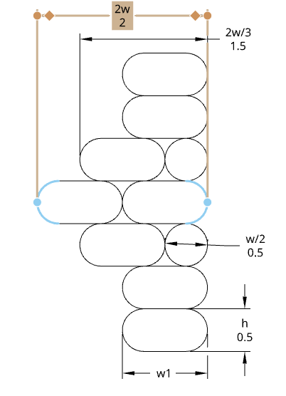

The profile is a cross-section through the Former wall in the z direction, showing the full layer stack at the anchor point. The base Skin extrusions below and above the Former band have width w and layer height h. Each ramp layer steps the wall outward by w/2 on each side relative to the layer below it, growing the wall symmetrically about the perimeter centreline.

The number of ramp layers *n* is a slicer parameter. This gives a total Former band height of (2n + 1) layers — n ramp-up layers, one peak layer, and n ramp-down layers — and a peak wall thickness of (1 + n)w. The profile shown uses n = 3, giving a band of 7 layers and a peak thickness of 4w. The w/2 step per ramp layer produces a 45° overhang on the outer face of the ramp, which is the printability limit for FFF without support.

Where the peak thickness exceeds 2w, the Hoop at the peak layer becomes hollow. The hollow condition prevents excess material accumulation at the apex while preserving the outer wall profile.

#### Developed

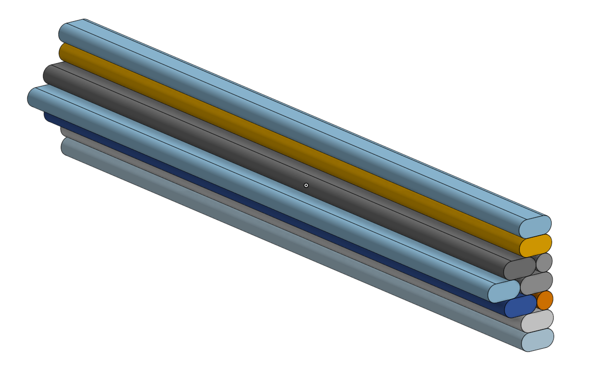

The Developed view shows the Former band across its full layer span on a straight perimeter segment. The wall width increases symmetrically from Skin width toward the peak layer and returns symmetrically on the far side. The colour coding across layers corresponds to the ramp position: Skin layers at the outer edges of the band, ramp layers stepping inward to the peak. The band is continuous along the perimeter at each layer — the Hoop traces the full perimeter circuit at the thickened width before returning to Skin width on subsequent layers.

---

### Stringer

#### Profile

The Trace profile is defined in the Anchor Point UCS, with the perimeter running along the x axis and the inward direction along −y. The perimeter cutout spans from x = −0.5w to x = +0.5w (half a line width on each side of the anchor point). At the anchor point the perimeter extrusion splits, and a closed teardrop loop descends inward toward the centroid.

The loop is formed by three arcs:

| Arc | Centre (w units) | Radius | Direction | Start | End |
| --- | --- | --- | --- | --- | --- |
| Arc 1 | (−0.5, −1.5) | 1.5w | CW | 90° | 0° |
| Arc 2 | (0, −1.5) | 1.0w | CW | 0° | 180° |
| Arc 3 | (+0.5, −1.5) | 1.5w | CW | 180° | 90° |

The departure point is (−0.5, 0) and the return point is (+0.5, 0). The total inward depth of the loop is 2.5w, reached at x = 0, y = −2.5 (the bottom of Arc 2). The crossover where the outbound and return paths re-merge is at the top of the loop; a small squeezout from the crossover fills the divot at the perimeter. The layer lift occurs at the crossover.

Arc 1 sweeps 90° CW from (−0.5, 0) to (1.0, −1.5), curving the outbound path away from the anchor. Arc 2 sweeps 180° CW from (1.0, −1.5) around the bottom to (−1.0, −1.5), reaching maximum depth 2.5w at the bottom. Arc 3 sweeps 90° CW from (−1.0, −1.5) back up to (0.5, 0), completing the return.

The CCW Trace departs from x = −0.5w and the loop leans toward the negative-x (CCW-backward) direction. The CW Trace uses the mirror profile: the arc traversal order and arc directions are reversed (Arc 3 → Arc 2 → Arc 1, each traversed CCW), and x_sign = −1 is applied in the Conformal Placement Transform, so the loop leans toward the positive-x (CW-backward) direction. Both Traces use the same perimeter cutout of 1.0w total (s_anchor − 0.5w to s_anchor + 0.5w).

#### Slice

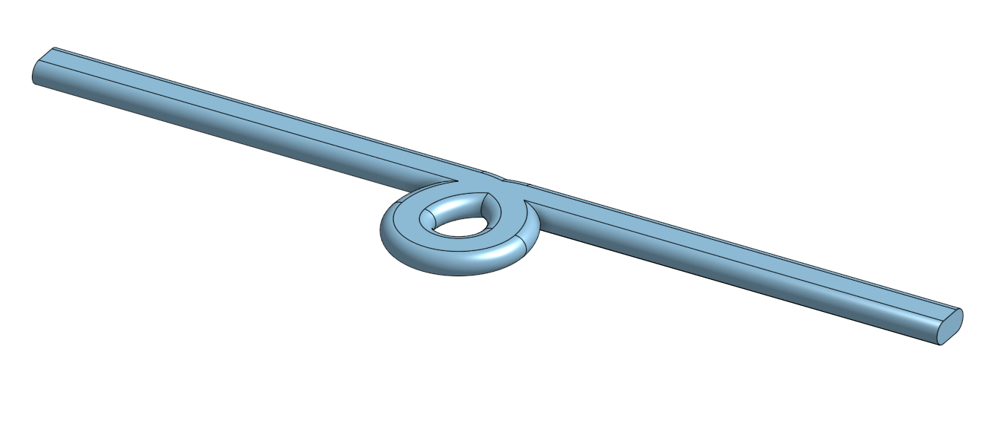

The Slice shows an isolated Trace in three dimensions. The perimeter extrusion runs as a continuous ribbon; at the anchor point the ribbon opens and the Trace loop descends inward, forming a closed torus-like ring below the perimeter plane. The crossover is visible at the top of the loop where the outbound and return paths re-merge with the perimeter. The loop interior is open — the void enclosed by the loop and the layer below it is not filled.

#### Developed

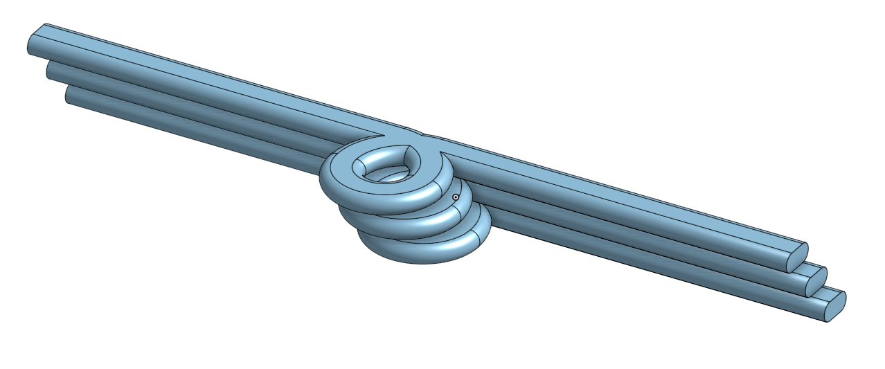

The Developed view shows a Stringer across several successive layers. As the helix advances, the anchor point of each Trace steps along the perimeter at the fixed helical pitch, so successive Traces are offset laterally from one another. When stacked, the individual Trace loops coil into a continuous helical tube. The perimeter extrusions of each layer run as parallel ribbons offset by the layer height; the tube grows between them as the Traces accumulate.

#### Helix Phase and Angle

The angular advance of the helix per layer is determined by the **Helix Angle** parameter θ_h (degrees, default 45°). θ_h is the angle between the stringer tube axis and the skin surface: at 45° the CCW and CW helices cross at 90° to each other, forming square diamonds.

To maintain a constant intersection angle across tapered tubes (where the perimeter circumference changes with z), the helical pitch is not fixed in mm/layer but is computed as a running integral over the actual per-layer perimeter length:

> Δphase = layer_height / (perimeter_length × tan θ_h)

This integral is accumulated sequentially across all layers in a pre-pass before the parallel wall-generation step. The result is stored as a fractional helix phase per layer, which is passed to the per-layer toolpath generator. On a constant-diameter tube, this reduces to a fixed advance per layer. On a tapered tube, the advance per layer adjusts so that the physical angle between the stringer and the perimeter remains θ_h at every z height.

The phase reference for each layer is the **Reference Ray** (+X ray from centroid to perimeter), not the polygon's starting vertex. This ensures phase continuity across layers even when the slicer reindexes the polygon vertex order between layers.

---

### Whip

#### Profile

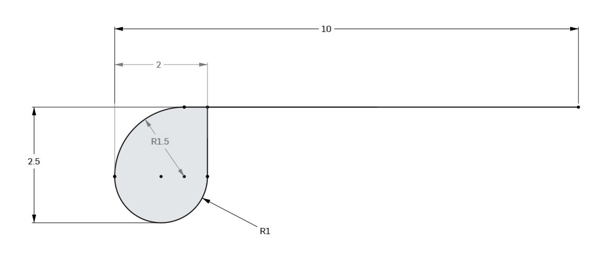

The Terminal profile is geometrically similar to the Stringer Trace — total loop depth 2.5w, upper arcs R 1.5w, lower arc R 1.0w — but is asymmetric about the anchor point. The loop is tangent to the y-axis of the Anchor Point UCS at x = 0: the anchor sits at the leftmost edge of the loop, and the entire loop occupies x ∈ [0, 2]. The perimeter runs from the interior of the open manifold toward the anchor point and terminates there; the loop closes back onto itself at that point rather than bridging across two perimeter segments. The overall loop width of 2w is measured from the anchor point toward the interior side of the polyline.

The loop is formed by two arcs and one line segment:

| Segment | Type | Centre (w units) | Radius | Direction | Start | End |
| --- | --- | --- | --- | --- | --- | --- |
| Arc 1 | Arc | (1.5, −1.5) | 1.5w | CCW | 90° | 180° |
| Arc 2 | Arc | (1.0, −1.5) | 1.0w | CCW | 180° | 360° |
| Line 1 | Line | — | — | — | (2, −1.5) | (2, 0) |

Arc 1 sweeps 90° CCW from (1.5, 0) to (0, −1.5), bringing the path from the perimeter level (at lx = 1.5, the departure point) to the anchor depth at lx = 0. Arc 2 sweeps 180° CCW from (0, −1.5) around the bottom — reaching maximum depth 2.5w at (1.0, −2.5) — and arriving at (2, −1.5). Line 1 returns the path from depth 1.5w at lx = 2 straight back to the perimeter surface at (2, 0), which is the terminal's far-side return point.

The perimeter skin departs from the terminal at lx = 1.5 (1.5w from the anchor) and the path ends at lx = 2 (2w from the anchor). The anchor at lx = 0 is the deepest point in x; the loop's widest x-extent is at depth −1.5w (Arc 2 endpoints at lx = 0 and lx = 2).

**Toolpath direction — ends at terminal** (end of open polyline, x_sign = −1):

The skin walks from the polyline start to 1.5w before the anchor. The terminal then draws Arc 1, Arc 2, and Line 1 in the order listed. With x_sign = −1 in the Conformal Placement Transform, positive canonical lx maps toward decreasing arc-length s, so the terminal occupies [s_end − 2w, s_end] with the anchor at s_end.

**Toolpath direction — begins at terminal** (start of open polyline, x_sign = +1, reversed traversal):

The terminal draws Line 1 reversed, then Arc 2 reversed (CW), then Arc 1 reversed (CW). The path exits at (1.5, 0) on the perimeter, and the skin walk continues from s = 1.5w toward the far end of the open polyline. With x_sign = +1, the terminal occupies [0, 2w] with the anchor at s = 0.

#### Slice

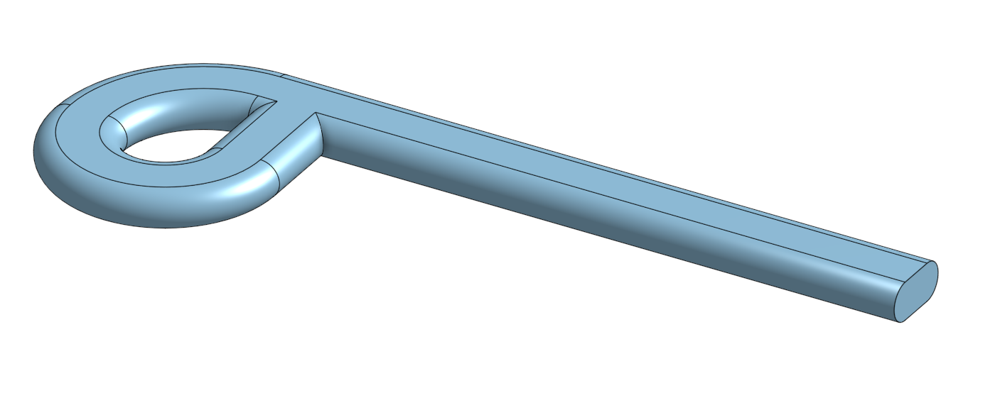

The Slice shows a single Terminal in three dimensions. One perimeter arm extends away from the boundary edge; the boundary-side end terminates at the anchor point, where the path turns into the closing loop. The loop is a full closed ring, with the crossover at the top re-merging the path back onto the perimeter arm. The geometry on the open side of the anchor point is absent — no perimeter extrusion extends past the Terminal.

#### Developed

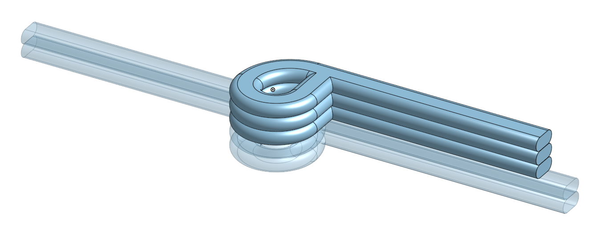

The Developed view shows the Terminal column stacking across layers at the boundary edge. The perimeter arms extend to the interior side only; the boundary side shows the growing column of stacked Terminal loops. The transparent elements flanking the column represent the bonding substrate provided by the Splay feature — either Stringer Traces that happen to coincide with the Whip endpoint position, or dedicated fixed Traces inserted on the n layers below the first Terminal and the n layers above the last when no coincident Stringer is present. The Splay geometry specification is not yet finalised; see the Splay section and the `featherprint_whip_stub_layers` parameter.

#### Terminal–Stringer Collision Zone

A Stringer Trace anchor that falls within the Terminal's extent will physically intersect the Terminal loop. The collision zone extends 4w from each Whip endpoint along the perimeter (derived as: 2w Terminal extent + 0.5w Stringer half-width + 1.5w edge clearance). When a Stringer anchor falls within this zone, both the Stringer Trace and the Terminal are suppressed on that layer. This is a placeholder; the Splay geometry will eventually replace the suppression with a tapered transition.

---

### Flange

#### Profile

*[Drawing: dimensioned 2D profile of the Flange's Wall stack in the z direction, showing the outer Wall held flush at the OML across every Layer, the inner Wall(s) building up behind it, and the placement of the half-width Wall — outer at the first Layer, buried mid-stack thereafter. Dimensions in w and h.]*

The profile is a cross-section through the Flange's Wall stack in the z direction, at the anchor point. The outer face of the outer Wall does not move at any Layer — it stays flush with the OML for the full span of the Flange, since the Flange must not alter the model's outer aerodynamic surface. All added thickness is built inward as additional Walls, per the build-up rule in the Flange terminology section: the first ramp Layer is a full-width inner Wall plus a half-width outer Wall; each subsequent Layer adds w/2 of total thickness, arranged as whole-width Walls with any half-width remainder buried between full-width Walls once three or more Walls are present.

#### Slice

*[Drawing: 3D view of a single Flange Layer, showing its Wall stack — outer Wall at the OML, inner Wall(s) behind it — relative to the centroid and the closed perimeter polygon of the boundary loop.]*

At each Layer within the Flange zone, every Wall in that Layer's stack traces the full closed perimeter circuit, exactly as the Former's Hoop does — the two features share underlying geometry, differing only in that the Flange's added Walls build inward from a fixed OML rather than growing symmetrically outward and back down.

#### Developed

*[Drawing: 3D view of the full Flange zone across its Layer span, showing the Wall stack thickening inward Layer by Layer while the outer Wall remains flush with the OML throughout.]*

The Developed view shows the transition from standard single-Wall Skin at the base of the Flange zone to the full Wall stack at the topmost Layer. Because the topmost Layer is the terminal Layer of the print, its top face is exposed and unprinted-over, providing the flat gluing surface referenced in the feature's description.

---

### Collision Features

#### Lacing (Stringer × Stringer)

##### Profile

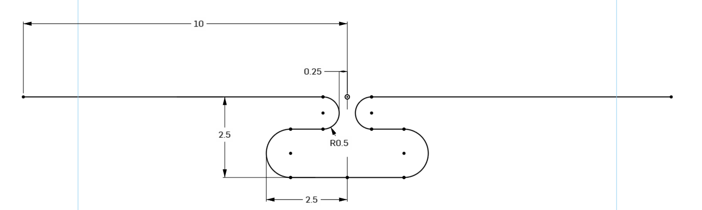

The Lacing Trace profile is symmetric about the y-axis of the Anchor Point UCS. The anchor point is the midpoint between the two suppressed Stringer anchors. The perimeter cutout spans from x = −0.75w to x = +0.75w.

The path is a single continuous extrusion forming an S-link. Starting from the left perimeter cutout edge and ending at the right:

| Segment | Description | Start | End |
| --- | --- | --- | --- |
| Left inner arc | Centre (−0.75, −0.5), R = 0.5w, CW 90°→ −90° | (−0.75, 0) | (−0.75, −1.0) |
| Left outer arc | Centre (−0.75, −1.75), R = 0.75w, CCW 90°→ 270° | (−0.75, −1.0) | (−0.75, −2.5) |
| Bottom segment | Horizontal at y = −2.5 | (−0.75, −2.5) | (+0.75, −2.5) |
| Right outer arc | Centre (+0.75, −1.75), R = 0.75w, CCW −90°→ 90° | (+0.75, −2.5) | (+0.75, −1.0) |
| Right inner arc | Centre (+0.75, −0.5), R = 0.5w, CW −90°→ 90° | (+0.75, −1.0) | (+0.75, 0) |

The inner arcs (R = 0.5w) each create a small eye that opens toward the centre of the feature (toward x = 0). The outer arcs (R = 0.75w) sweep outward to ±1.5w, forming the structural outer loops of the S-link. The outer arcs chain directly from the inner arc ends with no intervening straight segment; the arc radii together set the total feature depth of 2.5w. The path crosses 0.25w above the perimeter at the centre — this crossover is visible as a small nub at the top of the profile.

The total inward depth of 2.5w matches the standard Stringer Trace, preserving each Stringer's structural tube cross-section through the Lacing zone. The total lateral span of the feature is 3.0w (±1.5w from the anchor midpoint).

All arc endpoints are mapped to world-space toolpath coordinates via the Conformal Placement Transform with x_sign = +1. The lacing is not mirrored; its canonical geometry is explicitly symmetric.

##### Slice

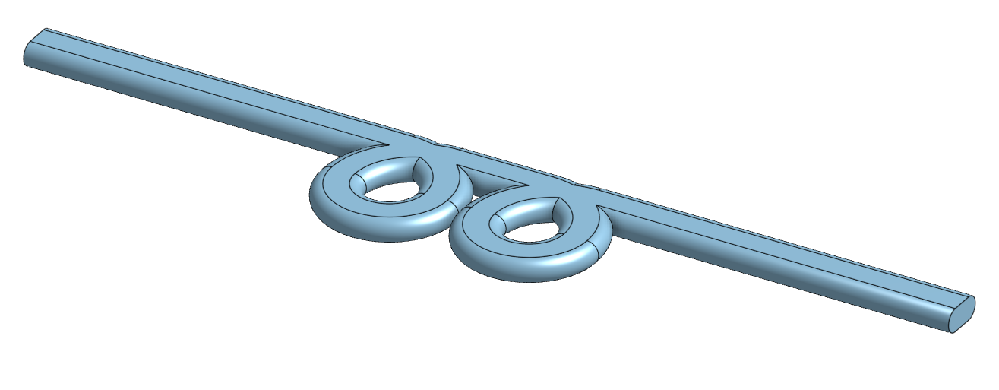

The Entry Trace shows the last layer before the Lacing zone begins. Two standard Traces sit side by side at their coincident perimeter position — one CCW, one CW. On the next layer, these two separate Traces are replaced by the Lacing Trace.

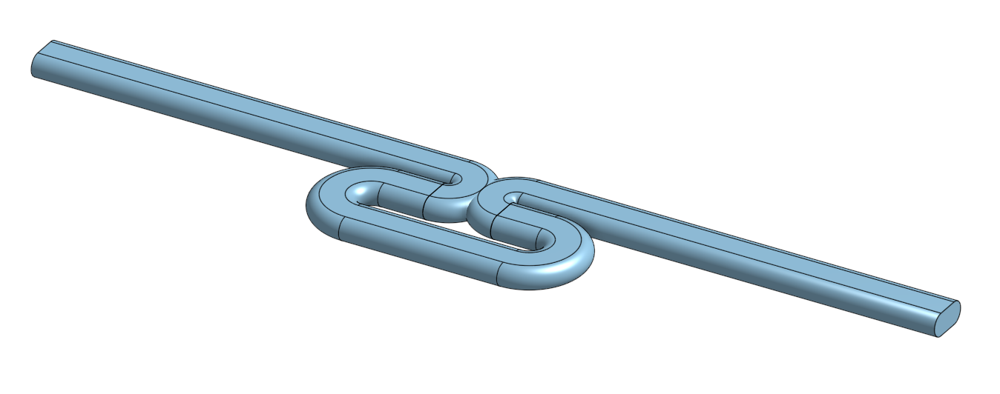

The Lacing Trace shows a single layer within the Lacing zone. The two loops interlock in an S-curve in the interior space beneath the perimeter. The crossover bonds the two loops together at the top. The perimeter ribbon continues uninterrupted through the anchor point on both sides, with the narrow cutout at ±0.75w.

##### Developed

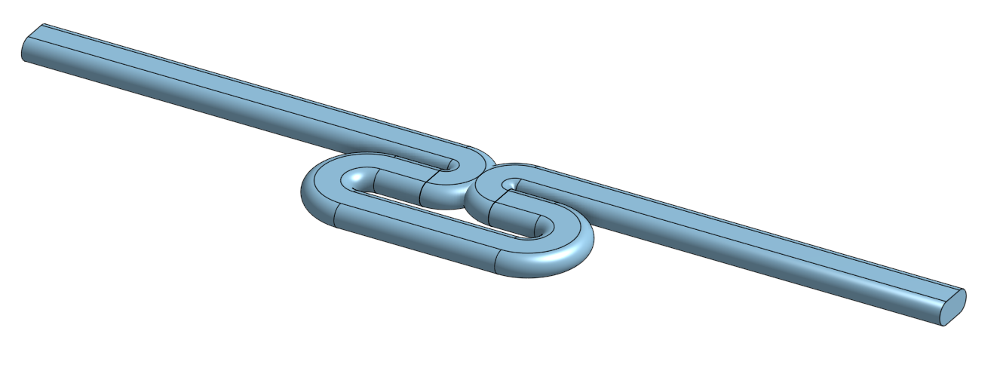

The Developed view shows the full Lacing zone across its layer span. Below the zone the CCW and CW Stringer tubes approach as separate helical columns. Within the zone the interlocked Lacing Traces stack into a double-coil form, bonding the two tubes together across every layer of contact. Above, the tubes resume their independent helices. The depth of the Lacing zone is determined by the helical geometry of the two parent Stringers and is not a fixed parameter.

---

#### Gusset (Stringer × Former)

##### Profile

*[Drawing: dimensioned 2D profile of the Gusset Hoop, showing the merged Former thickening and Stringer crossover in a single continuous extrusion. Dimensions in w and h.]*

##### Slice

*[Drawing: 3D view of a Gusset layer, showing the Gusset Hoop tracing the thickened Former profile with the Stringer crossover integrated at the Stringer's angular position.]*

##### Developed

*[Drawing: 3D view of the Gusset zone across the Former layer span, showing the Stringer passing through the Former band with integrated geometry throughout.]*

---

#### Splay (Stringer × Whip)

##### Profile

*[Drawing: dimensioned 2D profile of the Splay Terminal at the final approach layer, showing the merged Terminal loop and reduced Trace. Dimensions in w and h.]*

##### Slice

*[Drawing: 3D view of the Splay zone at the Terminal layer, showing the Splay Terminal at the Stringer's anchor point as the Stringer tube tapers to zero.]*

##### Developed

*[Drawing: 3D view of the Splay approach zone across its layer span, showing the progressive taper of the Stringer Trace down to the Splay Terminal at the Whip boundary.]*

---

#### Cuff (Former × Whip)

##### Profile

*[Drawing: dimensioned 2D profile of the Cuff Terminal, showing the truncated Former profile closing into the Terminal loop. Dimensions in w and h.]*

##### Slice

*[Drawing: 3D view of a Cuff layer, showing the Former wall truncated at the Whip boundary and closing into the Terminal column.]*

##### Developed

*[Drawing: 3D view of the Cuff zone across the Former layer span, showing the Former thickening ramping back down to one line width as it approaches the boundary edge, with the Terminal column at the opening.]*

---

#### Flare (Stringer × Flange)

##### Profile

*[Drawing: dimensioned 2D profile of a Flare Rim — the innermost Wall of a Flange Layer — projected further inboard to cover and weld the Stringer crossover, drawn alongside the Gusset Hoop profile for comparison. Dimensions in w and h.]*

##### Slice

*[Drawing: 3D view of a single Flange Layer, showing the Flare Rim substituting for that Layer's innermost Wall and Stringer Trace at the Stringer's angular position, with the outer Wall and any buried middle Walls unmodified.]*

##### Developed

*[Drawing: 3D view of the Stringer tube continuing up through the full Flange zone as a stack of Flare Rims, each welded to the one below via the same crossover mechanism used by a standard Stringer Trace, embedded in the innermost Wall of each successive Layer up to the topmost Layer.]*

---

#### Miter (Whip × Flange)

##### Profile

*(No distinct profile — the Miter reuses the standard Whip Terminal profile unmodified at the outer Wall of each affected Layer. See Whip § Profile.)*

##### Slice

*[Drawing: 3D view of a Flange Layer at the junction, showing the outer Wall's Terminal loop closing at the OML and sweeping over the open, unwelded end of an inner Wall in the same cross-section.]*

##### Developed

*[Drawing: 3D view of the Miter zone across the Flange's ramp Layers, showing the continuous outer-Wall Terminal column running unmodified through the zone while each Layer's inner Wall ends are left open, to be swept over and welded by that Layer's own outer-Wall Terminal.]*

---

## Parameters

| Parameter | Feature | Default | Units | Notes |
| --- | --- | --- | --- | --- |
| Line width (*w*) | All | — | mm | Sets all canonical w-unit dimensions |
| Layer height (*h*) | All | — | mm | |
| Stringer count | Stringer | 4 | — | Number of CCW helices; equal number of CW helices generated automatically |
| Helix angle (θ_h) | Stringer | 45 | ° | Angle between stringer tube and skin surface; constant across all z heights via running integral |
| Former ramp layers (*n*) | Former | — | layers | |
| Whip stub layers (*n*) | Whip / Splay | 3 | layers | Fixed Traces inserted at each Whip endpoint on the n closed-perimeter layers immediately below the first Terminal and above the last, when no coincident Stringer Splay is present. Pending Splay specification. |
| Flange ramp layers (*n*) | Flange | — | layers | Number of Layers over which the Flange's Wall stack builds up inward from the OML by w/2 total thickness per Layer, per the Wall build-up rule in the Flange terminology section. Peak Wall-stack thickness = 1w + n × w/2. |

---

## Implementation Notes

### Slicer Setting
FeatherPrint is activated by setting `infill_pattern = featherprint` on a mesh with `wall_line_count ≥ 1`, `top_layers = 0`, and `bottom_layers = 0`. The helix angle is exposed as `featherprint_helix_angle` (float, degrees). The stringer count is exposed as `featherprint_stringer_count` (int). The line width is exposed as `featherprint_line_width` (float, mm). The whip stub layer count is exposed as `featherprint_whip_stub_layers` (int). The flange ramp layer count is exposed as `featherprint_flange_ramp_layers` (int); the resulting Wall stack (count and arrangement) is derived per Layer via the build-up rule in the Flange terminology section and is not independently configurable.

### Boundary Loop Detection
Where the input mesh contains one or more boundary edges, the slicer classifies them as either a boundary edge (handled by the Whip) or a boundary loop (handled by the Flange). The mesh's boundary edges are first assembled into connected chains. Each chain is walked and split into maximal runs of edges that fall within a single Layer's z-tolerance band; a run that closes into a cycle on its own is classified as a boundary loop, while the remaining runs are classified as boundary edges. A chain may therefore yield both classifications at once — this is the interrupted-loop case described in the Input Model section, arising when a slot or hole reaches into a Flange zone. Every angular position at which a boundary-loop run meets a boundary-edge run is recorded as a Miter junction, applying at every Layer of the Flange's span at that position. A mesh may also contain multiple, fully independent boundary loops and boundary edges (e.g. a separate open top and an unrelated side slot); each is handled independently.

### Flare Detection
Stringer anchor positions are tested against the Flange's angular extent at every Layer within the Flange zone (the full perimeter, since the Flange spans the whole boundary loop). Any Stringer anchor found at a given Layer triggers generation of a Flare Rim at that Layer's innermost Wall, in place of the standard innermost-Wall segment and Stringer Trace, per the Flare geometry described under Collision Features. Any other Walls present at that Layer (outer Wall, or buried middle Walls) are generated normally and are not affected. Each Layer's Flare Rim is welded to the one below via the standard Trace crossover mechanism, continuing the Stringer's tube up through the full Flange zone.

### Miter Detection
At every Layer within a Flange zone that coincides with a recorded Miter junction, Wall generation is modified in two ways. First, the outer Wall's Terminal is generated normally — continuing the same Terminal column as the ordinary Whip Terminals below the Flange — with no distinct "Miter" geometry substituted. Second, any inner Wall(s) at that Layer are walked to the anchor and left open, with no closing pass generated. Because the outer Wall's Terminal must physically sweep over these open inner-Wall ends to weld them, the Wall print order at affected Layers is reversed from the Flange's usual outer-to-inner sequence: inner Walls are extruded first, and the outer Wall is extruded last.

### Phase Pre-Pass
The running integral for helix phase is computed in a sequential pre-pass across all layers of the mesh before the parallel wall-generation step. The per-layer perimeter length is taken from the largest polygon in each layer's outline. Results are stored in `mesh.fp_helix_phase[]` and indexed by layer number.

### Collision Detection
For each layer, all CCW and CW anchor positions are sorted by arc position. Adjacent anchors of opposite helix direction that are within 2w of each other in arc distance are tested for world-space proximity. If the Euclidean distance between the two anchor points is less than w, both anchors are flagged and paired. During toolpath generation, the first anchor of each flagged pair emits a Lacing Trace centred at the midpoint between the two anchors; the second anchor is silently skipped.

For open-manifold layers, an additional check suppresses any Stringer Trace whose anchor falls within 4w of either Whip endpoint. The colliding Terminal is also suppressed on that layer. This is a placeholder for the Splay feature.

### Conformal Placement Transform
Each canonical point is mapped to world space via the transform described in the Geometric Features section. The `radiusAt(centroid, θ)` method ray-casts from the centroid at angle θ and returns the intersection distance with the perimeter polygon. All feature arc primitives are tessellated at a fixed segment count and each sample is passed individually through the transform.

### Open Manifold Layers
Open-manifold layers (layers where the slicer produces `open_polylines` rather than closed polygons) are processed by a separate code path. The slicer's `stitch()` pass is suppressed for FeatherPrint meshes to preserve open boundaries. Each open polyline is oriented CCW in math coordinates, assembled into a virtual closed ring with gap chords, and processed by `generateOpen()`. The helix phase for open layers is advanced using the full virtual ring perimeter so that phase is continuous across the closed-to-open transition. Terminals are placed at both endpoints unless suppressed by the collision zone check.
