# FeatherPrint User Manual

*Manual version 0.2 draft, for FeatherPrint v1.0.0 (spec REV 4.12), 19 September 2026.*

## About this manual

This manual shows you how to slice lightweight, hollow prints with FeatherPrint v1.0.0, a modified CuraEngine for UltiMaker Cura 5.13.x on Windows. It is written for makers and designers who model in CAD, export an STL and slice in Cura, so it explains what to do and what to expect rather than how the algorithms work.

FeatherPrint adds two infill generators, chosen with Cura's Infill Pattern setting. **FeatherPrint** builds a single-line-width skin braced by a helical net of tube-like stringers, for ultralight aerodynamic parts such as drones, model aircraft, wind turbines and hydrodynamic surfaces. **Corrugated** fills the gap between the inner and outer walls of an ordinary shelled part with corrugated support, in place of conventional infill.

Each mode has a workflow chart ([FeatherPrint](diagrams/featherprint-workflow.html), [Corrugated](diagrams/corrugated-workflow.html)), and its chapters follow the same five phases: Model, Configure, Slice, Inspect, Print. Short "Why" notes explain a rule where knowing the reason helps you make a better part, and the Glossary defines the terms.

## Choosing a mode

Use FeatherPrint when your model is the skin itself, a single surface with no separate inner wall, and Corrugated when it is an ordinary shelled part with a real inner and outer wall. A mesh uses one mode or the other, never both, because both are selected through the same Infill Pattern setting.

|  | FeatherPrint | Corrugated |
| --- | --- | --- |
| Model is | A surface, or a closed model treated as surfaces rather than a solid | An ordinary closed, hollow, thin-walled part |
| Result | One line-width skin braced by a helical stringer net, no infill | Normal walls with corrugated support between the inner and outer wall |
| Open edges (slots, open top) | Supported | Not supported; use FeatherPrint |
| Settings | Mostly applied automatically | Start from the bundled profile |

**Why:** FeatherPrint has no inner wall to work with, so it builds its structure directly off the skin. Corrugated has to find the pairing between the outer and inner wall on every layer before it can bridge the gap.

If you are unsure, check whether the part has wall thickness you designed in. If it does, choose Corrugated. If the STL is a bare surface, or has slots or an open top, choose FeatherPrint.

## Installation and setup

FeatherPrint installs over an existing Cura with one Windows installer, and you can remove it later to restore Cura's original engine. It needs Windows 10 or later and UltiMaker Cura 5.13.x already installed.

1. Download `FeatherPrint-1.0.0-Windows-x64-Setup.exe` from the [v1.0.0 release page](https://github.com/Rszalay/FeatherPrint/releases/tag/v1.0.0).
2. Right-click the file and choose Run as administrator.
3. Follow the installer. It finds your Cura 5.13.x installation, backs up the original engine files, deploys FeatherPrint, and installs the bundled "FeatherPrint" and "FeatherPrint Corrugated" print profiles.
4. Start Cura and open the Infill Pattern setting. You should now see FeatherPrint and Corrugated in the list.

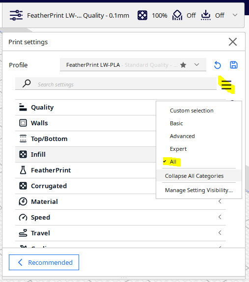

To uninstall, run Uninstall FeatherPrint from Windows Add or Remove Programs. Your original Cura engine files are restored automatically.

### Where the settings live

Corrugated settings appear in their own Corrugated category in Cura's print settings, and stay greyed out until Infill Pattern is set to Corrugated. The bundled profile is under Print Settings, then Profiles.

The `featherprint_` settings sit in their own category, which Cura hides by default. To show it, click the three-bar menu beside the settings search box and choose All. If the Corrugated category is not visible either, the same step reveals it.

## FeatherPrint mode: workflow

A FeatherPrint print takes five steps: check the model, select the pattern and tune a few settings, slice, inspect the layer view, then print. The [FeatherPrint workflow chart](diagrams/featherprint-workflow.html) shows the whole path, including where to loop back if the preview is wrong.

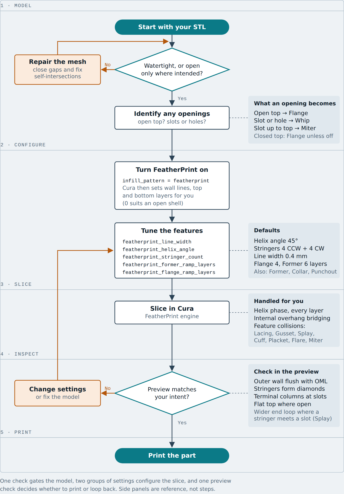

1. **Model.** Confirm the mesh is watertight, or open only where you meant it to be. Note any open top or slots, because they decide which end features you will get. See Preparing your model.
2. **Configure.** Set Infill Pattern to FeatherPrint. Cura then applies the rest of the required setup for you: Wall Line Count 1, Top Layers 0, Bottom Layers 0 and Z Seam Alignment set to Sharpest Corner. Top and Bottom Layers of 0 suit an open shell, but you can raise them if you want solid caps. Use a 0.2 mm layer height and LW-PLA or PETG, then adjust the FeatherPrint settings if you need to. See the settings reference.
3. **Slice.** Slice as usual. FeatherPrint works out the stringer helices, the end features and every place two features meet.
4. **Inspect.** Step through the layer view before you print. See Reading the layer view.
5. **Print.** If the preview matches your intent, print. If not, change the settings or the model and slice again.

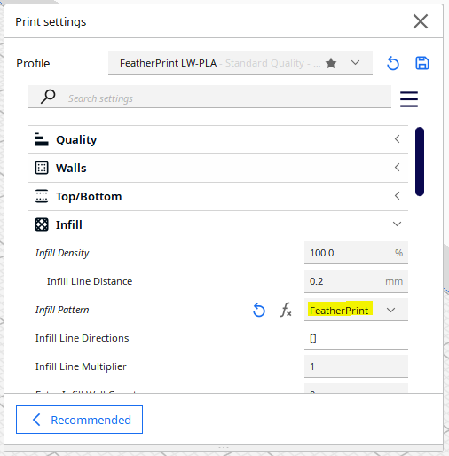

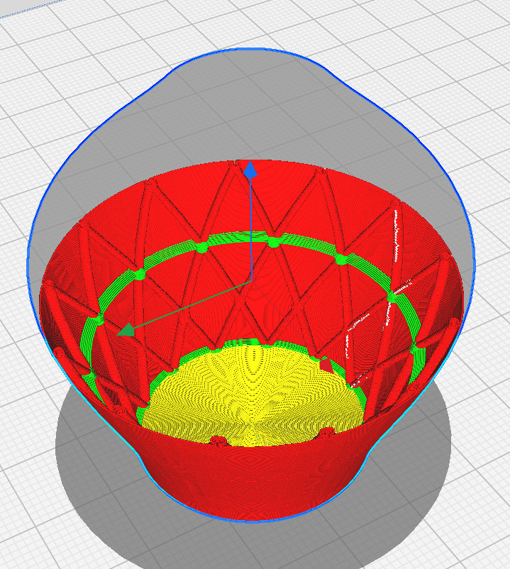

## FeatherPrint: preparing your model

FeatherPrint works from a manifold STL, and it accepts openings only in two specific forms: an open top or bottom, or a slot or hole in the side wall. Get these right in CAD and the slicer needs no further help. FeatherPrint will also slice a closed model. It treats the model as a set of surfaces, not as a solid.

### Watertight or deliberately open

A manifold is a closed, watertight mesh: every edge is shared by exactly two faces, with no gaps, holes or self-intersections. FeatherPrint also accepts an open mesh, where some edges belong to only one face, as long as the opening is intentional. Openings come in two kinds, and each gets its own end feature.

| Opening in your model | What you will see in the print |
| --- | --- |
| Open top, such as a tube or shell with no cap | A Flange: the last layers thicken inward to make a flat gluing surface, with the outer surface unchanged |
| Slot or hole in the side wall | A Whip: each layer ends in a small closed loop, stacking into a solid column along the opening |
| Slot or hole that reaches the open top | A Whip meeting a Flange at a Miter junction, handled automatically |

Each open top or slot is detected independently, so one part can have an open top, a closed end and several slots.

A Flange is built only at the top of the model. A part that is open at the bottom is accepted, but its bottom edge does not get a Flange. A closed top gets a Flange too, unless you turn it off with featherprint_flange_enabled (see the settings reference).

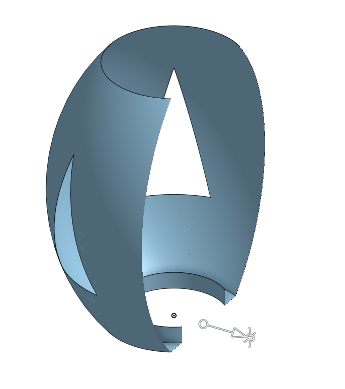

### Layer shape and internal overhangs

FeatherPrint no longer needs your layers to be any particular shape. Earlier versions required every layer to be star-convex, and that rule has been retired, so notches, hooks, thin sections and layers with several islands can all be sliced. Where a section is too thin for a stringer, lacing or flare to fit, FeatherPrint leaves that feature out and lets the ordinary skin wall pass straight through. Where a Flange, Former or Collar would grow into a thin neck, it is trimmed back.

Skin that has nothing below it, such as the inside roof of a cavity, is bridged automatically from the layers beneath it (Shore). There is no setting for this. It respects the Flange enable setting, and bridges narrower than about three line widths are not attempted. A hole in the model is left open rather than skinned over, even when Top or Bottom Layers is above 0.

Why: features are placed by distance along the outline rather than by measuring outward from a centre point, so the shape of the outline no longer limits where they can go.

### Before you export

- Check the mesh is watertight, or open only at the places above.
- Check for very thin necks or tiny holes you did not intend; FeatherPrint drops features there rather than failing.
- Note where any open top or slots are, so you can look for their end features in the layer view.

## FeatherPrint: settings reference

FeatherPrint has a set of tuning settings of its own, and four Cura settings it sets for you when you choose the pattern. In most prints you only change the helix angle or stringer count; the later rows switch optional features on or off and tune them.

### FeatherPrint settings

| Setting | Default | Units | What it controls |
| --- | --- | --- | --- |
| `featherprint_helix_angle` | 45 | ° | Angle between a stringer tube and the skin. At 45° the two counter-rotating helices cross at 90°, forming square diamonds. The angle stays constant even as a part tapers. |
| `featherprint_stringer_count` | 4 | helices | Number of counter-clockwise helices. The same number of clockwise helices is added automatically, so 4 gives 8 in total. |
| `featherprint_line_width` | 0.4 | mm | The line width w. Every feature dimension is a multiple of it. |
| `featherprint_flange_ramp_layers` | 4 | layers | Number of layers at the top of the part over which it thickens inward. Each layer adds half a line width, so the peak thickness is 1w + n × w/2. |
| `featherprint_former_ramp_layers` | 6 | layers | Number of layers the Former thickens on each side of its peak layer. The band is 2n + 1 layers tall and peaks at w + (n + 1) × w/2 in thickness, so 6 gives a 13-layer band, 4.5 line widths thick at its peak. The outer surface stays on the model and all added thickness builds inward. Minimum 2. |
| `featherprint_flange_enabled` | true | on/off | Whether the Flange is built at all. It applies to the top layers of every mesh, so turn it off for a genuinely closed top, such as a nose cone, where no gluing surface is wanted. |
| `featherprint_former_enabled` | true | on/off | Whether Formers are placed where stringer helices cross. |
| `featherprint_former_spacing` | 1 | crossings | Skips crossings when placing Formers, trading stiffness for weight. At 1 every crossing gets a Former; at 2 every other one does, and so on. |
| `featherprint_collar_enabled` | true | on/off | Whether Collars are built around holes and slots. |
| `featherprint_collar_layers` | 6 | layers | Ramp length of each Collar band, and of the taper into the open span. Minimum 2. |
| `featherprint_punchout_enabled` | false | on/off | Opt-in. Prints support into holes so a flat-topped closure has something to bridge from. You decide which parts need it; it is not detected for you. |
| `featherprint_punchout_gap` | 0.6 | mm | Minimum clearance between a Punchout line and the end loops at the hole edge. It can grow on an angled hole edge. |
| `featherprint_punchout_contour_samples` | 5 | points | Points sampled along each wall around a hole when Punchout matches its contour. |
| `featherprint_feature_depth` | 2.5 | line widths | How far stringers, lacings and flares reach inward from the skin. One setting drives all of them, so they stay in step. |
| `featherprint_stringer_width` | 1.5 | line widths | Width of a stringer trace. |
| `featherprint_lacing_width` | 3.0 | line widths | Width of a lacing, where two stringers meet. |
| `featherprint_force_zhop_height` | 2.0 | mm | Z-hop height used when the nozzle travels between FeatherPrint's small separate features, such as end loops and collars, so it does not drag the wall it just printed. Not yet validated on printed parts. |

### Set for you

| Setting | Value |
| --- | --- |
| Wall Line Count | 1 |
| Top Layers | 0 |
| Bottom Layers | 0 |
| Z Seam Alignment | Sharpest Corner |

Recommended alongside these: a 0.2 mm layer height, and LW-PLA or PETG.

**Why:** with no top or bottom layers, a FeatherPrint part simply stops at its last skin layer. That is why an open top gets a Flange, which supplies the flat surface a cap or mating part can glue to.

## FeatherPrint: features you will see in the print

A FeatherPrint part is built from several print features, plus collision features that appear wherever two of them meet. Punchout is opt-in; the others appear automatically where the model calls for them. Knowing what each one looks like in the layer view lets you tell a correct print from a problem.

### Print features

| Feature | Where it appears | What it is |
| --- | --- | --- |
| Skin | The whole surface | A stack of single-line-width extrusions tracing the outer perimeter |
| Stringer | Spiralling up the surface | A tube made of stacked loops that reach inward toward the centre. Two counter-rotating helices form a diamond net |
| Former | Where stringer helices cross | A local thickening of the skin, stepped out half a line width per layer, that acts as a transverse brace. |
| Whip | Along a slot or hole in the side wall | The skin ends in a small closed loop on every layer, so the opening has no loose filament end |
| Flange | The top layers of the part, most noticeably on an open top | The wall thickens inward, half a line width per layer, while the outer surface stays exactly on the model. The top layer is the gluing surface |
| Collar | Both ends of every slot or hole | Two bands of thickening on the skin at each end of a slot or hole, ramped like a Former. It braces the edge of the opening |
| Punchout | Inside a hole, when enabled | Support lines and end loops printed into the hole so a flat-topped closure has something to bridge from. It has a matching Shelf where a Collar sits over a hole |
| Shore | Under an internal overhang | Automatic bridging of skin that has nothing below it, such as the roof of a cavity. There is no setting for it |

### Collision features

Where two features would overlap, FeatherPrint swaps in a defined shape instead of leaving the toolpath to chance.

| Where | Feature | What you will see |
| --- | --- | --- |
| Two stringers meet | Lacing | Both loops replaced by one interlocking S-shaped link |
| Stringer meets Former | Gusset | The stringer loop merged into the thickened band, so no void forms inside it |
| Stringer meets Flange | Flare | The same merge as a Gusset, repeated on every layer of the Flange |
| Stringer meets Whip | Splay | The end loop widens to cover the stringer where a stringer reaches the slot end |
| Former meets Whip | Cuff | The thickening ramps back down to one line width as it nears the slot |
| Whip meets Flange | Miter | The outer wall closes as a normal end loop and welds the inner walls beneath it |
| Collar meets Whip | Placket | The Collar tapers into the open span so the end loop and the Collar join cleanly |

**Why:** these swaps keep every junction well bonded. A stringer that simply ran into a Former or a Flange would leave a void or an unattached filament end.

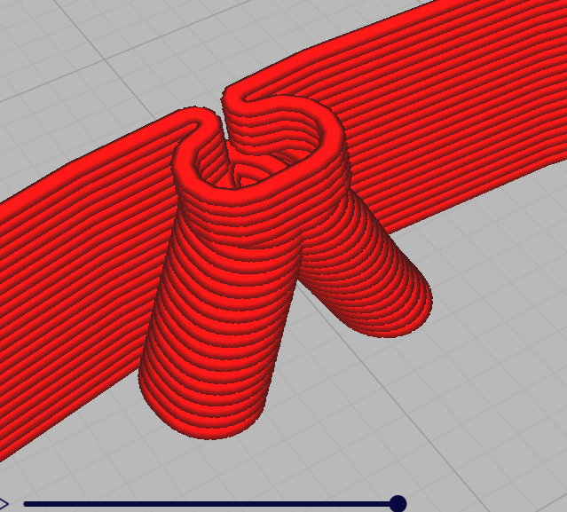

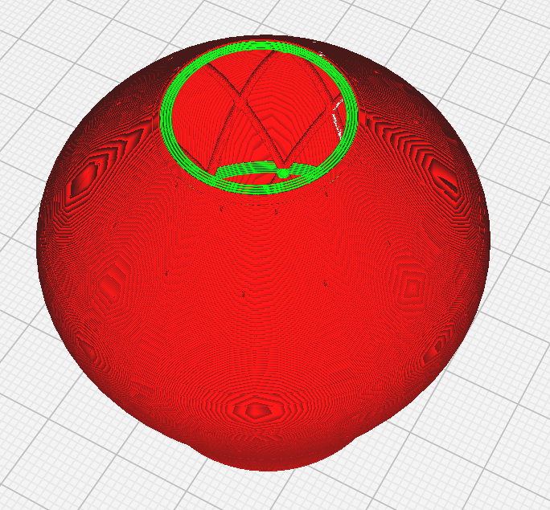

## Corrugated mode: workflow

A Corrugated print follows the same five steps as FeatherPrint, but starts from the bundled print profile instead of hand-tuning settings. The [Corrugated workflow chart](diagrams/corrugated-workflow.html) shows the whole path.

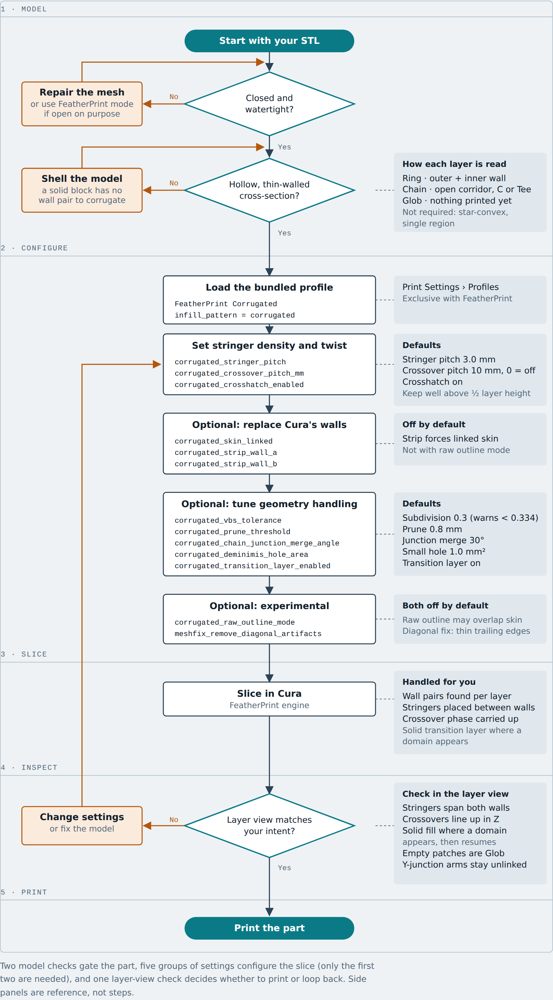

1. **Model.** Confirm the mesh is closed and watertight, and that it is a hollow, thin-walled part with a real inner and outer wall. See Corrugated: preparing your model.
2. **Configure.** Select the "FeatherPrint Corrugated" profile under Print Settings, then Profiles, and confirm Infill Pattern is set to Corrugated. The profile carries the validated `corrugated_` settings, so start there rather than changing them on a stock profile. Then adjust stringer pitch or crossover pitch only if the preview calls for it. See the settings reference.
3. **Slice.** Slice as usual. On every layer, Corrugated finds which contours are the outer and inner walls, then places stringers between them and keeps their pattern continuous from layer to layer.
4. **Inspect.** Step through the layer view before you print. See Reading the layer view.
5. **Print.** If the preview matches your intent, print. If not, change the settings or the model and slice again.

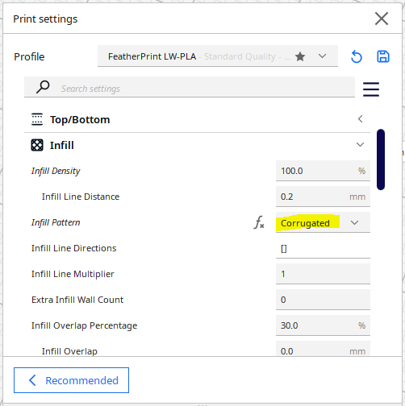

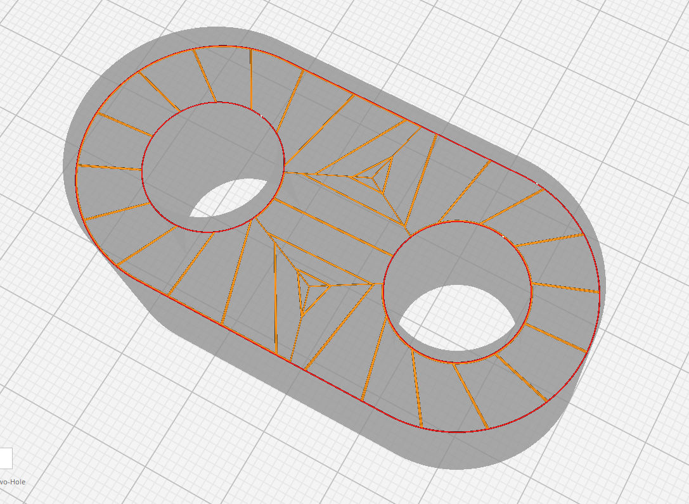

## Corrugated: preparing your model

Corrugated needs a closed, watertight mesh that is genuinely hollow, because it fills the space between an inner and an outer wall. It works with complex shapes, but a few layer shapes are not yet fully supported.

### Closed and hollow

The mesh must be closed: every edge shared by exactly two faces. Open meshes, with a slot cut through to the outside or an open top, are not supported in Corrugated; use FeatherPrint mode for those. The part must also be thin-walled or shelled. A solid block has no inner wall to pair with, so there is nothing for the corrugation to span.

### How each layer is read

On every layer, Corrugated sorts the space between walls into three kinds of region. You do not choose these; the slicer does. Knowing them helps you predict the result.

| Region | Typical shape | What gets printed |
| --- | --- | --- |
| Ring | A tube or airfoil cross-section: one outer contour with one inner contour nested inside | Corrugation all the way around the gap |
| Chain | An open corridor between two walls, such as a C-shape, a rib, or a Tee where one corridor meets another | Corrugation along the corridor, from one end to the other |
| Glob | A region the slicer cannot reduce to a Ring or a Chain | Nothing yet; the corrugation is left out of it |

Your model does not need to have one region per layer. Where corridors meet in a Tee, the straight-through pair is merged into one continuous corridor. A junction with no straight-through pair still works, but each arm is corrugated separately.

For most parts, Globs are not expected to form. They mainly result from complex junctions that cannot be resolved, or from applying corrugation to shapes with a low aspect ratio, which is not what Corrugated is for.

### Small holes

A small hole inside an otherwise filled region is ignored when Corrugated decides a region's shape, if its area is under 1.0 mm². Cura still prints a real wall around it, and no corrugation is printed through it. This stops a tiny hole from splitting one simple region into several pieces.

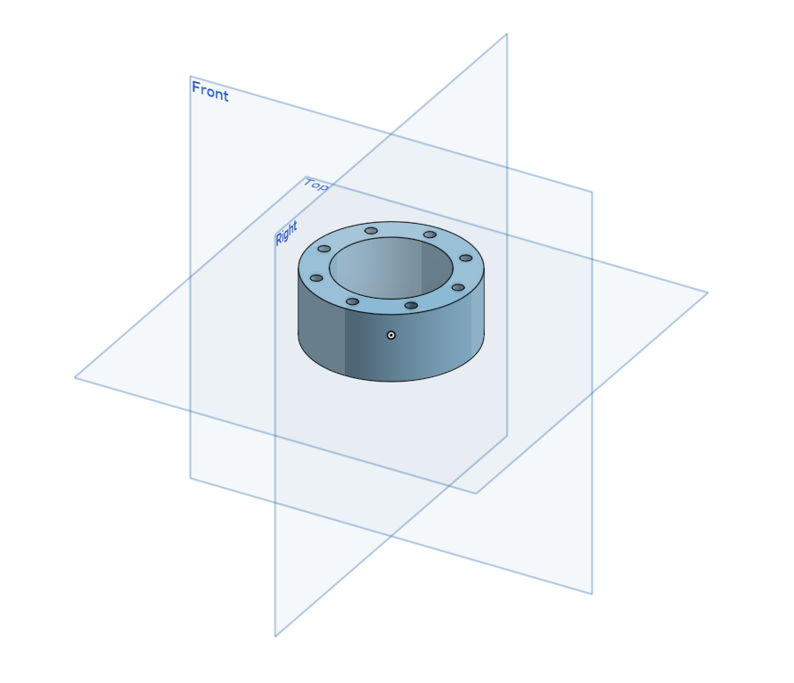

### Wall gap and corridor shape

The shape of a corridor matters more than the exact gap width. Wall gaps of 5 to 10 mm have given good results. Corridors, the ladder-like spans between two walls, generate well when they are at least three times longer than they are wide; a low aspect ratio tends to cause problems.

## Corrugated: settings reference

Corrugated adds twelve settings in their own Corrugated category, all active only when Infill Pattern is Corrugated. Start from the bundled profile; the two settings that most change the result are stringer pitch and crossover pitch.

### Density and twist

| Setting | Default | Units | What it controls |
| --- | --- | --- | --- |
| `corrugated_stringer_pitch` | 3.0 | mm | Target distance between neighbouring stringers, measured along the longer wall of a region. A longer wall gets more stringers. |
| `corrugated_crossover_pitch_mm` | 10.0 | mm | Height between successive crossings of the two counter-rotating stringer families. Every region crosses at the same height. 0 turns off both the crossover and the sweep. Keep it well above half a layer height, or the pattern aliases into a static or jittery look. |
| `corrugated_crosshatch_enabled` | On |  | Adds a second stringer family spiralling the opposite way, so the two cross over the part's height. Needs a nonzero crossover pitch to show. |

### Wall handling

| Setting | Default | What it controls |
| --- | --- | --- |
| `corrugated_skin_linked` | On | Prints the wall-following part of the corrugation as one continuous path that swaps between outer and inner wall at each stringer, instead of separate segments. Falls back to unlinked stringers on layers it cannot link. |
| `corrugated_strip_wall_a` | Off | Removes Cura's own wall on the outer wall (Wall A), letting the corrugation take over its job. Turns on linked skin for that side. |
| `corrugated_strip_wall_b` | Off | The same for the inner wall (Wall B). |

Stripping a wall does not work together with Raw Outline Mode; turn that off to use either strip setting.

### Geometry handling

| Setting | Default | Units | What it controls |
| --- | --- | --- | --- |
| `corrugated_vbs_tolerance` | 0.3 | fraction | How finely long contour edges are split. Values below about 0.334 can make irregular shapes over-subdivide, and Cura warns below that. |
| `corrugated_prune_threshold` | 11 | mm | Short side-arms shorter than this are folded into a neighbouring wall. Too large a value can absorb real short features. |
| `corrugated_chain_junction_merge_angle` | 30 | ° | How far from a straight 180° two corridors may bend at a junction and still be merged into one continuous corridor. |
| `corrugated_deminimis_hole_area` | 1.0 | mm² | Holes smaller than this are ignored when deciding a region's shape. Experimental. |
| `corrugated_transition_layer_enabled` | On |  | Prints a solid fill layer where the number of regions changes, so corrugation has something to build on. Experimental. |

### Experimental

| Setting | Default | What it controls |
| --- | --- | --- |
| `corrugated_raw_outline_mode` | On | Corrugates a fixed-width inset of the raw slice outline instead of Cura's generated walls, for parts where wall generation changes shape between layers. May overlap the top and bottom skin. |
| `meshfix_remove_diagonal_artifacts` | Off | A Cura mesh-fix option, not in the Corrugated category. Removes false vertices left by STL tessellation, which can otherwise make a thin trailing edge unstable. Helps every infill pattern. This mainly applies to vertical quads from extrusions in the z axis. |

These defaults are first-pass values that have not yet been tested across a wide range of parts, which is why the bundled profile is the safer starting point.

## Reading the layer view and troubleshooting

Step through the layer view from bottom to top before every print; most problems show up there, and several things that look wrong are expected in this release. Look first at the outer wall, then at the structure inside it, then at any layer where something changes.

What a good FeatherPrint slice shows: an outer skin that follows the model exactly, stringer loops that advance steadily around the part layer by layer and cross to form diamonds, an end loop on every layer along each slot, and a thickened, flat top on an open top.

What a good Corrugated slice shows: normal walls, stringers spanning the gap between them on every layer, the two stringer families crossing at the same height in every region, and a solid layer wherever a region appears.

### FeatherPrint

| You see | Likely cause | What to do |
| --- | --- | --- |
| A wider end loop where a stringer reaches a slot end | The stringer and the end loop merge into a Splay, which applies within three line widths of a slot end | Expected |
| Diamonds too flat or too steep | Helix angle | Change `featherprint_helix_angle`; 45° gives square diamonds |
| Nozzle drags the wall between small features | The Z-hop is too low for the feature it is clearing | Raise featherprint_force_zhop_height |
| Sag or stringing over a hole under a Collar | A Collar peaks above a hole with nothing to support it | Turn on featherprint_punchout_enabled |

### Corrugated

| You see | Likely cause | What to do |
| --- | --- | --- |
| An empty patch with no corrugation | A Glob region, which is not yet filled. Usually a complex junction or a low-aspect-ratio shape | Expected. Reshape the part, or accept the gap |
| A full-density layer partway up | A transition layer where the number of regions changed | Expected. Turn off `corrugated_transition_layer_enabled` only if you accept the risk |
| A stringer pattern that looks static or jittery | Crossover pitch too close to the layer height | Raise `corrugated_crossover_pitch_mm` well above half a layer height |
| Strip Wall A or B has no effect | Raw Outline Mode is on | Turn off `corrugated_raw_outline_mode` |
| Corrugation overlapping the top or bottom skin | Raw Outline Mode is on | Turn it off |
| A wobbling or unstable thin trailing edge | STL tessellation artifacts | Turn on `meshfix_remove_diagonal_artifacts` |
| Short side-arms missing | Prune threshold too large | Lower `corrugated_prune_threshold` |
| A three-way junction whose arms are not linked | No straight-through pair at that junction | Expected in this release |
| Stringer orientation drifting or flipping between layers in a short, wide corridor | Low aspect ratio: the corridor is less than about three times longer than it is wide | Lengthen or narrow the corridor in the model |

## Known limitations in this release

These are the gaps to plan around in v1.0.0; each is a known, deliberate scope boundary rather than a fault in your model.

### All modes

- FeatherPrint runs only on Windows with UltiMaker Cura 5.13.x.
- A mesh uses either FeatherPrint or Corrugated, never both.

### FeatherPrint

- **A Collar can overhang a hole unsupported.** If Punchout is off but a Collar peaks above a hole, nothing supports the peak; turn Punchout on for such parts. This is scheduled to be corrected.
- **No cut-back of the skin before an end loop.** A parametric cut-back is reserved for a future release.
- **Untested**** Z-hop height****.** The hop used between FeatherPrint's small separate features (featherprint_force_zhop_height) has not yet been validated on printed parts.

### Corrugated

- **Closed meshes only.** Open meshes are permanently out of scope for this mode; use FeatherPrint.
- **Glob regions print no corrugation.** They are left empty.
- **Three-way junctions without a straight-through pair** are corrugated arm by arm, not as one connected path.
- **One ring region per layer** is tracked for continuity and linked skin. Several separate corridors per layer are handled.
- **Stringers are straight.** The planned shaped cross-section, with rising and falling walls between troughs and peaks, is not built yet.
- **Transition layers are partial.** They trigger when a region appears or the region layout changes, not yet for a large change in area or when a region reaches the top skin.
- **Wall stripping and transition layers do not combine.** A region with a stripped wall never gets a transition layer.
- **Experimental settings.** Raw Outline Mode, Transition Layer and De Minimis Hole Area have each been checked on a limited set of parts.
- **Defaults are first-pass** and not yet validated across a wide range of geometry.

## Glossary

| Term | Meaning |
| --- | --- |
| Boundary edge | An edge that belongs to only one face of the mesh, marking an opening. Slots and holes produce these |
| Chain | In Corrugated, an open corridor between two walls, such as a C-shape or a rib |
| Collar | FeatherPrint's thickened bands at both ends of a slot or hole, built like a Former |
| Crosshatch | A second stringer family spiralling the opposite way to the first, so the two cross as the part rises |
| Crossover | A place where two stringer families cross, or where a Stringer loop closes on itself and lifts to the next layer |
| Flange | FeatherPrint's thickened, inward-building top layers on a part with an open top |
| Former | A local thickening of the skin where stringer helices cross, acting as a transverse brace |
| Glob | In Corrugated, a region that is not a Ring or a Chain. Rare in normal parts, and not yet filled |
| Helix angle | The angle between a stringer tube and the skin surface |
| Layer | One pass of the print head at a fixed height |
| Line width (w) | The width of one extrusion. FeatherPrint dimensions are multiples of it |
| Linked skin | In Corrugated, a single continuous path that alternates between the outer and inner wall |
| Manifold | A closed, watertight mesh in which every edge is shared by exactly two faces |
| OML | Outer mould line: the outer surface of the model, which FeatherPrint never alters |
| Placket | Where a Collar meets a Whip: the Collar tapers into the open span |
| Punchout | Optional support printed into a hole so a flat-topped closure can bridge from it |
| Ring | In Corrugated, one outer contour with one inner contour nested inside it |
| Shore | Automatic bridging of an internal overhang |
| Skin | A stack of single-line-width extrusions tracing the model's outer surface |
| Splay | Where a stringer reaches a slot end: the end loop widens to cover the stringer |
| Stringer | A tube built from stacked loops that follow a helix around the part |
| Terminal | The small closed loop a Whip prints at the end of the skin on each layer |
| Transition layer | In Corrugated, a solid fill layer printed where the region layout changes |
| Wall | One of the concentric lines within a layer. In a Corrugated Ring, Wall A is the outer wall and Wall B the inner wall |
| Wall strip | In Corrugated, removing Cura's own wall so the corrugation takes over its job |
| Whip | FeatherPrint's end feature along a slot or hole in the side wall |

## Revision history

| Date | Manual version | Covers | Notes |
| --- | --- | --- | --- |
| 18 Sep 2026 | 0.1 draft | FeatherPrint v1.0.0 | First draft. Both workflow charts and all screenshots included |
| 19 Sep 2026 | 0.2 draft | FeatherPrint v1.0.0; spec REV 4.12 | Brought up to date with REV 4.12: star-convex rule removed, Collar, Punchout, Shore, Splay, Placket and new settings added |
